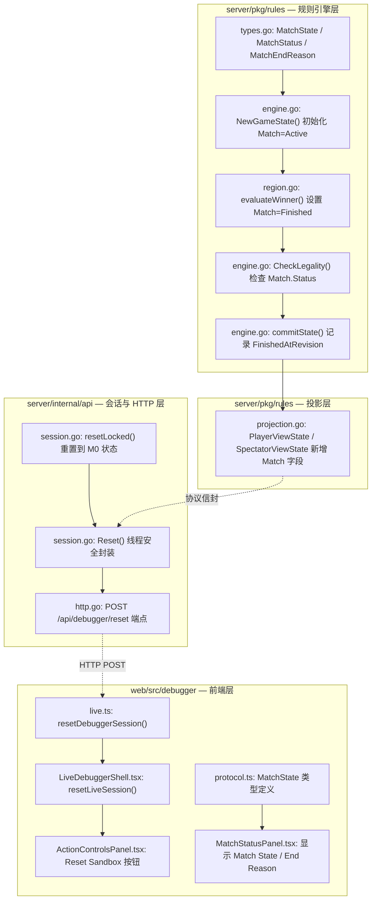
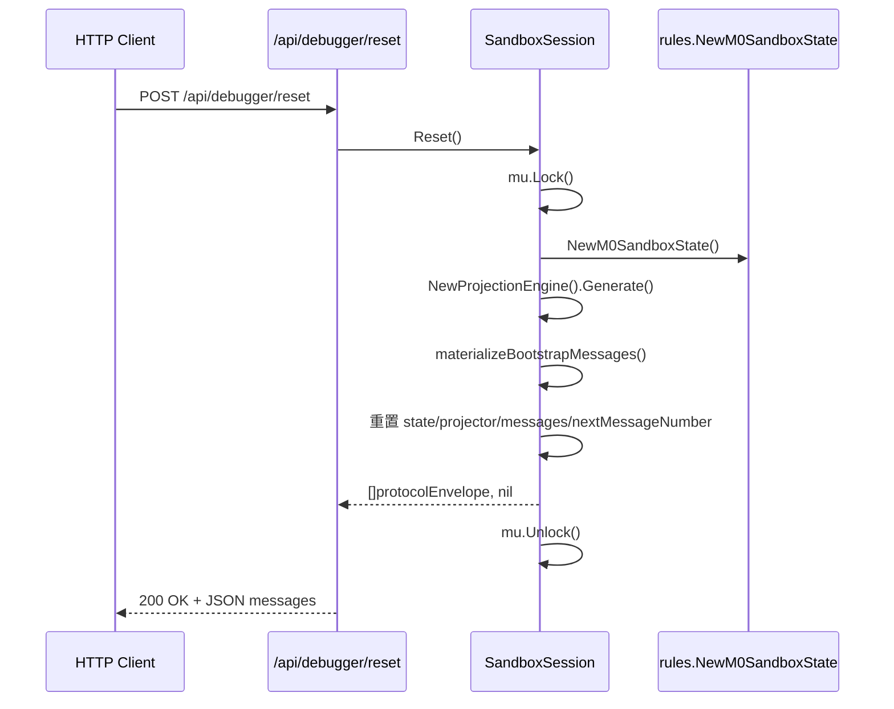

# Phase 3 Game Over Gate

本次任务把 `Phase 3` 再推进一格：当 `WinnerPlayerID` 已经写入权威状态后，对局不再继续接受新动作。

## 本次新增

### Go 侧

- 新增结构化拒绝码：
  - `RULES_FAILED_GAME_ALREADY_OVER`
- `CheckLegality` 现在会在基础结构校验之后、规则动作校验之前检查：
  - `state.Score.WinnerPlayerID != ""`
- 若已有 winner：
  - 返回 `rules.game.already_over`
  - `hook = score.winner`
  - `context.winnerPlayerId = <winner>`

### Web 侧

- live debugger 会读取当前 patch 里的 `score.winnerPlayerId`
- 若当前 patch 已存在 winner：
  - 预置动作按钮全部禁用
  - 显示 `Game over. Winner: <player>`
  - `Reload Feed` 仍可用

## 为什么这样做

前一轮已经有：

- 地区得分
- 胜利阈值
- `WinnerPlayerID`

如果对局在 winner 出现后仍能继续提交动作，那这个 winner 只是“显示用字段”，不是真正的规则边界。  
这一步把 winner 从“可见结果”推进成“会影响 legality 的规则状态”。

## 新增测试

### Go

- `TestWinnerStopsFurtherActionsWithStructuredReasonCode`
  - 胜利达成后继续动作会被拒绝
  - 拒绝码为 `RULES_FAILED_GAME_ALREADY_OVER`
  - rejection context 包含 `winnerPlayerId`

### Web

- `LiveDebuggerShell` 新增测试：
  - live patch 已有 winner 时，动作按钮被禁用
  - 页面显示 `Game over. Winner: <player>`

## 当前刻意未做

- 没有把“对局结束”做成独立 phase 或 terminal state enum
- 没有实现赛后页面或重开一局入口
- 没有把 winner 相关行为扩展到更完整的房间/session 生命周期

## 当前结果

当前最小 sandbox 的行为已经变成：

1. 地区控制产生分数
2. 分数达到阈值时写入 winner
3. 新回合主动玩家继续正常轮转
4. 一旦已有 winner，后续动作直接被规则核拒绝

## 1. 高层摘要 (TL;DR)

- **影响:** 🔴 **高** — 引入了全新的 `MatchState` 生命周期模型，贯穿规则引擎、投影层、HTTP API 和前端；同时新增沙箱重置端点，涉及全栈变更。
- **核心变更:**
  - ✨ 新增 `MatchState` 类型（`active` / `finished`），替代原来仅靠 `Score.WinnerPlayerID` 判断游戏是否结束的方式
  - ✨ 新增 `POST /api/debugger/reset` API 端点，支持将沙箱会话恢复到初始 M0 状态
  - 🔄 重构 `NewSandboxSession()` 构造函数，复用 `resetLocked()` 消除重复代码
  - 🔄 前端协议类型、Mock 数据、状态面板同步新增 `match` 字段
  - 🧪 大幅精简 HTTP 测试，移除旧的详细断言测试，新增重置端点测试

---

## 2. 视觉总览 (代码与逻辑地图)

---

## 3. 详细变更分析

### 3.1 🏗️ 规则引擎 — `MatchState` 生命周期

**文件:** `server/pkg/rules/types.go`

新增 `MatchState` 结构体及相关枚举类型，为游戏匹配引入显式生命周期管理：

| 类型 | 值 | 说明 |
|------|-----|------|
| `MatchStatus` | `"active"` | 比赛进行中 |
| `MatchStatus` | `"finished"` | 比赛已结束 |
| `MatchEndReason` | `""` (None) | 尚未结束 |
| `MatchEndReason` | `"victory_threshold"` | 达到胜利阈值 |

**`MatchState` 结构体字段：**

| 字段 | 类型 | 说明 |
|------|------|------|
| `Status` | `MatchStatus` | 当前比赛状态 |
| `EndReason` | `MatchEndReason` | 结束原因（仅 finished 时有值） |
| `WinnerPlayerID` | `string` | 获胜玩家 ID |
| `FinishedAtRevision` | `int` | 结束时的修订号 |

> **设计意图:** 原来仅通过 `Score.WinnerPlayerID != ""` 判断游戏是否结束，无法区分"尚未结束"和"平局/无赢家"场景。新模型通过 `MatchStatus` 枚举提供明确的状态语义。

---

### 3.2 ⚙️ 引擎逻辑变更

**文件:** `server/pkg/rules/engine.go`

- **`NewGameState()`**: 初始化时设置 `Match: MatchState{Status: MatchStatusActive}`
- **`CheckLegality()`**: 游戏结束检查从 `state.Score.WinnerPlayerID != ""` 改为 `state.Match.Status == MatchStatusFinished`，拒绝原因的 hook 从 `"score.winner"` 改为 `"match.status"`，附加信息中增加 `endReason` 字段
- **`commitState()`**: 新增逻辑——当 `Match.Status == MatchStatusFinished` 且 `FinishedAtRevision == 0` 时，记录当前修订号

**文件:** `server/pkg/rules/region.go`

- **`evaluateWinner()`**: 当存在获胜者时，同步设置 `Match.Status = MatchStatusFinished`、`Match.EndReason = MatchEndReasonVictoryThreshold`、`Match.WinnerPlayerID`

---

### 3.3 📊 投影层变更

**文件:** `server/pkg/rules/projection.go`

`PlayerViewState` 和 `SpectatorViewState` 均新增 `Match MatchState` 字段，在 `Generate()` 中直接透传 `full.Match`。

**文件:** `server/pkg/rules/regression.go`

回归验证新增对 `view.Match` 与 `state.Match` 一致性的检查（玩家视图和观众视图）。

---

### 3.4 🔄 沙箱会话重置

**文件:** `server/internal/api/session.go`

| 变更 | 说明 |
|------|------|
| `materializeBootstrapMessages()` 签名变更 | 返回值从 `[]protocolEnvelope` 改为 `([]protocolEnvelope, error)`，内部 `panic(err)` 替换为 `return nil, err` |
| 新增 `resetLocked()` | 核心重置逻辑：创建全新 M0 状态、投影引擎、生成引导消息，重置 `nextMessageNumber`，替换 `session` 所有字段 |
| 新增 `Reset()` | 线程安全封装（`mu.Lock` + `defer mu.Unlock`），调用 `resetLocked()` |
| 重构 `NewSandboxSession()` | 不再内联初始化逻辑，改为调用 `resetLocked()`，错误时 `panic`（构造函数契约） |

---

### 3.5 🌐 HTTP 端点

**文件:** `server/internal/api/http.go`

| 属性 | 值 |
|------|-----|
| 路由 | `POST /api/debugger/reset` |
| 请求体 | 无 |
| 成功响应 | `200 OK` + `[]protocolEnvelope`（引导消息） |
| 错误响应 | `405 Method Not Allowed`（非 POST）/ `500 Internal Server Error` |

---

### 3.6 🖥️ 前端变更

**文件:** `web/src/debugger/protocol.ts`

新增 `MatchState` 类型，`PlayerViewState` 和 `SpectatorViewState` 新增 `match: MatchState` 字段。

**文件:** `web/src/debugger/live.ts`

新增 `resetDebuggerSession()` 函数，向 `/api/debugger/reset` 发送 POST 请求。

**文件:** `web/src/debugger/LiveDebuggerShell.tsx`

| 变更 | 说明 |
|------|------|
| 新增 `resetLiveSession()` | 调用 `resetDebuggerSession()`，成功后 dispatch `loadSucceeded`，失败时回退到 mock 数据 |
| `currentWinnerPlayerId()` | 读取路径从 `score.winnerPlayerId` 改为 `match.winnerPlayerId` |

**文件:** `web/src/debugger/components/ActionControlsPanel.tsx`

新增 `onReset` 回调属性和 **"Reset Sandbox"** 按钮（样式 `action-button--secondary`，加载时禁用）。

**文件:** `web/src/debugger/components/MatchStatusPanel.tsx`

新增两个显示字段：**Match State**（`match.status`）和 **End Reason**（`match.endReason`）。

**文件:** `web/src/debugger/mockProtocol.ts`

Mock 数据新增 `match` 常量（`finished` / `victory_threshold` / `P1` / revision 7），注入到所有 player 和 spectator 视图中。

---

### 3.7 🧪 测试变更

**文件:** `server/internal/api/http_test.go`

- **大幅精简:** 移除 3 个旧测试（`TestHandlerBootstrapsProjectedMessages`、`TestHandlerSubmitsActionsAndAppendsDispatchMessages`、`TestHandlerReturnsStructuredRejectionEnvelope`）及所有辅助函数（`performRequest`、`decodeResponseJSON`、`findEnvelopeByAudience`、`decodeStatePatchedPayload`、`containsVisibleCard`、`statePatchedPayload`、`actionRejectedPayload` 结构体）
- **新增:** `TestResetEndpointRestoresCanonicalSandboxState` — 先提交一个动作改变状态，再调用 reset，验证状态恢复到 M0 且消息数量正确

**文件:** `server/internal/api/session_test.go`

新增 `TestSandboxSessionResetRestoresCanonicalM0State` — 验证 `Reset()` 后状态一致性、消息数量、所有消息名称为 `StatePatched`。

**文件:** `server/pkg/rules/region_scoring_test.go` & `projection_test.go` & `regression.go`

同步更新断言以覆盖 `MatchState` 相关字段。

**文件:** `web/src/debugger/LiveDebuggerShell.test.tsx`

- Mock 数据新增 `match` 字段（`active` 状态）
- 新增测试：验证点击 "Reset Sandbox" 按钮后发送 POST 请求、游戏结束提示消失、操作按钮恢复可用

---

## 4. 影响与风险评估

### ⚠️ 破坏性变更

| 变更 | 影响 | 范围 |
|------|------|------|
| `GameState` JSON 新增 `match` 字段 | 所有消费 `GameState` JSON 的客户端会收到新字段（向后兼容，非破坏） | API 消费方 |
| `PlayerViewState` / `SpectatorViewState` 新增 `match` 字段 | 前端协议类型必须更新，否则 TypeScript 编译可能报错 | 前端 |
| `materializeBootstrapMessages()` 签名变更 | 内部方法，返回值增加 `error`（包内影响） | `session.go` |
| `CheckLegality` 拒绝原因 hook 从 `"score.winner"` 改为 `"match.status"` | 依赖该 hook 字符串的前端/客户端逻辑需同步更新 | 依赖 hook 的消费方 |
| HTTP 测试大幅删除 | 减少了 bootstrap 和 action 提交的集成测试覆盖 | 测试覆盖面 |

### 🧪 测试建议

- ✅ 验证 **新游戏** 创建后 `match.status` 为 `"active"`
- ✅ 验证 **达到胜利条件** 后 `match.status` 变为 `"finished"`，`endReason` 为 `"victory_threshold"`，`finishedAtRevision` 正确记录
- ✅ 验证 **游戏结束后** 提交任何动作返回 `ActionRejected`，`legality.hook` 为 `"match.status"`
- ✅ 验证 **Reset 端点**：在游戏进行中和结束后分别调用 reset，确认状态完全恢复
- ✅ 验证 **前端 Reset 按钮**：点击后 feed 刷新、游戏结束提示消失、操作按钮恢复
- ⚠️ 关注：旧的 HTTP 集成测试被移除后，bootstrap 消息投影和 action 提交的端到端行为是否仍有充分覆盖