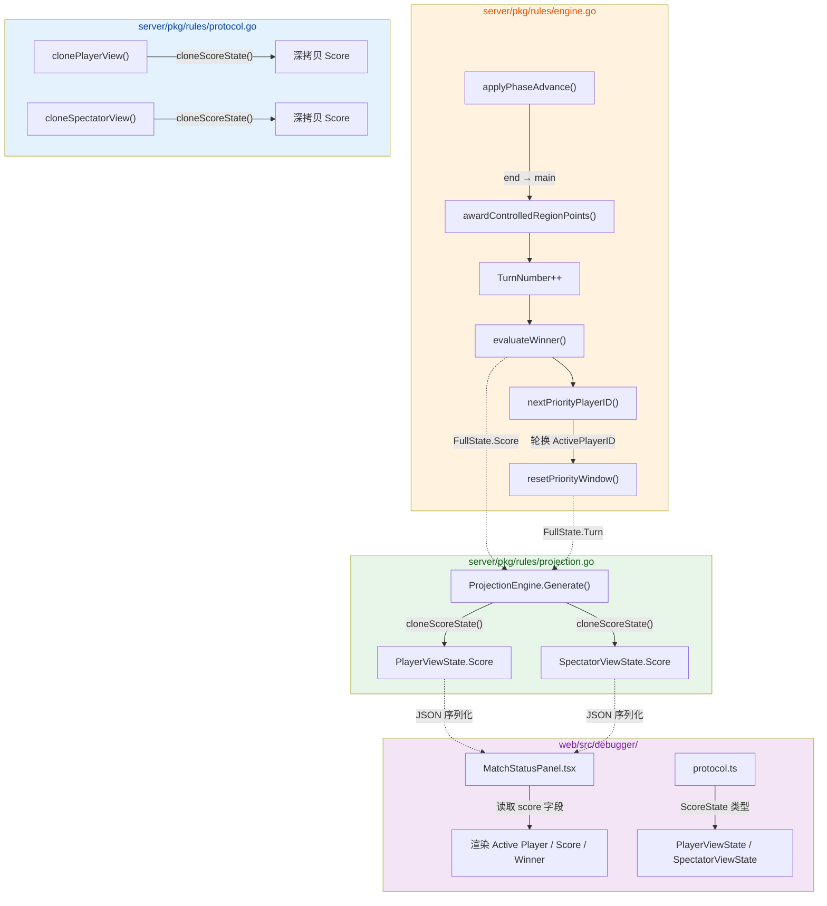

# Phase 3 Score Projection And Turn Rotation

本次任务补了 `Phase 3` 在“规则已存在，但调试和回合感知还没跟上”的两个缺口：

- 新回合开始时轮转 `ActivePlayerID`
- 把 `Score / Winner` 投影到 per-player / spectator view，并显示到 Web 调试器

## 本次新增

### Go 侧

- `PlayerViewState.Score`
- `SpectatorViewState.Score`
- `applyPhaseAdvance` 在 `end -> main` 时会：
  - 先结算地区得分
  - 再增加 `TurnNumber`
  - 再轮转 `ActivePlayerID`
  - 再保留新主动玩家的 priority window

### Web 侧

- `protocol.ts` 新增 `ScoreState`
- `MatchStatusPanel` 新增显示：
  - `Active Player`
  - `Score`
  - `Winner`
- mock protocol 数据同步带上 `score`

## 当前效果

- 当一轮从 `end` 回到 `main` 时，主动玩家会换到下家
- 所有 `PlayerViewState` 和 `SpectatorViewState` 都能看到同一份公共分数状态
- Web 调试器不再只能看 `revision / phase / step / priority`，现在也能直接看得分和 winner

## 新增测试

### Go

- `TestEndOfTurnRotatesActivePlayerToNextPlayer`
- `TestProjectionCarriesPublicScoreAndWinner`

### Web

- `DebuggerShell` 新增状态面板测试，验证：
  - `Active Player`
  - `Score`
  - `Winner`

## 当前刻意未做

- 没有在 `WinnerPlayerID != ""` 后阻止后续动作提交
- 没有把 score 做成独立面板或时间线
- 没有补完整胜负流程 UI

## 为什么现在做这一步

前一轮已经有“地区得分”和“胜利阈值”，但如果：

- 新回合主动玩家不轮转
- 调试器又看不到 score / winner

那 sandbox 仍然很难被当作可观察的最小对局骨架使用。  
这一步的价值是把已有规则结果真正暴露出来，并让 turn loop 更接近真实对局。

## 1. 高层概览 (TL;DR)

- **影响等级：** 🟡 **Medium** — 在规则引擎中补全了回合轮换逻辑，将公开分数/胜利者状态推送到客户端投影层，并在 Web 调试器中新增对应 UI 展示。
- **核心变更：**
  - 🔁 **回合结束轮换**：`end → main` 阶段推进时，`ActivePlayerID` 现在会自动轮转到下一位玩家。
  - 📊 **分数投影**：`PlayerViewState` 和 `SpectatorViewState` 新增 `Score` 字段，投影引擎生成视图时会携带完整分数信息。
  - 🖥️ **调试器 UI**：Match Status 面板新增 Active Player、Score、Winner 三项显示。
  - ✅ **测试覆盖**：新增 2 个 Go 测试 + 1 个前端测试，回归断言同步更新。

---

## 2. 可视化概览 (逻辑流图)



---

## 3. 详细变更分析

### 3.1 🔁 回合结束轮换 — `engine.go`

**文件：** `server/pkg/rules/engine.go`

在 `applyPhaseAdvance()` 中，当阶段从 `end` 推进到 `main` 时，新增一行调用：

```go
working.Turn.ActivePlayerID = nextPriorityPlayerID(working, working.Turn.ActivePlayerID)
```

**`nextPriorityPlayerID()`** 的逻辑（位于 `priority.go:60`）：
- 在 `state.Players` 列表中找到当前玩家的索引，返回 `(index+1) % len(Players)` 对应的下一位玩家。
- 空玩家列表或找不到当前玩家时做兜底处理。

**执行顺序：** 计分 → 回合数递增 → 胜利判定 → **轮换主动玩家** → 重置优先级窗口。

> ⚠️ 注意：轮换发生在 `evaluateWinner()` 之后，当前尚未基于 `WinnerPlayerID` 阻止后续动作（文档中已标注为待办）。

---

### 3.2 📊 分数投影 — `projection.go` + `protocol.go`

**文件：** `server/pkg/rules/projection.go`、`server/pkg/rules/protocol.go`

#### 数据结构扩展

| 视图类型 | 新增字段 | 类型 | JSON Key |
|---|---|---|---|
| `PlayerViewState` | `Score` | `ScoreState` | `score` |
| `SpectatorViewState` | `Score` | `ScoreState` | `score` |

#### `ScoreState` 结构（已有定义，`types.go:269`）

| 字段 | 类型 | 说明 |
|---|---|---|
| `ByPlayer` | `map[string]int` | 各玩家当前分数 |
| `VictoryThreshold` | `int` | 胜利所需分数阈值 |
| `WinnerPlayerID` | `string` | 胜利者 ID（`omitempty`） |

#### 投影生成逻辑

`ProjectionEngine.Generate()` 现在在构建每个玩家视图和旁观者视图时，通过 `cloneScoreState()` 将 `FullState.Score` 深拷贝到视图中，确保：
- **公开可见**：所有玩家和旁观者都能看到完整分数。
- **深拷贝隔离**：`cloneScoreState()` 会复制 `ByPlayer` map，避免投影与源状态共享引用。

#### 克隆链同步

| 函数 | 变更 |
|---|---|
| `clonePlayerView()` | 新增 `cloned.Score = cloneScoreState(view.Score)` |
| `cloneSpectatorView()` | 新增 `cloned.Score = cloneScoreState(view.Score)` |

---

### 3.3 🖥️ Web 调试器 UI — `MatchStatusPanel.tsx` + `protocol.ts`

**文件：** `web/src/debugger/components/MatchStatusPanel.tsx`、`web/src/debugger/protocol.ts`

#### 前端类型扩展

| 类型 | 新增字段 | 类型定义 |
|---|---|---|
| `ScoreState` | **新增类型** | `{ byPlayer: Record<string, number>; victoryThreshold: number; winnerPlayerId?: string }` |
| `PlayerViewState` | `score` | `ScoreState` |
| `SpectatorViewState` | `score` | `ScoreState` |

#### UI 新增展示项

| 展示项 | 数据来源 | 格式 |
|---|---|---|
| **Active Player** | `turn.activePlayerId` | 单个玩家 ID |
| **Score** | `score.byPlayer` | `P1: 2 \| P2: 1`（按玩家 ID 排序） |
| **Winner** | `score.winnerPlayerId` | 玩家 ID 或 `-` |

#### Mock 数据更新

`mockProtocol.ts` 中为所有三个视图（P1、P2、Spectator）的 mock `StatePatched` 消息添加了 `score` 对象：
```ts
const score = {
  byPlayer: { P1: 2, P2: 1 },
  victoryThreshold: 2,
  winnerPlayerId: "P1"
};
```

---

### 3.4 ✅ 测试变更

#### Go 后端测试

| 测试文件 | 测试名 | 验证内容 |
|---|---|---|
| `region_scoring_test.go` | `TestEndOfTurnRotatesActivePlayerToNextPlayer` | P1 结束回合后，`ActivePlayerID` 和 `Priority.CurrentPlayerID` 均轮换为 P2 |
| `projection_test.go` | `TestProjectionCarriesPublicScoreAndWinner` | P1/P2 投影中分数正确，旁观者投影中 `WinnerPlayerID` 正确 |
| `region_scoring_test.go` | `TestVictoryIsDeclaredWhenThresholdReached` | **修复**：第 3、4 步 `AdvancePhase` 的 `ActorID` 从 P1 改为 P2，反映轮换后的主动玩家 |
| `regression.go` | `validateProjectionBundleInvariants` | **新增断言**：玩家视图和旁观者视图的 `Score` 必须与 `state.Score` 一致 |

#### 前端测试

| 测试文件 | 测试名 | 验证内容 |
|---|---|---|
| `DebuggerShell.test.tsx` | `shows the active player plus public score and winner` | Match Status 面板包含 Active Player、Score（P1: 2, P2: 1）、Winner 文本 |

---

### 3.5 📝 文档更新

| 文件 | 变更 |
|---|---|
| `docs/NEXT_GEN_RULE_PLAN.md` | 新增 2026-04-01 补记，记录本次变更内容及当前 sandbox 可观察的状态 |
| `docs/WEB_DEBUGGER_2026-03-31.md` | 更新功能列表和 UI 决策，加入 active player / score / winner 相关描述 |

---

## 4. 影响与风险评估

### ⚠️ 潜在风险

- **轮换时机**：`ActivePlayerID` 在 `evaluateWinner()` 之后轮换，意味着即使已产生胜利者，轮换仍会执行。文档中已明确标注"还没有基于 `WinnerPlayerID` 停止后续动作"为待办项。
- **分数完全公开**：`Score` 被添加到所有玩家视图和旁观者视图中，无信息隐藏。如果未来需要隐藏对手分数，投影逻辑需要按玩家过滤 `ByPlayer`。
- **胜利测试 Actor 修复**：`TestVictoryIsDeclaredWhenThresholdReached` 中将后两步的 `ActorID` 从 P1 改为 P2，这说明之前的测试在轮换逻辑缺失时"碰巧"通过，现在修正为符合新逻辑的正确行为。

### 🧪 测试建议

- 验证 **2 人以上** 场景下 `nextPriorityPlayerID` 的环形轮换（P1 → P2 → P3 → P1）。
- 验证 **空玩家列表** 和 **当前玩家不在列表中** 的边界情况。
- 验证胜利者产生后，后续 `AdvancePhase` 是否仍被允许提交（当前行为：允许，待修复）。
- 前端验证：切换 viewer（P1 / P2 / spectator）时，Score 和 Winner 显示一致。