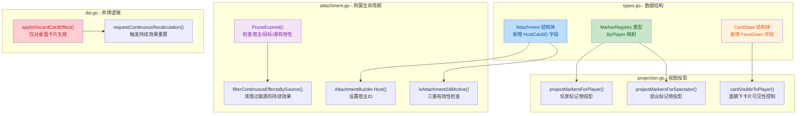
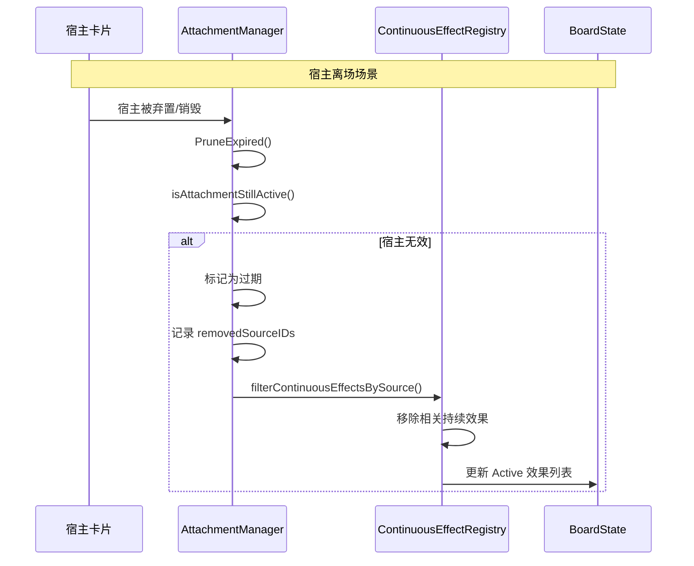

## 1. 高层摘要 (TL;DR)

*   **影响范围：** 🟡 **中等** - 完成了多个核心游戏机制的V1版本，包括附属/宿主生命周期、秘社标记物、暗藏部署、弃牌DSL改进
*   **核心变更：**
    *   ✅ **Attachment / Host Lifecycle V1** - 附属现在支持宿主离场联动，自动清理相关持续效果
    *   ✅ **Secret Society Marker V1** - 新增标记物注册表和玩家可见性投影
    *   ✅ **Hidden Deployment & Reveal V1** - 新增面朝下状态和可见性控制
    *   ✅ **Discard Card DSL 改进** - 只对桌面卡片生效，避免泄露手牌信息，并触发持续效果重算

---

## 2. 可视化概览 (代码与逻辑图)





---

## 3. 详细变更分析

### 📦 组件一：Attachment / Host Lifecycle V1

**变更文件：** `server/pkg/rules/types.go`, `server/pkg/rules/attachment.go`

**核心逻辑变更：**
- **数据结构扩展**：`Attachment` 结构体新增 `HostCardID` 字段，用于建立宿主与附属的生命周期关联
- **Builder 模式增强**：`AttachmentBuilder` 新增 `Host()` 方法，支持链式调用设置宿主ID
- **生命周期联动**：`PruneExpired()` 方法升级，现在会检查**宿主、目标、源**三重有效性
- **持续效果清理**：新增 `filterContinuousEffectsBySource()` 函数，当附属源被移除时自动清理对应的持续效果

**关键代码片段：**
```go
// attachment.go - 宿主有效性检查
func (am *AttachmentManager) isAttachmentStillActive(attachment Attachment) bool {
    // 检查目标（被附属的卡片）
    if !am.isCardValid(attachment.TargetCardID) {
        return false
    }
    // 检查宿主（生命周期锚点）
    if attachment.HostCardID != "" && !am.isCardValid(attachment.HostCardID) {
        return false
    }
    // 检查源（提供附属效果的卡片）
    if attachment.SourceCardID != "" {
        return am.isCardValid(attachment.SourceCardID)
    }
    return true
}
```

---

### 🏷️ 组件二：Secret Society Marker V1

**变更文件：** `server/pkg/rules/types.go`, `server/pkg/rules/projection.go`

**核心逻辑变更：**
- **新增数据结构**：`MarkerRegistry` 类型，使用 `map[string]map[string]int` 结构存储（玩家ID -> 标记类型 -> 数量）
- **状态管理**：`BoardState` 新增 `Markers` 字段
- **访问方法**：新增 `GetMarker()` 和 `SetMarker()` 方法，支持标记物的增删改查
- **视图投影**：`PlayerViewState` 和 `SpectatorViewState` 新增 `Markers` 字段，分别实现玩家可见和公开可见的标记物投影

**数据结构表：**

| 类型 | 字段 | 描述 |
|------|------|------|
| `MarkerRegistry` | `ByPlayer` | `map[string]map[string]int` - 玩家ID → 标记类型 → 数量 |
| `PlayerViewState` | `Markers` | 玩家可见的标记物（返回玩家自己的标记） |
| `SpectatorViewState` | `Markers` | 公开可见的标记物（聚合所有玩家标记） |

---

### 🎴 组件三：Hidden Deployment & Reveal V1

**变更文件：** `server/pkg/rules/projection.go`

**核心逻辑变更：**
- **面朝下状态**：`CardState` 新增 `FaceDown` 字段，表示暗藏部署状态
- **可见性控制**：`cardVisibleToPlayer()` 函数增强逻辑，面朝下卡片仅对拥有者可见
- **观众投影**：`projectCardForSpectator()` 函数增强，面朝下卡片对观众完全隐藏

**可见性规则表：**

| 卡片状态 | 拥有者可见 | 对手可见 | 观众可见 |
|---------|-----------|---------|---------|
| `FaceDown = true` | ✅ 是 | ❌ 否 | ❌ 否 |
| `Revealed = true` | ✅ 是 | ✅ 是 | ✅ 是 |
| `FaceDown = false, Revealed = false` | ✅ 是 | ❌ 否 | ❌ 否 |

---

### 🗑️ 组件四：Discard Card DSL 改进

**变更文件：** `server/pkg/rules/dsl.go`, `server/pkg/rules/discard_test.go`

**核心逻辑变更：**
- **保守性改进**：`discardCard` 现在只对 `CardZoneTable` 且未销毁的卡片生效
- **信息保护**：避免通过弃牌意外泄露手牌/牌堆的隐藏信息
- **持续效果联动**：弃牌操作触发 `requestContinuousRecalculation()`，确保持续效果正确更新
- **测试覆盖**：新增测试用例验证非桌面卡片的noop行为和持续效果清理

**测试用例表：**

| 测试用例 | 验证目标 |
|---------|---------|
| `TestDiscardCardDSLEffectNoopForNonTableTarget` | 非桌面卡片弃牌应为noop，不触发重算 |
| `TestDiscardCardDSLEffectTriggersContinuousCleanupForTemplateEffects` | 弃牌应触发持续效果重算，移除源卡片的buff |

---

### 🏗️ 组件五：初始化与文档更新

**变更文件：** `server/pkg/rules/engine.go`, `docs/HANDOVER_TRAE_2026-04-01.md`, `docs/NEXT_GEN_RULE_PLAN.md`

**核心逻辑变更：**
- **状态初始化**：`NewGameState()` 中初始化 `Board.Markers` 字段
- **文档同步**：更新交接文档和规则计划，标记多个V1功能已完成

---

## 4. 影响与风险评估

### ⚠️ 破坏性变更
- **数据结构变更**：`Attachment` 结构体新增 `HostCardID` 字段（向后兼容，使用 `omitempty`）
- **DSL 行为变更**：`discardCard` 现在对非桌面卡片执行 noop，之前可能产生意外行为

### 🧪 测试建议
- ✅ **宿主离场联动**：验证宿主被弃置/销毁时，附属及其持续效果正确清理
- ✅ **标记物投影**：验证玩家和观众视图正确显示标记物信息
- ✅ **面朝下可见性**：验证面朝下卡片仅对拥有者可见，对手和观众看不到
- ✅ **弃牌保守性**：验证弃牌操作不影响手牌/牌堆卡片，且触发持续效果重算
- ✅ **持续效果清理**：验证弃牌源卡片后，其提供的buff正确移除

### 📌 注意事项
- 当前实现是 **V1 版本**，不包含完整的附属系统功能（如回手/回收、附属堆栈互动）
- 标记物目前全部公开，未来可能需要支持私有标记物类型
- 面朝下状态目前仅用于可见性控制，未涉及翻牌机制