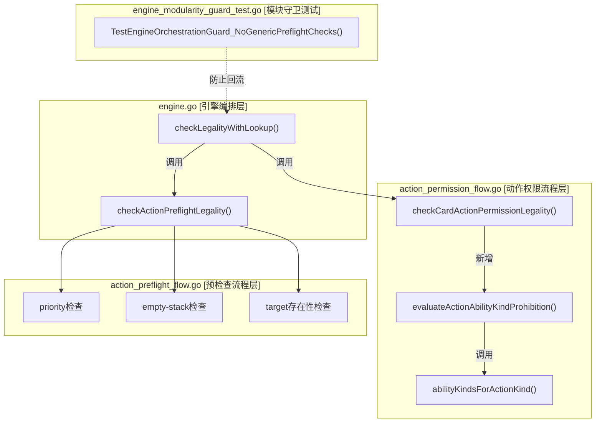

## 1. 高层摘要（TL;DR）

- **影响范围**: 🟡 **中等** - Engine核心模块的重构与扩展
- **关键变更**:
  - ✅ 将通用预检查逻辑（priority/stack/target存在性）从 `engine.go` 抽离到独立模块
  - ✅ 新增动作能力类型禁止规则支持（`XQ01` prerequisite框架层）
  - ✅ 增强模块化守卫测试，防止逻辑回流
  - 📝 更新文档记录第十七次补记，标记去重型收口阶段完成

---

## 2. 可视化概览（代码与逻辑映射）



**业务目标 → 模块 → 关键方法映射表**

| 业务目标 | 模块/文件 | 关键方法 | 说明 |
|---------|----------|---------|------|
| 动作合法性检查 | `engine.go` | `checkLegalityWithLookup()` | 主入口，编排检查流程 |
| 预检查解耦 | `action_preflight_flow.go` | `checkActionPreflightLegality()` | 统一处理priority/stack/target检查 |
| 能力禁止规则 | `action_permission_flow.go` | `evaluateActionAbilityKindProhibition()` | 评估动作是否被禁止 |
| 动作类型映射 | `action_permission_flow.go` | `abilityKindsForActionKind()` | ActionKind → AbilityKind映射 |
| 模块化守卫 | `engine_modularity_guard_test.go` | `TestEngineOrchestrationGuard_NoGenericPreflightChecks()` | 防止逻辑回流 |

---

## 3. 详细变更分析

### 📦 组件一：文档更新

**文件**: `docs/NEXT_GEN_RULE_PLAN.md`

**变更内容**:
- 添加第十七次补记（2026-04-02），标记 **Engine去重型收口阶段完成**
- 记录4个已完成的里程碑：
  1. ✅ 通用preflight抽离到 `action_preflight_flow.go`
  2. ✅ Engine结构守卫扩展（新增测试防止preflight回流）
  3. ✅ `XQ01` prerequisite框架层接线（不引入全局沉默）
  4. ✅ 回归基线通过（`go test`, `npm test`）

---

### 🔧 组件二：动作权限流程扩展

**文件**: `server/pkg/rules/action_permission_flow.go`

#### 🔍 核心逻辑变更

**1. 函数签名扩展**
```go
// 旧版：缺少 actorID 参数
func checkCardActionPermissionLegality(state GameState, cardID string, kind ActionKind)

// 新版：增加 actorID，支持能力禁止规则检查
func checkCardActionPermissionLegality(state GameState, actorID string, cardID string, kind ActionKind)
```

**2. 新增能力禁止规则评估**
- 新增 `evaluateActionAbilityKindProhibition()` 函数
- 通过 `ScopedProhibitionChecker` 检查动作是否被禁止
- 构造 `TargetCategory` 包含 `AbilityKinds` 条件

**3. 动作类型到能力类型映射**
新增 `abilityKindsForActionKind()` 函数：

| ActionKind | AbilityKind |
|-----------|-------------|
| `ActionKindRevealCard` | `"action"` |
| `ActionKindInspectCard` | `"action"` |
| `ActionKindSetFaceDown` | `"action"` |
| `ActionKindDeclareAttack` | `"action"` |
| `ActionKindDeclareInvestigation` | `"action"` |
| `ActionKindQueueOperation` | `"action"` |
| 其他 | `nil` |

---

### ⚙️ 组件三：引擎简化与解耦

**文件**: `server/pkg/rules/engine.go`

#### 🔄 重构前 vs 重构后

**重构前**：`checkLegalityWithLookup()` 包含大量内联检查逻辑
```go
// ❌ 旧版：通用预检查直接写在 engine.go 中
if actionRequiresPriority(action.Kind) && action.ActorID != currentPriorityPlayerID(state) {
    return legalityFailure(...)
}
if actionRequiresEmptyStack(action.Kind) && len(state.Board.Stack) != 0 {
    return legalityFailure(...)
}
if action.TargetPlayerID != "" && !containsString(state.Players, action.TargetPlayerID) {
    return legalityFailure(...)
}
if action.TargetCardID != "" && !hasCardID(state, action.TargetCardID) {
    return legalityFailure(...)
}
```

**重构后**：委托给专用预检查模块
```go
// ✅ 新版：统一调用预检查模块
preflightLegality := checkActionPreflightLegality(state, action)
if !preflightLegality.OK {
    return preflightLegality
}
```

#### 📊 函数调用更新表

| 调用位置 | 旧版调用 | 新版调用 |
|---------|---------|---------|
| `engine.go:175` | `checkCardActionPermissionLegality(state, action.CardID, action.Kind)` | `checkCardActionPermissionLegality(state, action.ActorID, action.CardID, action.Kind)` |
| `engine.go:235` | `checkCardActionPermissionLegality(state, action.CardID, action.Kind)` | `checkCardActionPermissionLegality(state, action.ActorID, action.CardID, action.Kind)` |
| `role_actions.go:56` | `checkCardActionPermissionLegality(state, action.CardID, action.Kind)` | `checkCardActionPermissionLegality(state, action.ActorID, action.CardID, action.Kind)` |

---

### 🛡️ 组件四：模块化守卫测试

**文件**: `server/pkg/rules/engine_modularity_guard_test.go`

#### 🚫 新增防回流测试

**测试名称**: `TestEngineOrchestrationGuard_NoGenericPreflightChecks()`

**禁止的代码模式**（防止回流到 `engine.go`）:

| 禁止模式 | 说明 |
|---------|------|
| `if actionRequiresPriority(action.Kind) && action.ActorID != currentPriorityPlayerID(state) {` | Priority检查逻辑 |
| `if actionRequiresEmptyStack(action.Kind) && len(state.Board.Stack) != 0 {` | Empty-stack检查逻辑 |
| `if action.TargetPlayerID != "" && !containsString(state.Players, action.TargetPlayerID) {` | Target player存在性检查 |
| `if action.TargetCardID != "" && !hasCardID(state, action.TargetCardID) {` | Target card存在性检查 |

**测试机制**: 通过读取 `engine.go` 文件内容，检测是否包含上述字符串模式，如果发现则测试失败。

---

## 4. 影响与风险评估

### ⚠️ 破坏性变更

| 变更类型 | 影响范围 | 说明 |
|---------|---------|------|
| **函数签名变更** | `checkCardActionPermissionLegality()` | 增加 `actorID` 参数，所有调用点需同步更新 |
| **逻辑迁移** | `engine.go` → `action_preflight_flow.go` | 预检查逻辑移出，需确保新模块功能完整 |

### ✅ 测试建议

**高优先级测试场景**:
1. **预检查完整性验证**
   - 验证priority检查：非优先玩家尝试执行需要priority的动作应被拒绝
   - 验证stack检查：栈非空时执行需要空栈的动作应被拒绝
   - 验证target存在性：target player/card不存在时应返回错误

2. **能力禁止规则测试**
   - 验证 `abilityKindsForActionKind()` 映射正确性
   - 验证禁止规则生效：当卡片禁止某动作类型时，应返回 `ReasonCodeLegalityFailedActionProhibited`
   - 验证禁止规则不生效：无禁止规则时应返回 `okLegalityResult()`

3. **回归测试**
   - 运行 `go test ./server/...` 确保所有现有测试通过
   - 运行 `cd tools/fixture-tools && npm test` 确保工具链正常
   - 运行 `cd web && npm test` 确保前端测试通过

4. **模块化守卫验证**
   - 故意在 `engine.go` 中添加被禁止的代码模式，验证测试能检测到
   - 确认测试在正常情况下通过

### 🎯 架构改进

- ✅ **单一职责原则**: `engine.go` 专注于编排，预检查逻辑独立到专用模块
- ✅ **可扩展性**: 新增 `AbilityKinds` 支持，为未来规则扩展奠定基础
- ✅ **可维护性**: 模块化守卫测试防止逻辑回流，保持架构清晰

---