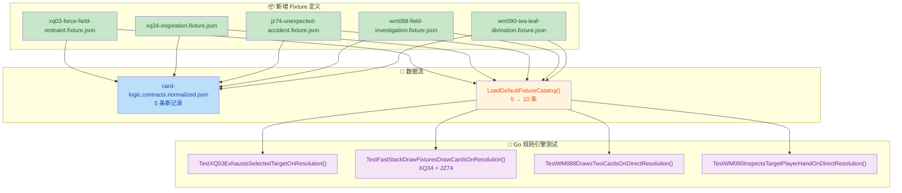

## 1. 高层摘要 (TL;DR)

* **影响范围：** 🟡 **中等** — 将 5 张新卡牌（XQ03、XQ34、JZ74、WM088、WM090）接入 Go 规则引擎的 fixture catalog，覆盖 `exhaust`、`drawCards`、`inspectHand` 三种 effect kind，并补充对应的端到端引擎测试。
* **核心变更：**
  - ✅ 新增 5 张卡牌的 fixture JSON 定义文件
  - ✅ 更新 normalized contract 输出，注册 5 条新卡牌记录
  - ✅ Fixture catalog 断言从 5 → 10，新增 WM090 查找验证
  - ✅ 新增 4 个 Go 规则引擎集成测试，覆盖 exhaust / draw / draw×2 / inspectHand
  - 📝 文档同步更新：批次命名、卡牌清单、effect kind 覆盖列表

---

## 2. 可视化总览

---

## 3. 详细变更分析

### 3.1 📦 新增卡牌 Fixture 定义

在 `shared/contracts/fixtures/` 下新增 5 个 fixture JSON 文件，每张卡牌均为 **纯 DSL 可执行**（`pureDSLExecutable: true`，无 script 依赖）。

| Card ID | 卡牌名称 | Speed | Target Kinds | requiresStack | Effect Kind | Effect 细节 |
|---------|---------|-------|-------------|---------------|-------------|------------|
| **XQ03** | 力场束缚 | `fast` | `character` | ✅ 是 | `exhaust` | 对选中目标执行 `exhaust` |
| **XQ34** | 灵感 | `fast` | _(无)_ | ✅ 是 | `drawCards` | 控制者抽 1 张 |
| **JZ74** | 意外事故 | `fast` | _(无)_ | ✅ 是 | `drawCards` | 控制者抽 1 张 |
| **WM088** | 现场调查 | `slow` | _(无)_ | ❌ 否 | `drawCards` | 控制者抽 2 张（直接结算） |
| **WM090** | 茶叶占卜法 | `slow` | `player` | ❌ 否 | `inspectHand` | 查看目标玩家手牌 |

> **来源文件：** `shared/contracts/fixtures/*.fixture.json`

### 3.2 🔄 Normalized Contract 更新

**文件：** `shared/contracts/normalized/card-logic.contracts.normalized.json`

- `generatedAt` 时间戳更新至 `2026-03-31T17:59:16.565Z`
- 新增 5 条 `records` 条目，字段结构与已有记录一致，包含 `cardId`、`cardName`、`sourcePath`、`logicId`、`speed`、`targetKinds`、`requiresStack`、`durationKind`、`effectKinds` 等

### 3.3 🧪 Go 规则引擎测试

**文件：** `server/pkg/rules/engine_test.go`

新增 5 个测试常量和 4 个测试函数：

| 测试函数 | 验证场景 | 结算方式 | 断言要点 |
|---------|---------|---------|---------|
| `TestXQ03ExhaustsSelectedTargetOnResolution` | XQ03 对选中角色 exhaustion | 入栈 → resolve | queue 时目标未 exhausted；resolve 后目标已 exhausted |
| `TestFastStackDrawFixturesDrawCardsOnResolution` | XQ34 / JZ74 抽牌 | 入栈 → resolve | 表驱动测试，resolve 后手牌数 = 1，已入 `Resolved` 列表 |
| `TestWM088DrawsTwoCardsOnDirectResolution` | WM088 直接抽 2 张 | 直接结算 | 无需入栈，`Resolved` 数 = 1，手牌数 = 2 |
| `TestWM090InspectsTargetPlayerHandOnDirectResolution` | WM090 查看对手手牌 | 直接结算 | 目标手牌 `InspectedBy` 含 P1；P1 视图中可见 2 张对手手牌 |

### 3.4 🔧 Fixture Catalog 测试更新

**文件：** `server/internal/contracts/loader_test.go` & `tools/fixture-tools/src/contracts.test.ts`

| 变更点 | 旧值 | 新值 |
|--------|------|------|
| Catalog 长度断言 (Go) | `5` | `10` |
| Fixture 数量断言 (TS) | `toHaveLength(5)` | `toHaveLength(10)` |
| Card ID 列表断言 (TS) | 5 个 BQ 系列 | 新增 `JZ74, WM088, WM090, XQ03, XQ34` |
| 新增 WM090 查找验证 (Go) | _(无)_ | 验证 `catalog.Find("WM090")` 成功且名称为 `"茶叶占卜法"` |

### 3.5 📝 文档更新

**文件：** `docs/GO_CARD_FIXTURE_ENTRYPOINT_2026-03-31.md`

- 章节标题 `First Batch` → `Current Batch`
- 卡牌清单新增 5 张
- 新增 effect kind 覆盖说明：`exhaust`、`drawCards`、`inspectHand`、`dealDamage`、`addKeyword`、`modifyStat`

---

## 4. 影响与风险评估

### ⚠️ 潜在风险

- **低风险** — 本次变更为纯增量操作（新增 fixture + 测试），未修改任何已有逻辑代码
- WM090 的 `inspectHand` effect 涉及 **多玩家视图隔离**（`InspectedBy` 字段 + `Views.Players` 投影），需确认投影引擎在多客户端场景下正确过滤可见性

### ✅ 测试建议

| 场景 | 验证要点 |
|------|---------|
| XQ03 exhaust 目标 | 目标在 queue 阶段保持 ready，resolve 后变为 exhausted |
| XQ34 / JZ74 抽牌 | resolve 前手牌不变，resolve 后恰好 +1 |
| WM088 直接结算 | 不经过 stack，直接进入 Resolved，手牌 +2 |
| WM090 查看手牌 | P1 可见 P2 手牌内容，P2 视图不受影响 |
| Catalog 完整性 | 运行 `TestDefaultFixtureCatalogIndexesRealCards` 确认 10 条全部加载 |
| TS 工具链 | 运行 `contracts.test.ts` 确认 normalize + validate 通过 |