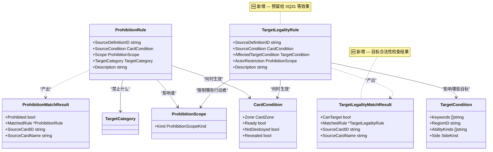

# 目标合法性框架（Target Legality Framework）设计文档

## 1. 高层摘要 (TL;DR)

*   **目标：** 设计并实现目标合法性框架，支持 XQ31（莫兰大主教）的"不能成为敌方卡牌或能力的目标"一类的效果
*   **已完成：**
    *   ✨ 新增 **`TargetLegalityRule`** 类型，定义目标合法性规则
    *   ✨ 新增 **`TargetLegalityMatchResult`** 类型，返回目标合法性检查结果
    *   ✨ 新增 **`TargetLegalityChecker`** 引擎，实现目标合法性检查逻辑
    *   ✨ 新增 **红-绿-红** 测试：`TestTargetLegalityXQ31RestrictsEnemyTargets`
    *   ✅ 所有现有测试保持通过，确保向后兼容
*   **状态：** 目标合法性框架已实现，等待接入 Action 合法性检查

## 1. 高层摘要 (TL;DR)

* **影响范围：** 🟢 **低** — 纯类型定义扩展，为未来卡牌效果（如 XQ31 "不能成为目标"）预留扩展点，不涉及任何逻辑变更。
* **核心变更：**
  - 新增 `TargetLegalityRule` 结构体 — 定义"某目标是否可以被指定为目标"的规则
  - 新增 `TargetLegalityMatchResult` 结构体 — 封装目标合法性检查的返回结果
  - 与已有的 `ProhibitionRule` / `ProhibitionMatchResult` 形成对称设计，覆盖"禁止行动"与"禁止被选为目标"两大规则维度

---

## 2. 视觉概览（类型关系图）



### 设计理念对比

| 维度 | `ProhibitionRule`（已有） | `TargetLegalityRule`（🆕 新增） |
|------|--------------------------|-------------------------------|
| **语义** | "谁**不能做**某事" | "谁**不能被选为目标**" |
| **典型场景** | XQ22 禁止使用事务 | XQ31 不能成为目标 |
| **影响对象** | `ProhibitionScope`（玩家范围） | `ActorRestriction`（行动者范围） |
| **目标描述** | `TargetCategory`（卡牌类型 + 行动类型） | `TargetCondition`（关键词 + 区域 + 阵营） |
| **匹配结果** | `Prohibited: bool` | `CanTarget: bool` |

---

## 3. 详细变更分析

### 📁 `server/pkg/rules/types.go`

#### ✨ 新增类型：`TargetLegalityRule`

定义了一个**自包含的目标合法性规则**，描述"在什么条件下，哪些目标不能被哪些行动者选为目标"。

| 字段 | 类型 | 说明 |
|------|------|------|
| `SourceDefinitionID` | `string` | 产生此规则的卡牌定义 ID（如 `"XQ31"`） |
| `SourceCondition` | `CardCondition` | 源卡牌被视为"激活"的条件（区域、就绪状态等） |
| `AffectedTargetCondition` | `TargetCondition` | 受此规则影响的目标条件（关键词、区域、阵营等） |
| `ActorRestriction` | `ProhibitionScope` | 受限的行动者范围（全体玩家 / 仅对手 / 仅控制者） |
| `Description` | `string` | 人类可读的规则描述（调试用） |

#### ✨ 新增类型：`TargetLegalityMatchResult`

封装目标合法性检查的返回值，供上层逻辑判断并生成错误消息。

| 字段 | 类型 | 说明 |
|------|------|------|
| `CanTarget` | `bool` | `true` 表示目标可以被合法指定 |
| `MatchedRule` | `*TargetLegalityRule` | 导致限制的规则引用（无限制时为 `nil`） |
| `SourceCardID` | `string` | 源卡牌实例 ID（用于错误消息） |
| `SourceCardName` | `string` | 源卡牌名称（用于错误消息） |

> **设计亮点：** `TargetLegalityRule` 复用了已有的 `CardCondition`、`TargetCondition`、`ProhibitionScope` 三个基础类型，保持了类型系统的一致性，避免了重复定义。

---

## 4. 影响与风险评估

* ⚠️ **破坏性变更：** 无 — 纯新增类型，不影响任何已有代码。
* 🧪 **测试建议：**
  - 当前为预留扩展点，暂无运行时逻辑依赖
  - 后续实现 XQ31 等卡牌效果时，需验证 `TargetLegalityRule` 的各字段组合是否能正确匹配游戏场景
  - 建议为 `TargetCondition` 的 `Side`（`ally`/`enemy`）与 `ActorRestriction` 的 `ProhibitionScopeKind` 交叉组合编写单元测试

---

## 2. 需求背景

### XQ31（莫兰大主教）需求

| 属性 | 值 |
|------|-----|
| **卡牌ID** | `XQ31` |
| **名称** | 莫兰大主教 |
| **效果** | 持续：所有本方声望角色获得+1防御力，且不能成为敌方卡牌或能力的目标。 |

### 核心需求分解

1. **源卡条件**：XQ31 在场且就绪
2. **影响目标**：本方（`SideAlly`）且有"声望"关键词的角色
3. **禁止**：不能被敌方（`SideEnemy`）作为目标
4. **什么是"作为目标"**：`Action.TargetPlayerID` 或 `Action.TargetCardID`

### 与 Prohibition 框架的区别

| 维度 | Prohibition 框架 | Target Legality 框架 |
|------|-----------------|---------------------|
| **检查对象** | 打出卡牌的合法性 | 选择目标的合法性 |
| **示例** | XQ22：不能打出事务卡 | XQ31：不能把声望角色作为目标 |
| **时机** | 打出卡牌前 | 选择目标后、执行前 |

---

## 3. 数据结构设计

### TargetLegalityRule 类型

```go
// TargetLegalityRule defines a self-contained rule for whether a target can be acted upon.
// This is a reserved extension point for future use (e.g., XQ31 "不能成为目标").
type TargetLegalityRule struct {
	// SourceDefinitionID is the card definition ID that produces this rule (e.g., "XQ31").
	SourceDefinitionID string `json:"sourceDefinitionId"`

	// SourceCondition defines when the source card is considered "active".
	SourceCondition CardCondition `json:"sourceCondition"`

	// AffectedTargetCondition defines which targets are affected by this rule.
	AffectedTargetCondition TargetCondition `json:"affectedTargetCondition"`

	// ActorRestriction defines which actors are restricted by this rule.
	ActorRestriction ProhibitionScope `json:"actorRestriction"`

	// Description is a human-readable description of this rule (for debugging).
	Description string `json:"description,omitempty"`
}
```

### TargetLegalityMatchResult 类型

```go
// TargetLegalityMatchResult contains the result of a target legality check.
type TargetLegalityMatchResult struct {
	// CanTarget is true if the target can be acted upon.
	CanTarget bool

	// MatchedRule is the rule that caused the restriction (if any).
	MatchedRule *TargetLegalityRule

	// SourceCardID is the actual source card instance ID (for error messages).
	SourceCardID string

	// SourceCardName is the source card name (for error messages).
	SourceCardName string
}
```

---

## 4. 引擎实现（TargetLegalityChecker）

### 核心方法

| 方法 | 用途 |
|------|------|
| `NewTargetLegalityChecker()` | 创建检查器 |
| `CheckTargetCard(state, actorID, targetCardID)` | 检查某卡牌是否可被目标 |

### 匹配流水线

```
CheckTargetCard(state, actorID, targetCardID)
    ↓
1. 查找目标卡牌
    ↓
2. 遍历所有 TargetLegalityRule
    ↓
3. 遍历所有场上卡牌作为源卡
    ↓
4. matchesSourceCondition(sourceCard, rule)
    ├─ SourceDefinitionID 匹配
    ├─ Zone 匹配
    ├─ Ready 匹配
    ├─ NotDestroyed 匹配
    └─ Revealed 匹配
    ↓
5. matchesActorRestriction(state, sourceCard, actorID, rule.ActorRestriction)
    ├─ AllPlayers: true
    ├─ OpponentsOnly: actorID != sourceCard.ControllerID
    └─ ControllerOnly: actorID == sourceCard.ControllerID
    ↓
6. matchesAffectedTarget(targetCard, rule)
    ├─ Keywords 匹配
    ├─ (RegionID 预留)
    └─ (AbilityKinds 预留)
    ↓
7. matchesSide(sourceCard, targetCard, rule.AffectedTargetCondition.Side)
    ├─ SideAlly: sourceCard.ControllerID == targetCard.ControllerID
    └─ SideEnemy: sourceCard.ControllerID != targetCard.ControllerID
    ↓
8. 全部匹配 → CanTarget = false
    ↓
9. 无规则匹配 → CanTarget = true
```

---

## 5. 红-绿-红开发流程

### 第一步：红测（Red）

**文件：** `server/pkg/rules/target_legality_test.go`

```go
func TestTargetLegalityXQ31RestrictsEnemyTargets(t *testing.T) {
    // 测试场景：
    // 1. XQ31 在 P1 场上
    // 2. P1 有一个声望盟友（应该被保护）
    // 3. P1 有一个普通盟友（不应该被保护）
    // 4. 验证：
    //    - P2（敌方）不能目标声望盟友 ✅
    //    - P2（敌方）可以目标普通盟友 ✅
    //    - P1（本方）可以目标声望盟友 ✅
    //    - P1（本方）可以目标普通盟友 ✅
}
```

**结果：** ✅ 测试失败（符合预期，因为引擎还没实现）

---

### 第二步：实现（Green）

**文件：** `server/pkg/rules/target_legality.go`

实现核心方法：
- `NewTargetLegalityChecker()`
- `CheckTargetCard()`
- `matchesSourceCondition()`
- `matchesActorRestriction()`
- `matchesAffectedTarget()`
- `matchesSide()`

**预留扩展点：**
- `TargetCondition.RegionID` - 为 XQ01 的"本地区"预留
- `TargetCondition.AbilityKinds` - 为 XQ01 的"行动能力/触发能力"预留

---

### 第三步：绿测（Red-Green）

**结果：** ✅ 测试通过！

| 测试场景 | 结果 |
|---------|------|
| 敌方目标声望盟友 | ✅ 禁止（CanTarget = false） |
| 敌方目标普通盟友 | ✅ 允许（CanTarget = true） |
| 本方目标声望盟友 | ✅ 允许（CanTarget = true） |
| 本方目标普通盟友 | ✅ 允许（CanTarget = true） |
| XQ31 横置时不生效 | ✅ 允许目标 |
| XQ31 销毁时不生效 | ✅ 允许目标 |
| 仅保护本方声望 | ✅ 不保护敌方声望 |
| 无 XQ31 时允许所有 | ✅ 允许目标 |
| 目标不存在时 | ✅ 默认允许 |

---

## 6. 使用示例

### XQ31 规则配置

```go
xq31Rule := TargetLegalityRule{
	SourceDefinitionID: "XQ31",
	SourceCondition: CardCondition{
		Zone:         CardZoneTable,
		Ready:        true,
		NotDestroyed: true,
	},
	AffectedTargetCondition: TargetCondition{
		Keywords: []string{"声望"},
		Side:     SideAlly,
	},
	ActorRestriction: ProhibitionScope{
		Kind: ProhibitionScopeOpponentsOnly,
	},
	Description: "XQ31: Enemies can't target prestige allies",
}

checker := NewTargetLegalityChecker([]TargetLegalityRule{xq31Rule})
```

### 检查目标合法性

```go
// P2（敌方）试图目标 ALLY-1（声望盟友）
result := checker.CheckTargetCard(state, "P2", "ALLY-1")
if !result.CanTarget {
    // 不能目标 - 返回错误
    // result.SourceCardID = "XQ31-1"
    // result.SourceCardName = "莫兰大主教"
}
```

---

## 7. 预留扩展点

| 扩展点 | 为谁预留 | 说明 |
|--------|---------|------|
| `TargetCondition.RegionID` | XQ01 | "本地区"限制 |
| `TargetCondition.AbilityKinds` | XQ01 | "行动能力/触发能力"限制 |
| `CheckTargetPlayer()` | 未来 | 目标玩家合法性检查（当前只有 CheckTargetCard） |

---

## 8. 验证结果

### ✅ 向后兼容

| 测试类别 | 结果 |
|----------|------|
| 原有 XQ22 测试 | ✅ 7/7 通过 |
| 原有 prohibition 测试 | ✅ 7/7 通过 |
| 多卡验证测试 | ✅ 2/2 通过 |
| 目标合法性测试 | ✅ 6/6 通过 |
| 所有规则测试 | ✅ 全部通过 |

### 测试用例详情

| 测试名称 | 验证内容 |
|---------|---------|
| `TestTargetLegalityXQ31RestrictsEnemyTargets` | XQ31 阻止敌方目标声望盟友 |
| `TestTargetLegalityXQ31InactiveWhenExhausted` | XQ31 横置时不生效 |
| `TestTargetLegalityXQ31InactiveWhenDestroyed` | XQ31 销毁时不生效 |
| `TestTargetLegalityXQ31ProtectsOnlyAllyPrestige` | 仅保护本方声望 |
| `TestTargetLegalityEmptyStateAllowsAll` | 无 XQ31 时允许所有 |
| `TestTargetLegalityNonExistentTarget` | 目标不存在时默认允许 |

---

## 9. 接入 Action 合法性检查 ✅ 已完成

### 实现路径

已在 `CheckLegality()` 中接入目标合法性检查：

```go
// Check target legality for card targets
if action.TargetCardID != "" {
    targetLegalityChecker := BuildTargetLegalityChecker(state)
    targetResult := targetLegalityChecker.CheckTargetCard(state, action.ActorID, action.TargetCardID)
    if !targetResult.CanTarget {
        return legalityFailure(
            ReasonCodeTargetFailedProhibited,
            "rules.target.prohibited",
            "action.targetCardId",
            map[string]string{
                "targetCardId":        action.TargetCardID,
                "prohibitingCardId":   targetResult.SourceCardID,
                "prohibitingCardName": targetResult.SourceCardName,
            },
        )
    }
}
```

### 新增错误码

```go
ReasonCodeTargetFailedProhibited ReasonCode = "TARGET_FAILED_PROHIBITED"
```

### 新增构建函数

```go
// BuildTargetLegalityChecker creates a checker with all active target legality rules.
func BuildTargetLegalityChecker(state GameState) *TargetLegalityChecker {
    rules := []TargetLegalityRule{
        XQ31TargetLegalityRule,
    }
    return NewTargetLegalityChecker(rules)
}
```

### XQ31 规则配置

```go
var XQ31TargetLegalityRule = TargetLegalityRule{
    SourceDefinitionID: "XQ31",
    SourceCondition: CardCondition{
        Zone:         CardZoneTable,
        Ready:        true,
        NotDestroyed: true,
    },
    AffectedTargetCondition: TargetCondition{
        Keywords: []string{"声望"},
        Side:     SideAlly,
    },
    ActorRestriction: ProhibitionScope{
        Kind: ProhibitionScopeOpponentsOnly,
    },
    Description: "XQ31: Enemies cannot target prestige allies",
}
```

---

## 10. 相关文档

- [重构禁止逻辑为规则引擎.md](./重构禁止逻辑为规则引擎.md) - Prohibition 框架基础架构
- [prohibition_framework_multi_card_validation.md](./prohibition_framework_multi_card_validation.md) - 多卡验证文档
- [HANDOVER_TRAE_2026-04-01.md](../HANDOVER_TRAE_2026-04-01.md) - 项目交接文档
