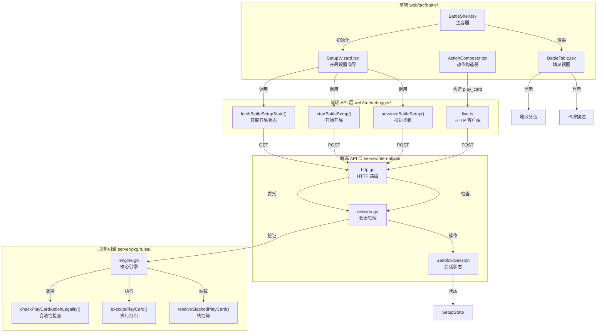
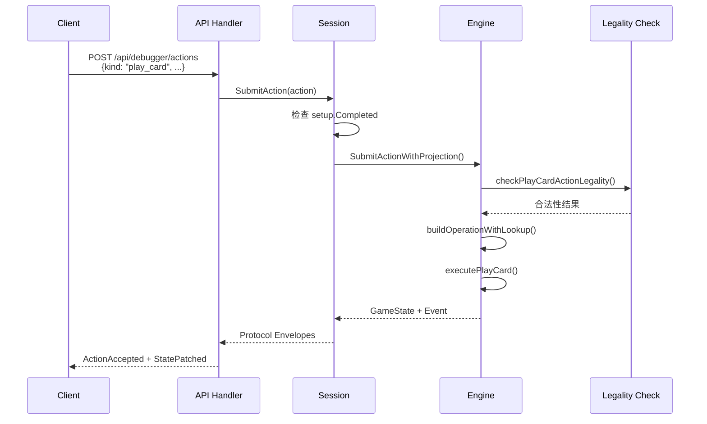

## 1. 高层摘要 (TL;DR)

*   **影响范围**: **高** - 引入了完整的开局设置流程和卡牌打出机制，是游戏可玩性的关键里程碑
*   **核心变更**:
    *   🎯 新增 **开局设置向导**（Setup Wizard），包含7个步骤的状态管理
    *   🃏 实现了 **`play_card` 动作**，支持从手牌部署角色/附属/事务到地区
    *   🌐 扩展了 **HTTP API**，新增 `/api/battle/setup/*` 三个端点
    *   📝 完善了 **规则引擎**，添加卡牌打出的合法性检查和执行逻辑
    *   🧪 更新了 **E2E测试**，覆盖完整的开局设置流程

---

## 2. 可视化概览 (代码与逻辑映射)



---

## 3. 详细变更分析

### 📋 组件一：开局设置流程 (Setup Flow)

#### **变更说明**
引入了完整的开局设置状态机，包含7个步骤的线性流程，阻塞对战动作直到设置完成。

#### **新增 API 端点**

| 端点 | 方法 | 说明 | 请求体 | 响应 |
|------|------|------|--------|------|
| `/api/battle/setup/state` | GET | 获取当前开局状态 | - | `SetupState` |
| `/api/battle/setup/start` | POST | 开始开局设置 | `SetupStartInput` | `SetupState` |
| `/api/battle/setup/advance` | POST | 推进到下一步 | `SetupAdvanceInput` | `SetupState` |

#### **SetupState 数据结构**

| 字段 | 类型 | 说明 |
|------|------|------|
| `active` | boolean | 设置流程是否激活 |
| `completed` | boolean | 是否已完成所有步骤 |
| `currentStep` | number | 当前步骤 (1-7) |
| `steps` | `SetupStepStatus[]` | 所有步骤的状态 |
| `p1Societies` / `p2Societies` | `string[]` | 玩家选择的派系 |
| `markerPoolReady` | boolean | 标志池是否就绪 |
| `worldDeckCount` | number | 世界牌库数量 |
| `playerDeckCount` | `Record<string, number>` | 玩家牌库数量 |
| `startingPlayerId` | `string` | 先手玩家ID |

#### **关键逻辑** (Source: `server/internal/api/session.go`)
```go
// SubmitAction 现在会检查 setup 状态
if session.setup.Active && !session.setup.Completed {
    return nil, errSetupNotCompleted
}
```

---

### 🃏 组件二：卡牌打出机制 (Play Card Action)

#### **变更说明**
实现了从手牌打出卡牌的核心机制，支持明置/暗置部署和目标地区选择。

#### **新增 Action/Operation 类型**

| 类型 | 常量 | 说明 |
|------|------|------|
| `ActionKind` | `ActionKindPlayCard` | 动作类型：打出卡牌 |
| `OperationKind` | `OperationKindPlayCard` | 操作类型：打出卡牌 |
| `EventKind` | `EventKindCardPlayed` | 事件类型：卡牌已打出 |

#### **Action 扩展字段**

| 字段 | 类型 | 说明 |
|------|------|------|
| `targetRegionCardId` | `string?` | 目标地区卡ID |
| `playMode` | `string?` | 部署方式：`face_up` / `face_down` |

#### **前端 UI 新增字段**

| 字段 | 标签 | 选项 |
|------|------|------|
| `playMode` | 部署方式 | 明置 / 暗置 |
| `targetRegionCardId` | 部署地区 | 地区卡列表 |

#### **规则引擎流程** (Source: `server/pkg/rules/engine.go`)



---

### 🎨 组件三：前端 UI 本地化与增强

#### **变更说明**
全面中文化界面文本，并增强卡牌/地区信息的展示。

#### **文本本地化对照表**

| 原文 | 新译文 |
|------|--------|
| `Action Kind` | 动作类型 |
| `Source Card` | 来源卡牌 |
| `Target Card` | 目标卡牌 |
| `Pass Priority` | 让过优先权 |
| `Advance Phase` | 推进阶段 |
| `Play Card` | 打出卡牌 |
| `Game over. Winner: P1` | 对局结束，胜者：P1 |
| `Live server unavailable` | 实时服务不可用 |

#### **新增 UI 元素**

| 组件 | 新增内容 | 说明 |
|------|----------|------|
| `BattleTable` | 地区势力值/分值显示 | 显示 `influence` 和 `regionScore` |
| `BattleTable` | 地区说明折叠面板 | 可展开查看 `description` 和 `faq` |
| `ActionComposer` | 部署方式选择器 | 明置/暗置切换 |
| `ActionComposer` | 部署地区选择器 | 目标地区选择 |

---

### 📝 组件四：文档与规划更新

#### **变更说明**
在 `docs/NEXT_GEN_RULE_PLAN.md` 中添加了 8 个延后项规划。

| ID | 名称 | 延后原因 |
|----|------|----------|
| PN-BASE-001 | 费用子系统 | 当前优先基础包可玩闭环 |
| PN-BASE-002 | 构筑限制验证 | 当前原型优先验证战斗主回路 |
| PN-BASE-003 | 牌库规模规则 | 当前先保证可打牌与可结算 |
| PN-BASE-004 | 忠诚/颜色前置条件 | 需要额外状态字段与关键词解释器 |
| PN-BASE-005 | 扩展系列支持 | 基础包优先 |
| PN-BASE-006 | 互洗/先手决定历史 | 涉及多人交互，本轮先落地服务端语义 |
| PN-BASE-007 | 地区信息UI | 当前以文本与折叠说明承载 |
| PN-BASE-008 | 基础包完整卡义 | 当前只覆盖对战主通路子集 |

---

## 4. 影响与风险评估

### ⚠️ 破坏性变更

1.  **API 行为变更**: 
    *   在 setup 未完成前，`/api/debugger/actions` 现在返回 `409 Conflict` 而非接受动作
    *   前端必须先完成 setup 流程才能进行对战

2.  **数据结构扩展**:
    *   `Action` 和 `Operation` 新增了 `targetRegionCardId` 和 `playMode` 字段
    *   `CardView` 新增了 `description`、`faq`、`regionScore` 字段

### 🧪 测试建议

| 测试场景 | 验证点 |
|----------|--------|
| **Setup 流程** | 7个步骤能正常推进，最终 `completed=true` |
| **Setup 阻塞** | Setup 未完成时提交对战动作应返回 `409` |
| **Play Card 合法性** | 从手牌打出角色到地区应成功 |
| **Play Card 暗置** | `playMode=face_down` 应正确设置 `faceDown=true` |
| **地区分值显示** | `regionScore` 应正确显示在牌桌视图 |
| **E2E 完整流程** | Setup → Play Card → Attack → Investigation → Finish |

### 🔍 潜在风险

1.  **Setup 状态同步**: 前端和后端的 setup 状态可能不一致，需要确保状态刷新机制可靠
2.  **Play Card 边界**: 当前实现了基础打出逻辑，但费用、前置条件等规则尚未接入（见 PN-BASE-001/004）
3.  **测试隔离**: Playwright 配置改为 `reuseExistingServer: false` 可能增加测试运行时间

---

## 5. 代码片段精选

### Setup 状态检查 (Source: `server/internal/api/session.go`)
```go
func (session *SandboxSession) SubmitAction(action rules.Action) ([]protocolEnvelope, error) {
    session.mu.Lock()
    defer session.mu.Unlock()
    
    // 新增：检查 setup 是否完成
    if session.setup.Active && !session.setup.Completed {
        return nil, errSetupNotCompleted
    }
    
    // ... 原有逻辑
}
```

### Play Card 操作构建 (Source: `server/pkg/rules/engine.go`)
```go
case ActionKindPlayCard:
    operation.Kind = OperationKindPlayCard
    operation.CardID = action.CardID
    operation.TargetRegionCardID = action.TargetRegionCardID
    operation.PlayMode = action.PlayMode
    operation.Label = "play_card"
    
    // 查找卡牌定义并设置 Source
    if cardIndex := findCardIndex(state, action.CardID); cardIndex >= 0 {
        card := state.Board.Cards[cardIndex]
        if card.Kind == CardKindEvent || card.Kind == CardKindAsset {
            source, found, err := lookupCardOperationSourceWithLookup(sourceLookup, lookupID)
            if found {
                operation.Source = &source
                if card.Kind == CardKindEvent {
                    operation.RequiresStack = source.RequiresStack
                }
            }
        }
    }
```

### 前端 Setup 初始化 (Source: `web/src/battle/BattleShell.tsx`)
```typescript
async function initializeSetup() {
  setSetupLoading(true);
  setSetupErrorMessage("");
  
  try {
    const setup = await fetchBattleSetupState();
    setSetupState(setup);
    setSetupLoading(false);
    
    // 如果 setup 已完成，加载对战消息
    if (setup.active && setup.completed) {
      await reloadLiveMessages(dispatch, fallbackMessageSets);
    }
  } catch {
    setSetupLoading(false);
    setSetupErrorMessage("无法连接服务端，已切换离线协议演示。");
    // ... 回退逻辑
  }
}
```