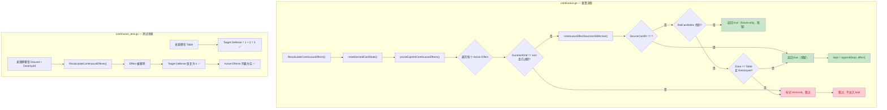

## 1. 高层摘要 (TL;DR)

- **影响：** 🟢 **中** — 为持续效果（continuous effects）系统补齐了"来源牌离场时自动清理"的最小语义闭环。
- **关键变更：**
  - ✨ 新增 `continuousEffectSourceIsStillActive()` 函数，在 prune 阶段检测来源牌是否仍在场上
  - ✨ `pruneExpiredContinuousEffects()` 增加来源牌活性检查，离场/销毁的来源对应的 effect 会被自动移除
  - ✅ 新增回归测试 `TestContinuousEffectIsRemovedWhenSourceLeavesTable`，覆盖来源在场上 → 离场的完整生命周期
  - 📝 更新 `NEXT_GEN_RULE_PLAN.md`，标记"持续效果来源离场清理"为已完成

---

## 2. 可视化概览（逻辑流）



---

## 3. 详细变更分析

### 3.1 🧠 核心逻辑 — `continuous.go`

**变更内容：** 在持续效果的重算 prune 阶段，新增来源牌活性检测，确保来源牌离场后其产生的效果被自动清理。

#### 新增函数：`continuousEffectSourceIsStillActive()`

| 判定条件 | 返回值 | 说明 |
|---------|--------|------|
| `SourceCardID == ""` | `true` | 无来源卡的效果（如全局效果），始终保留 |
| `findCardIndex()` 返回 `-1` | `true` | 来源卡不在 `board.cards` 中（如 fixture-only 卡牌 `BQ022`），不误判为失效 |
| `Zone == CardZoneTable && !Destroyed` | `true` | 来源牌仍在场上且未被销毁，效果保留 |
| 其他（离场或已销毁） | `false` | 来源牌已离场，效果将被移除 |

#### 修改函数：`pruneExpiredContinuousEffects()`

在原有的回合过期检查之后，新增一行调用：

```go
if !continuousEffectSourceIsStillActive(*state, effect) {
    removed = true
    continue
}
```

> **Source:** `server/pkg/rules/continuous.go` 第 159-162 行

---

### 3.2 ✅ 测试 — `continuous_test.go`

**新增测试：** `TestContinuousEffectIsRemovedWhenSourceLeavesTable`

| 测试阶段 | 操作 | 预期结果 |
|---------|------|---------|
| ① 来源在场 | Source 在 `CardZoneTable`，Effect 给 Target +2 Defense | Target `EffectiveStats.Defense == 3`（printed 1 + buff 2） |
| ② 来源离场 | Source 移至 `CardZoneDiscard` 且 `Destroyed = true` | — |
| ③ 重算清理 | 调用 `RecalculateContinuousEffects()` | Target `EffectiveStats.Defense == 1`（恢复 printed），`Active` 列表为空 |

> **Source:** `server/pkg/rules/continuous_test.go` 第 132-189 行

---

### 3.3 📝 文档 — `NEXT_GEN_RULE_PLAN.md`

| 位置 | 旧内容 | 新内容 |
|------|--------|--------|
| 第 21 行 | `持续效果来源离场清理` | `持续效果来源离场清理（已在后续补上）` |
| 第 36 行 | `持续效果来源离场清理仍未接入` | `持续效果来源离场清理当时仍未接入，但已在后续补上` |
| 第 72-91 行 | *(无)* | 新增 `## 2026-04-01 后续补记（continuous source lifecycle）` 完整章节 |

新增章节确认当前**最小闭环已全部完成**：
- ✅ 地区争夺
- ✅ 得分
- ✅ 胜利产生
- ✅ 新回合主动玩家轮转
- ✅ 胜利后停止继续提交动作
- ✅ **continuous effects 来源离场清理**（本次新增）

---

## 4. 影响与风险评估

### ⚠️ 潜在风险

- **Fixture-only 卡牌保护：** 当前对 `findCardIndex()` 返回 `-1` 的情况直接返回 `true`（保留效果）。这意味着如果一张真实卡牌因 bug 从 `board.cards` 中丢失，其效果也会被保留而非清理。这是一个**有意的设计权衡**，但未来可能需要更精确的区分机制。
- **`Destroyed` 标志依赖：** `resetDerivedCardState()` 中会根据 `Zone == CardZoneDiscard` 设置 `Destroyed = true`，而 `continuousEffectSourceIsStillActive()` 同时检查 `Zone` 和 `Destroyed`。如果未来有"在 Discard 但未 Destroyed"的场景，需确认语义是否正确。

### 🧪 建议测试场景

1. **来源牌被弃置（Discard）** — 效果是否正确移除 ✅（已覆盖）
2. **来源牌被销毁（Destroyed）** — 效果是否正确移除 ✅（已覆盖）
3. **来源牌在手牌/牌库中** — 不应产生 continuous effect（当前设计由 `registerContinuousEffect` 保证，与本次变更无关）
4. **Fixture-only 来源（如 `BQ022`）** — 确认其效果不会被误判为失效
5. **多个效果共享同一来源** — 来源离场后所有相关效果是否全部被清理
6. **来源离场触发清理后，是否正确触发 `requestContinuousRecalculation`** — 确保下游状态同步更新