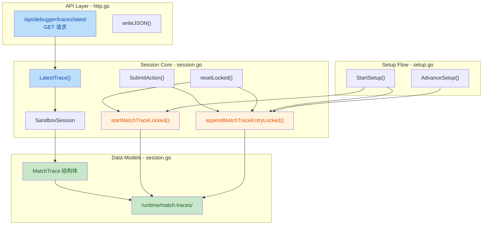
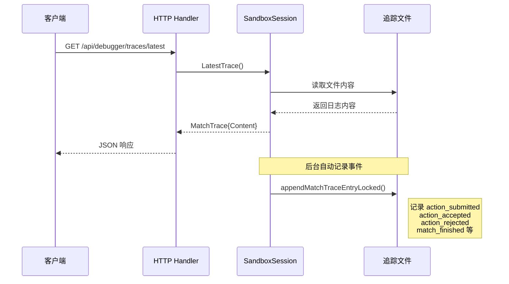

## 1. 高层摘要 (TL;DR)

*   **影响范围:** **中等** - 为沙盒会话添加了完整的调试追踪功能，用于记录游戏过程中的详细事件流
*   **核心变更:**
    *   ✨ 新增 `MatchTrace` 数据结构和 `/api/debugger/traces/latest` API 端点
    *   📝 在游戏动作提交、设置流程、会话重置等关键节点自动记录追踪日志
    *   🗂️ 追踪日志以 Markdown 格式持久化到 `runtime/match-traces/` 目录
    *   🧪 添加完整的单元测试覆盖

---

## 2. 可视化概览 (代码与逻辑映射)



**追踪事件流程图:**



---

## 3. 详细变更分析

### 📦 数据结构变更

#### 新增类型定义 (Source: `server/internal/api/session.go`)

| 类型/字段 | 类型 | 说明 |
|-----------|------|------|
| `MatchTrace` | `struct` | 追踪日志元数据结构 |
| `GameID` | `string` | 游戏ID |
| `StartedAt` | `string` | 追踪开始时间 (RFC3339) |
| `UpdatedAt` | `string` | 最后更新时间 |
| `Path` | `string` | 追踪文件绝对路径 |
| `EntryCount` | `int` | 追踪条目数量 |
| `Content` | `string` | 完整文件内容 |

#### 配置选项扩展

| 字段 | 类型 | 默认值 | 说明 |
|------|------|--------|------|
| `TraceDirectory` | `string` | `"runtime/match-traces"` | 追踪日志存储目录 |

---

### 🌐 API 端点变更 (Source: `server/internal/api/http.go`)

| 端点 | 方法 | 功能 | 响应码 |
|------|------|------|--------|
| `/api/debugger/traces/latest` | `GET` | 获取最新的游戏追踪日志 | `200` (成功) / `404` (未找到) |

**响应结构:**
```json
{
  "gameId": "game-sandbox-live",
  "startedAt": "2026-04-03T10:00:00Z",
  "updatedAt": "2026-04-03T10:30:00Z",
  "path": "/absolute/path/to/runtime/match-traces/game-sandbox-live-20260403T100000Z.log",
  "entryCount": 15,
  "content": "# Match Trace\n\n..."
}
```

---

### 🔧 核心逻辑变更

#### 3.1 会话初始化 (Source: `server/internal/api/session.go`)

**变更点:** 在 `NewSandboxSessionWithOptions` 中添加追踪目录解析

```go
// 新增路径解析逻辑
traceDirectory := strings.TrimSpace(options.TraceDirectory)
if traceDirectory == "" {
    traceDirectory = defaultMatchTraceDirectory
}
traceDirectory = resolveSandboxPath(traceDirectory)  // 自动解析为绝对路径
```

**新增辅助函数:**
- `resolveSandboxPath()`: 将相对路径转换为基于仓库根目录的绝对路径
- `detectRepositoryRoot()`: 通过查找 `go.mod` 文件检测仓库根目录

---

#### 3.2 动作提交追踪 (Source: `server/internal/api/session.go`)

**变更点:** 在 `SubmitAction()` 方法中添加多个追踪点

| 追踪时机 | 事件类型 | 记录内容 |
|---------|---------|---------|
| 动作提交前 | `action_submitted` | 动作ID、执行者、类型、目标等 |
| 动作被拒绝 | `action_rejected` | 拒绝原因码、消息、上下文 |
| 动作被接受 | `action_accepted` | 接受的动作、操作、事件 |
| 比赛结束 | `match_finished` | 获胜者、结束原因、报告路径 |

---

#### 3.3 会话重置追踪 (Source: `server/internal/api/session.go`)

**变更点:** 在 `resetLocked()` 中启动新追踪并记录重置事件

```go
// 重置时启动新的追踪文件
if err := session.startMatchTraceLocked(state, "reset"); err != nil {
    session.logError("match_trace_start_failed gameId=%s err=%v", state.GameID, err)
}

// 记录重置事件
session.appendMatchTraceEntryLocked("session_reset", map[string]any{
    "reason": "api.debugger.reset",
}, &session.state)
```

---

#### 3.4 设置流程追踪 (Source: `server/internal/api/setup.go`)

**变更点:** 在设置流程中添加追踪点

| 方法 | 事件类型 | 记录内容 |
|------|---------|---------|
| `StartSetup()` | `setup_started` | 种子、社会选择、上一轮败者 |
| `AdvanceSetup()` | `setup_advanced` | 当前步骤、完成状态、牌组数量 |

---

### 📝 追踪文件格式 (Source: `server/internal/api/session.go`)

追踪日志采用 **Markdown** 格式，结构如下：

```markdown
# Match Trace

- Game ID: game-sandbox-live
- Started At: 2026-04-03T10:00:00Z
- Trigger: setup_start

## 2026-04-03T10:00:00Z setup_started

```json
{
  "seed": 20260403,
  "p1Societies": [...],
  "p2Societies": [...]
}
```

### State Snapshot

- Revision: 0
- Match: not_started
- Turn: 0
- Active Player: -
- Phase: -
- Resources: -
- Score: -
- Board: P1{hand=0 deck=0 table=0 asset=0 discard=0 score=0} P2{...} regions=0 hiddenTableCards=0
```

**新增辅助函数:**
- `renderTraceStateSnapshot()`: 渲染游戏状态快照
- `traceResourceSummary()`: 生成资源摘要
- `traceBoardSummary()`: 生成棋盘摘要

---

### 🧪 测试覆盖 (Source: `server/internal/api/http_test.go`, `session_test.go`)

| 测试用例 | 文件 | 验证内容 |
|---------|------|---------|
| `TestLatestTraceEndpointReturnsMostRecentTrace` | `http_test.go` | API端点返回最新追踪 |
| `TestSandboxSessionWritesLiveTraceBeforeMatchFinish` | `session_test.go` | 实时写入追踪日志 |
| `TestSandboxSessionTraceIncludesSetupTransitions` | `session_test.go` | 设置流程追踪记录 |

---

## 4. 影响与风险评估

### ⚠️ 潜在风险

| 风险项 | 严重程度 | 说明 | 缓解措施 |
|--------|---------|------|---------|
| 磁盘空间占用 | 低 | 长时间运行可能产生大量追踪文件 | 已通过 `.gitignore` 排除，建议定期清理 |
| 文件IO性能 | 低 | 每次动作都会追加写入文件 | 写入失败不影响游戏逻辑，仅记录错误日志 |
| 路径解析失败 | 低 | `detectRepositoryRoot()` 可能失败 | 失败时回退到原始路径 |

### ✅ 向后兼容性

- ✅ **无破坏性变更**: 新增功能不影响现有API和数据结构
- ✅ **可选配置**: `TraceDirectory` 为空时使用默认值
- ✅ **容错处理**: 追踪写入失败不会中断游戏流程

### 🧪 建议测试场景

1. **基本功能测试:**
   - 验证 `/api/debugger/traces/latest` 端点返回正确格式
   - 确认追踪文件在 `runtime/match-traces/` 目录生成

2. **事件覆盖测试:**
   - 提交合法动作，验证 `action_accepted` 记录
   - 提交非法动作，验证 `action_rejected` 记录
   - 完成比赛，验证 `match_finished` 记录

3. **边界条件测试:**
   - 追踪目录无写权限时的行为
   - 快速连续提交动作时的文件写入
   - 会话重置后追踪文件是否正确重新创建

4. **性能测试:**
   - 长时间游戏会话的追踪文件大小
   - 高频动作提交时的IO性能影响

---