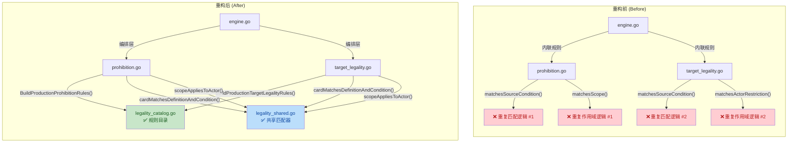
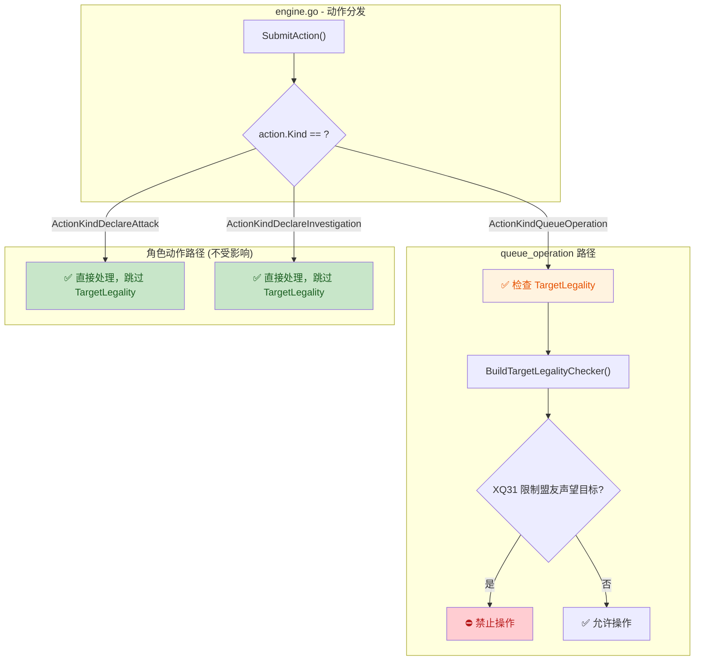

## 1. 高层摘要 (TL;DR)

- **影响**: 🟡 **中等** — 纯重构，不改变游戏玩法语义，但显著改善了规则引擎的代码架构。
- **核心变更**:
  - ✅ 新建 **`legality_catalog.go`**，将 XQ22/XQ31 生产规则集中注册到一个明显的目录文件中
  - ✅ 新建 **`legality_shared.go`**，提取 `cardMatchesDefinitionAndCondition()` 和 `scopeAppliesToActor()` 两个共享匹配器，消除 `prohibition.go` 与 `target_legality.go` 中的重复逻辑
  - ✅ `BuildProhibitionChecker` / `BuildTargetLegalityChecker` 改为调用目录函数，不再内联硬编码规则列表
  - ✅ 新增回归测试：`declare_investigation` 不受 XQ31 影响、生产构建器忽略测试专用规则
  - ✅ 文档同步更新（交接文档 + 路线图）

---

## 2. 可视化概览（代码与逻辑地图）

### 重构前后架构对比



### XQ31 引擎边界锁定流程



---

## 3. 详细变更分析

### 📦 组件一：生产规则目录（新建）

| 文件 | 类型 | 说明 |
|------|------|------|
| `server/pkg/rules/legality_catalog.go` | 新建 | 集中注册 XQ22/XQ31 生产规则 |
| `server/pkg/rules/legality_catalog_test.go` | 新建 | 验证目录返回正确的规则集 |

**变更逻辑**：

将原先散落在 `BuildProhibitionChecker()` 和 `BuildTargetLegalityChecker()` 内部的硬编码规则列表，提取到独立的目录文件中：

- **`BuildProductionProhibitionRules()`** → 返回 `[XQ22ProhibitionRule]`（禁止对手打出"事务"类型卡）
- **`BuildProductionTargetLegalityRules()`** → 返回 `[XQ31TargetLegalityRule]`（限制对手以声望盟友为目标）

> **Source**: `server/pkg/rules/legality_catalog.go`

```go
func BuildProductionProhibitionRules() []ProhibitionRule {
    return []ProhibitionRule{XQ22ProhibitionRule}
}

func BuildProductionTargetLegalityRules() []TargetLegalityRule {
    return []TargetLegalityRule{XQ31TargetLegalityRule}
}
```

---

### 📦 组件二：共享匹配器（新建）

| 文件 | 类型 | 说明 |
|------|------|------|
| `server/pkg/rules/legality_shared.go` | 新建 | 共享的源条件 + 作用域匹配逻辑 |
| `server/pkg/rules/legality_shared_test.go` | 新建 | 覆盖定义匹配、区域、就绪、摧毁、揭示、作用域等场景 |

**变更逻辑**：

`prohibition.go` 和 `target_legality.go` 中存在 **完全重复** 的两段匹配逻辑（各 ~30 行），现已统一提取为两个共享函数：

| 共享函数 | 职责 | 替换位置 |
|----------|------|----------|
| `cardMatchesDefinitionAndCondition(card, definitionID, condition)` | 检查卡牌是否匹配定义 ID + 区域/就绪/未摧毁/揭示条件 | `prohibition.go` 的 `matchesSourceCondition()` + `target_legality.go` 的 `matchesSourceCondition()` |
| `scopeAppliesToActor(sourceCard, actorID, scope)` | 检查作用域是否适用于指定行动者（AllPlayers / OpponentsOnly / ControllerOnly） | `prohibition.go` 的 `matchesScope()` + `target_legality.go` 的 `matchesActorRestriction()` |

> **Source**: `server/pkg/rules/legality_shared.go`

---

### 📦 组件三：现有文件重构（修改）

| 文件 | 变更内容 |
|------|----------|
| `server/pkg/rules/prohibition.go` | `matchesSourceCondition()` → 委托给 `cardMatchesDefinitionAndCondition()`；`matchesScope()` → 委托给 `scopeAppliesToActor()`；`BuildProhibitionChecker()` → 调用 `BuildProductionProhibitionRules()` |
| `server/pkg/rules/target_legality.go` | `matchesSourceCondition()` → 委托给 `cardMatchesDefinitionAndCondition()`；`matchesActorRestriction()` → 委托给 `scopeAppliesToActor()`；`BuildTargetLegalityChecker()` → 调用 `BuildProductionTargetLegalityRules()` |

**净效果**：`prohibition.go` 减少约 **40 行**，`target_legality.go` 减少约 **40 行**，两个文件都变成了薄薄的求值器层。

---

### 📦 组件四：回归测试（新增）

| 测试函数 | 文件 | 验证内容 |
|----------|------|----------|
| `TestDeclareInvestigationIgnoresXQ31TargetLegalityRestriction` | `role_actions_test.go` | P2 的调查员对区域卡发起调查时，即使场上有 P1 的 XQ31 声望角色，动作也应成功 |
| `TestBuildProhibitionCheckerIgnoresTestOnlyRules` | `prohibition_test.go` | 生产构建器不应包含 `TEST01` 等测试专用规则 |

---

### 📦 组件五：文档同步

| 文件 | 变更要点 |
|------|----------|
| `docs/HANDOVER_TRAE_2026-04-01.md` | 新增已完成项：规则目录建立、共享匹配器提取、XQ31 边界锁定；更新待完成项；新增文件树条目 |
| `docs/NEXT_GEN_RULE_PLAN.md` | 新增"第六次补记"，记录 Phase 3 合法性加固成果及下一阶段方向 |
| `.trae/documents/legality-framework-hardening-v1-plan.md` | 中文实施计划（TDD 步骤、文件映射、成功标准） |
| `docs/superpowers/plans/2026-04-01-legality-framework-hardening-v1.md` | 英文详细实施计划（含完整代码模板） |

---

## 4. 影响与风险评估

### ⚠️ 潜在风险

| 风险项 | 级别 | 说明 |
|--------|------|------|
| `matchesActorRestriction` 行为微变 | 🟡 低 | 重构前 `ControllerOnly` 分支缺少 `sourceCard.ControllerID != ""` 的空值守卫，重构后通过共享函数补上了。这是一个 **隐含的 bug 修复**，在正常流程中不会触发，但理论上改变了边界行为 |
| 测试规则泄漏到生产 | 🟢 已缓解 | 新增 `TestBuildProhibitionCheckerIgnoresTestOnlyRules` 专门验证生产构建器不包含测试规则 |

### ✅ 无破坏性变更

- **游戏玩法语义完全不变**：XQ22 仍然禁止对手打出事务卡，XQ31 仍然限制声望盟友目标
- **API 接口不变**：`BuildProhibitionChecker()` 和 `BuildTargetLegalityChecker()` 签名未改
- **数据库/Schema 无变更**

### 🧪 测试建议

1. **运行完整 Go 测试套件**：`go test ./server/...` — 确认所有现有测试通过
2. **验证 XQ22 禁令**：XQ22 就绪时，对手尝试打出事务卡应被禁止
3. **验证 XQ31 目标限制**：XQ31 就绪时，对手不能以声望盟友为 `queue_operation` 目标
4. **验证 `declare_investigation` 不受影响**：即使场上有 XQ31，调查动作应正常执行
5. **验证 `declare_attack` 不受影响**：攻击动作不应触发 TargetLegality 检查
6. **TypeScript 验证**：`cd tools/fixture-tools && npm test` 和 `cd web && npm test`