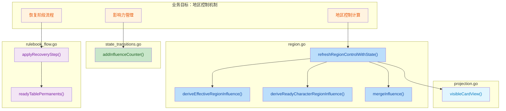
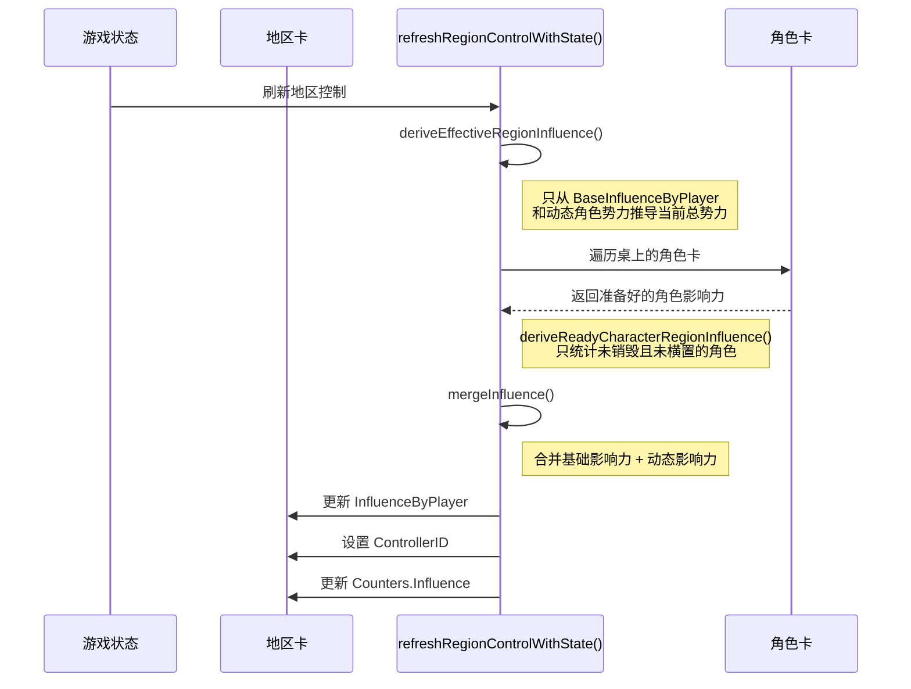

## 1. 高层摘要（TL;DR）

*   **影响范围：** 🔴 **高** - 重构了地区控制机制，引入动态影响力系统，影响核心游戏逻辑
*   **关键变更：**
    *   ✨ 引入**基础影响力**和**动态影响力**的双层影响力系统
    *   ✨ 地区控制现在会自动计算区域内**准备好的角色卡**的影响力
    *   ✨ 恢复阶段新增**准备桌上永久卡**机制
    *   ✨ 前端显示地区控制详情（控制者和玩家影响力）
    *   🐛 修复开局设置向导允许选择重复派系的验证问题

---

## 2. 可视化概览（代码与逻辑映射）



**影响力计算流程：**



---

## 3. 详细变更分析

### 🎮 后端核心逻辑（Go）

#### 3.1 地区控制机制重构（`region.go`）

**变更内容：**
将地区影响力计算从单一静态值重构为**基础影响力 + 动态影响力**的双层系统。

**关键函数：**

| 函数名 | 作用 | 逻辑说明 |
|--------|------|----------|
| `deriveEffectiveRegionInfluence()` | 计算地区当前总势力 | 只使用 `BaseInfluenceByPlayer` 加上当前地区内可用角色的动态势力 |
| `deriveReadyCharacterRegionInfluence()` | 派生动态影响力 | 遍历桌上的角色卡，统计**非耗尽**角色的 `EffectiveStats.Influence` |
| `mergeInfluence()` | 合并影响力 | 将基础影响力和动态影响力相加得到总影响力 |
| `refreshRegionControlWithState()` | 刷新地区控制 | 使用上述函数计算总影响力，确定控制者 |

**代码逻辑变更（来源：`region.go`）：**
```go
// 旧逻辑：直接使用 InfluenceByPlayer
if len(card.InfluenceByPlayer) != 0 {
    card.Counters.Influence = sumInfluence(card.InfluenceByPlayer)
    // ... 计算控制者
}

// 新逻辑：由单一规则源推导基础 + 动态影响力
totalInfluence := deriveEffectiveRegionInfluence(state, *card)
card.InfluenceByPlayer = totalInfluence
card.Counters.Influence = sumInfluence(totalInfluence)
// ... 计算控制者
```

#### 3.2 影响力计数器管理（`state_transitions.go`）

**变更内容：**
在添加影响力计数器时，同时更新基础势力存储，并同步刷新当前总势力快照。

**代码逻辑（来源：`state_transitions.go`）：**
```go
func addInfluenceCounter(card *CardState, controllerID string, amount int) {
    // 初始化 BaseInfluenceByPlayer
    if card.BaseInfluenceByPlayer == nil {
        card.BaseInfluenceByPlayer = map[string]int{}
    }
    card.BaseInfluenceByPlayer[controllerID] += amount
    
    // 同时更新当前总势力快照
    if card.InfluenceByPlayer == nil {
        card.InfluenceByPlayer = map[string]int{}
    }
    card.InfluenceByPlayer[controllerID] += amount
}
```

#### 3.3 恢复阶段流程增强（`rulebook_flow.go`）

**变更内容：**
在恢复阶段的"清除伤害和回合结束效果"步骤中，新增**准备桌上永久卡**的机制。

**新增函数（来源：`rulebook_flow.go`）：**
```go
func readyTablePermanents(state *GameState) {
    for index := range state.Board.Cards {
        card := &state.Board.Cards[index]
        if card.Zone != CardZoneTable || card.Destroyed {
            continue
        }
        // 只准备角色卡和资产卡
        if card.Kind != CardKindCharacter && card.Kind != CardKindAsset {
            continue
        }
        card.Exhausted = false  // 重置耗尽状态
    }
}
```

**调用位置：**
```go
case RecoveryStepPhaseClearDamageAndEndTurnEffects:
    clearTableCharacterDamage(state)
    readyTablePermanents(state)  // 新增调用
```

#### 3.4 数据结构扩展（`projection.go`）

**新增字段：**

| 结构体 | 字段名 | 类型 | 说明 |
|--------|--------|------|------|
| `CardState` | `BaseInfluenceByPlayer` | `map[string]int` | 基础影响力（手动添加的） |
| `CardView` | `InfluenceByPlayer` | `map[string]int` | 玩家影响力（用于前端显示） |
| `CardView` | `ControllerID` | `string` | 当前控制者ID（用于前端显示） |

#### 3.5 卡牌状态克隆（`clone.go`）

**变更内容：**
在克隆卡牌状态时，新增对 `BaseInfluenceByPlayer` 的克隆。

```go
next.BaseInfluenceByPlayer = cloneIntMap(card.BaseInfluenceByPlayer)
```

---

### 🖥️ 前端显示层（TypeScript）

#### 3.6 协议类型定义（`protocol.ts`）

**新增字段（来源：`web/src/debugger/protocol.ts`）：**
```typescript
export type CardView = {
    // ... 现有字段
    influenceByPlayer?: Record<string, number>;  // 新增
    controllerId?: string;                        // 新增
    markers?: Record<string, number>;
};
```

#### 3.7 战斗表格显示（`BattleTable.tsx`）

**变更内容：**
在地区槽位中显示控制者和玩家影响力详情。

**新增显示内容（来源：`web/src/battle/components/BattleTable.tsx`）：**
```tsx
// 显示当前控制者
<p className="muted">
  当前控制：{formatRegionController(slot.regionCard.controllerId)}
</p>

// 按实际玩家 ID 动态显示各玩家影响力
<p className="muted">
  地区势力：{formatPlayerValueSummary(slot.regionCard.influenceByPlayer, playerOrder)}
</p>

// 分数和资源也按实际玩家 ID 动态显示
<p className="muted">
  分数：{formatPlayerValueSummary(battle.score.byPlayer, playerOrder)} | 胜利阈值 {battle.score.victoryThreshold}
</p>
```

**辅助函数：**
```typescript
function formatRegionController(controllerId: string | undefined) {
  if (!controllerId) {
    return "无人控制";
  }
  return controllerId;
}
```

#### 3.8 开局设置向导验证（`SetupWizard.tsx`）

**变更内容：**
添加派系选择验证，防止玩家选择重复的派系。

**新增验证逻辑（来源：`web/src/battle/components/SetupWizard.tsx`）：**

| 函数名 | 作用 |
|--------|------|
| `updateSocietyChoice()` | 更新派系选择并清除错误信息 |
| `trimSocieties()` | 清理和过滤空派系名称 |
| `validateSocietySelections()` | 验证双方玩家是否选择了两个不同的派系 |
| `hasTwoDistinctSocieties()` | 检查是否恰好有两个不同的派系 |

**验证触发点：**
1. 点击"开始开局设置"按钮时
2. 在设置进行中点击"执行下一步"（第1步）时

**错误提示：**
```
每位玩家必须选择两个不同派系。
```

---

### 🧪 测试覆盖

#### 3.9 后端测试（Go）

| 测试文件 | 测试名称 | 测试内容 |
|----------|----------|----------|
| `projection_test.go` | `TestProjectionCardViewIncludesRegionControlDetails` | 验证投影包含地区控制详情 |
| `region_scoring_test.go` | `TestRegionControlUsesReadyCharactersInRegionAsDynamicInfluence` | 验证地区控制使用准备好的角色作为动态影响力 |
| `rulebook_flow_integration_test.go` | `TestRulebookFlow_C02_EndToMainReadiesTablePermanents` | 验证恢复阶段准备桌上永久卡 |

#### 3.10 前端测试（TypeScript）

| 测试文件 | 测试名称 | 测试内容 |
|----------|----------|----------|
| `BattleShell.test.tsx` | `renders region control and influence details` | 验证战斗界面渲染地区控制详情 |
| `SetupWizard.test.tsx` | `blocks duplicate society selections before starting setup` | 验证开始前阻止重复派系选择 |
| `SetupWizard.test.tsx` | `blocks duplicate society selections when advancing step one` | 验证第1步推进时阻止重复派系选择 |
| `battle.spec.ts` | `setup wizard rejects duplicate society selections before start` | E2E测试验证重复派系被拒绝 |

---

## 4. 影响与风险评估

### ⚠️ 破坏性变更

| 变更类型 | 影响范围 | 说明 |
|----------|----------|------|
| **数据结构扩展** | `CardState` / `CardView` | 新增字段，但使用 `omitempty` 标签，向后兼容 |
| **影响力计算逻辑** | 地区控制机制 | 从静态值改为动态计算，可能影响现有游戏平衡 |
| **恢复阶段流程** | 回合结束流程 | 新增准备永久卡步骤，可能改变游戏节奏 |

### ✅ 测试建议

1.  **地区控制测试：**
    *   验证地区卡正确显示控制者和各玩家影响力
    *   测试角色卡进入地区后，影响力是否正确累加
    *   测试角色卡耗尽后，影响力是否正确移除

2.  **恢复阶段测试：**
    *   验证回合结束时，桌上的角色卡和资产卡是否被正确准备（`Exhausted = false`）
    *   测试连续多回合后，影响力计算是否保持正确

3.  **设置向导测试：**
    *   测试选择相同派系时是否显示错误提示
    *   测试错误提示在选择不同派系后是否清除
    *   测试在设置进行中修改派系时的验证逻辑

4.  **边界情况测试：**
    *   测试地区没有角色卡时的控制计算
    *   测试所有角色都耗尽时的地区控制
    *   测试影响力平局时的控制者判定

### 🔍 兼容性说明

*   ✅ **向后兼容：** 新增字段均使用 `omitempty` 标签，旧版本客户端可以正常解析
*   ✅ **数据迁移：** 现有游戏状态会自动使用旧的 `InfluenceByPlayer` 作为基础影响力
*   ⚠️ **游戏平衡：** 动态影响力机制可能需要调整现有卡牌数值以维持游戏平衡

---

## 5. 总结

本次重构显著增强了地区控制系统的深度和策略性：

1.  **动态影响力**让角色卡的实际在场状态直接影响地区控制，增加了游戏的动态性和策略深度
2.  **恢复阶段准备机制**简化了卡牌状态管理，减少了玩家手动操作负担
3.  **前端可视化改进**让玩家能更清晰地了解地区控制状态
4.  **设置验证增强**提高了用户体验，防止了配置错误

建议在合并后进行充分的平衡性测试，确保动态影响力机制不会导致某一方过度优势。
