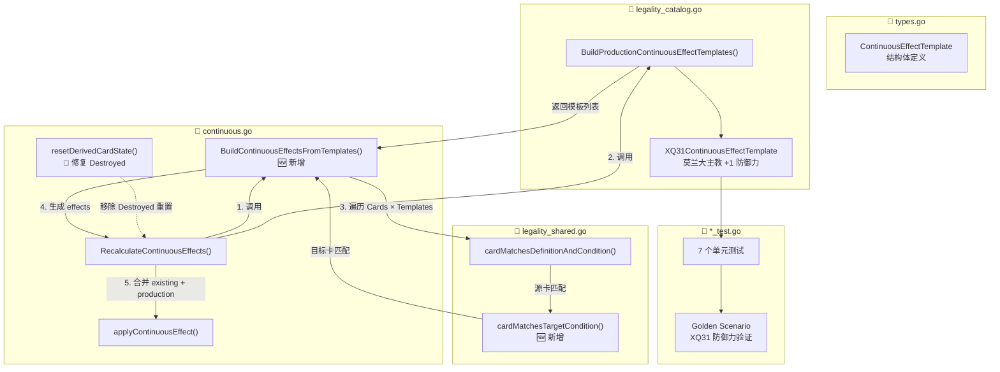
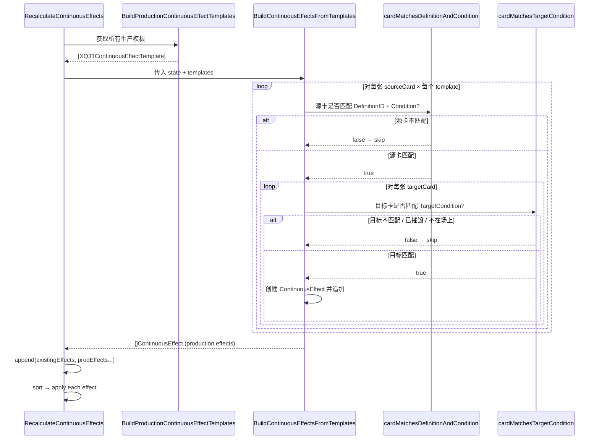

## 1. 高层摘要 (TL;DR)

* **影响：** 🔴 **高** — 引入了全新的 **Production Continuous Effect Template** 系统，为卡牌数值光环（如 XQ31 莫兰大主教）提供了声明式、可扩展的框架，同时修复了一个 `Destroyed` 标志被意外重置的 🐛 Bug。
* **核心变更：**
  - ✨ 新增 `ContinuousEffectTemplate` 类型，支持以模板方式动态生成持续效果
  - ✨ 新增 `BuildContinuousEffectsFromTemplates()` 函数，集成到 `RecalculateContinuousEffects` 主流程
  - ✨ 新增 `cardMatchesTargetCondition()` 共享匹配函数，处理阵营（Ally/Enemy）和关键词过滤
  - 🐛 修复 `resetDerivedCardState` 中 `Destroyed` 标志被 `CardZoneDiscard` 覆盖的问题
  - ✅ 新增 7 个单元测试 + 1 个 Golden Scenario，覆盖 XQ31 光环的所有边界场景

---

## 2. 视觉概览（代码与逻辑映射）



### 效果生成流程



---

## 3. 详细变更分析

### 3.1 📐 新类型定义 — `ContinuousEffectTemplate`

**文件：** `server/pkg/rules/types.go`

新增了 `ContinuousEffectTemplate` 结构体，作为持续效果的**声明式模板**，将"什么卡牌在什么条件下产生什么效果"抽象为数据：

| 字段 | 类型 | 说明 |
|------|------|------|
| `SourceDefinitionID` | `string` | 产生效果的卡牌定义 ID（如 `"XQ31"`） |
| `SourceCondition` | `CardCondition` | 源卡激活条件（Zone、Ready、NotDestroyed） |
| `TargetCondition` | `TargetCondition` | 目标卡过滤条件（Keywords、Side） |
| `Layer` | `ContinuousLayer` | 效果层级（如 `LayerNumeric`） |
| `EffectKind` | `string` | 效果种类（如 `"modifyStat"`） |
| `DurationKind` | `string` | 持续时间（如 `"permanent"`） |
| `Stat` / `Amount` | `string` / `int` | 修改的属性及数值 |
| `Keyword` / `Permission` | `string` | 扩展字段（关键词/权限） |
| `Description` | `string` | 调试用人类可读描述 |

> 💡 **设计意图：** 与已有的 `TargetLegalityRule` / `ProhibitionRule` 保持一致的 catalog 模式，未来新增光环效果只需添加模板即可。

---

### 3.2 🏭 模板目录 — XQ31 光环定义

**文件：** `server/pkg/rules/legality_catalog.go`

新增 `XQ31ContinuousEffectTemplate` 变量和 `BuildProductionContinuousEffectTemplates()` 函数：

| 属性 | 值 | 含义 |
|------|------|------|
| **源卡** | `XQ31`（莫兰大主教） | 产生光环的卡牌 |
| **源卡条件** | Zone=Table, Ready=true, NotDestroyed=true | 在场且就绪且未摧毁 |
| **目标阵营** | `SideAlly` | 仅影响本方 |
| **目标关键词** | `["声望"]` | 仅影响有声望关键词的角色 |
| **效果** | `LayerNumeric`, `modifyStat`, `defense +1` | 数值光环：+1 防御力 |
| **持续时间** | `permanent` | 永续（随源卡状态动态计算） |

---

### 3.3 🧩 共享匹配逻辑 — `cardMatchesTargetCondition()`

**文件：** `server/pkg/rules/legality_shared.go`

新增 `cardMatchesTargetCondition()` 函数，处理两个维度的目标过滤：

1. **阵营过滤（Side）：** 比较 `sourceCard.ControllerID` 与 `targetCard.ControllerID`
   - `SideAlly` → 同一控制者
   - `SideEnemy` → 不同控制者
2. **关键词过滤（Keywords）：** 检查目标卡的 `EffectiveKeywords`（回退到 `PrintedKeywords`）是否包含任一要求的关键词（OR 语义）

同时新增了 `"slices"` 包导入。

---

### 3.4 ⚙️ 核心引擎 — `BuildContinuousEffectsFromTemplates()`

**文件：** `server/pkg/rules/continuous.go`

新增约 45 行的核心函数，实现 **O(Cards × Templates × Cards)** 的效果生成：

```
对每张 sourceCard:
  对每个 template:
    如果 sourceCard 不匹配 template.SourceDefinitionID + SourceCondition → skip
    对每张 targetCard:
      如果 targetCard 不在场上或已摧毁 → skip
      如果 targetCard 不匹配 template.TargetCondition → skip
      → 创建 ContinuousEffect（ID 格式: "ce:prod:{defID}:{cardID}:{timestamp}"）
```

**集成到 `RecalculateContinuousEffects()`：**

```go
// 旧代码
effects := cloneContinuousEffects(working.Board.Continuous.Active)

// 新代码
prodEffects := BuildContinuousEffectsFromTemplates(working, BuildProductionContinuousEffectTemplates())
existingEffects := cloneContinuousEffects(working.Board.Continuous.Active)
effects := append(existingEffects, prodEffects...)
```

> ⚠️ **注意：** 生产模板效果与已有效果合并后统一排序和施加，确保效果叠加顺序的一致性。

---

### 3.5 🐛 Bug 修复 — `Destroyed` 标志不再被意外重置

**文件：** `server/pkg/rules/continuous.go` → `resetDerivedCardState()`

```diff
- card.Destroyed = card.Zone == CardZoneDiscard
```

**问题分析：** 在 `resetDerivedCardState` 中，`Destroyed` 标志被强制根据 `CardZoneDiscard` 重新计算。这会导致通过其他途径（如战斗伤害）设置的 `Destroyed = true` 但卡牌仍在 `CardZoneTable` 的状态被错误清除。

**修复方式：** 移除该行，让 `Destroyed` 标志由其真正的设置逻辑管理，而非在派生状态重置时被覆盖。

---

### 3.6 ✅ 测试覆盖

#### 单元测试（`continuous_test.go`）— 7 个新测试

| 测试函数 | 验证场景 |
|----------|----------|
| `TestContinuousEffectsBuiltFromXQ31` | XQ31 在场就绪时，为自己和声望盟友各生成 1 个 effect（共 2 个） |
| `TestContinuousEffectsNotBuiltFromExhaustedXQ31` | XQ31 疲惫时不产生任何效果 |
| `TestContinuousEffectsNotBuiltFromDestroyedXQ31` | XQ31 已摧毁时不产生任何效果 |
| `TestContinuousEffectsNotAppliedToDestroyedTarget` | 效果不会作用于已摧毁的目标卡 |
| `TestXQ31GrantsDefenseToPrestigeAlly` | 端到端：XQ31(4→5) + 声望盟友(2→3) 防御力正确 |
| `TestXQ31DoesNotAffectNonPrestigeAlly` | 非声望盟友不受影响（防御力保持 2） |
| `TestXQ31DoesNotAffectEnemy` | 敌方声望角色不受影响（防御力保持 2） |
| `TestXQ31DoesNotAffectDestroyedCard` | 已摧毁的本方声望角色不受影响 |

#### Catalog 测试（`legality_catalog_test.go`）— 1 个新测试

| 测试函数 | 验证内容 |
|----------|----------|
| `TestBuildProductionContinuousEffectTemplates` | 模板数量=1，所有字段（SourceDefinitionID、Zone、Ready、NotDestroyed、Layer、EffectKind、Stat、Amount、Side、Keywords）均正确 |

#### Golden Scenario（`golden_scenario_test.go`）— 1 个新测试

| 测试函数 | 场景 |
|----------|------|
| `TestGoldenScenario_XQ31GrantsDefenseToPrestigeAllies` | 4 张卡同场：XQ31(4→5)✅、声望盟友(2→3)✅、非声望盟友(2→2)✅、敌方声望(2→2)✅ |

---

## 4. 影响与风险评估

### ⚠️ 潜在风险

| 风险项 | 级别 | 说明 |
|--------|------|------|
| **性能** | 🟡 中 | `BuildContinuousEffectsFromTemplates` 是 O(C×T×C) 复杂度，当前卡牌数量少可接受，但大规模场面可能需要优化（如索引） |
| **Bug 修复影响** | 🟡 中 | 移除 `Destroyed` 重置可能影响依赖该行为的其他代码路径，需确认是否有其他地方隐式依赖此逻辑 |
| **效果 ID 命名** | 🟢 低 | 生产效果 ID 格式 `ce:prod:{defID}:{cardID}:{ts}` 与现有效果 ID 命名空间不同，不会冲突 |

### ✅ 无破坏性变更

- 新增类型和函数均为**增量添加**，不修改已有接口签名
- `RecalculateContinuousEffects` 的外部行为兼容（只是效果来源增加了模板生成）
- `Destroyed` 修复属于 **Bug Fix**，使行为更正确

### 🧪 建议测试场景

1. **多光环叠加：** 场上同时存在多个产生光环的卡牌，验证效果正确叠加
2. **光环消失：** XQ31 被摧毁或疲惫后，验证之前获得 +1 防御力的卡牌恢复原始数值
3. **Destroyed 标志回归：** 验证战斗中卡牌被摧毁后 `Destroyed=true` 在 `RecalculateContinuousEffects` 中不会被意外清除
4. **空场面边界：** 场上无卡牌时 `BuildContinuousEffectsFromTemplates` 返回空切片，不产生副作用