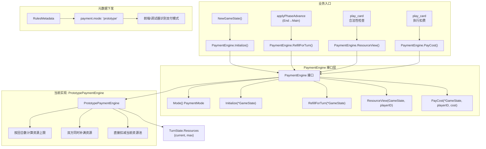
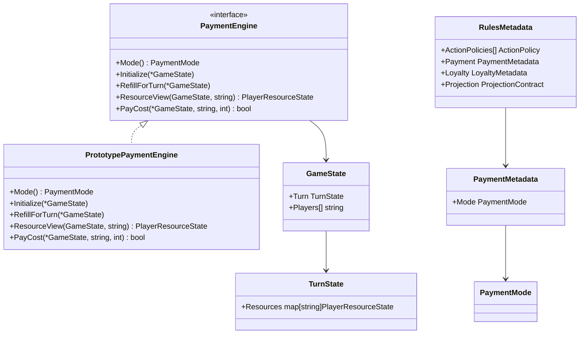

## 1. 高层概览（TL;DR）

- **影响范围**：🔴 **高** - 核心资源管理架构重构，涉及后端规则引擎和前端类型定义
- **核心目标**：将散落的资源管理逻辑抽离成统一的`PaymentEngine`接口，为后续规则书支付模型铺路
- **关键变更**：
  - ✨ 新增`PaymentEngine`接口和`PaymentModePrototype`实现
  - 🔧 资源初始化、回合补费，以及正式 battle 出牌/建立牌的扣费改走统一支付入口
  - 📊 `RulesMetadata`新增`payment.mode`字段，当前值为`"prototype"`
  - 🧪 新增完整的单元测试覆盖支付引擎行为
  - 📝 新增项目架构文档和AI协作开发规范

> 2026-04-03 边界修正：本文原先把 `queue_operation` 也写成了正式支付入口。当前实现里，`queue_operation` 仍是调试/fixture 通道，不承担正式 battle 费用与忠诚裁决；正式支付并轨以 `play_card` / `build_asset` 为准。

---

## 2. 可视化架构图

### 支付引擎调用流程



### 模块依赖关系



---

## 3. 详细变更分析

### 🏗️ 核心架构层

#### 新增文件：`server/pkg/rules/payment.go`

**变更内容**：
- 定义`PaymentEngine`接口，包含5个核心方法：
  - `Mode()` - 返回支付模式标识
  - `Initialize(*GameState)` - 游戏初始化时设置资源
  - `RefillForTurn(*GameState)` - 回合切换时补充资源
  - `ResourceView(GameState, string)` - 查询玩家资源状态
  - `PayCost(*GameState, string, int)` - 扣除费用
- 定义`PaymentMode`类型和`PaymentModePrototype`常量
- 提供`CurrentPaymentEngine()`和`CurrentPaymentMode()`全局访问入口
- 默认使用`PrototypePaymentEngine`实现

**设计意图**：
> 将资源管理从具体规则逻辑中抽离，形成可替换的支付边界，为未来实现`PaymentModeRulebook`预留扩展点。

---

### 🔧 规则引擎层

#### 文件：`server/pkg/rules/resources.go`

**变更内容**：
- 新增`PrototypePaymentEngine`结构体，实现`PaymentEngine`接口
- 将原有的资源管理逻辑封装到引擎方法中：
  - `Initialize()` - 替代原`InitializeTurnResources()`
  - `RefillForTurn()` - 替代原`RefillActivePlayerResources()`
  - `ResourceView()` - 替代原`currentPlayerResource()`
  - `PayCost()` - 替代原`payPlayerResourceCost()`
- 保留旧函数作为**委托适配器**，内部调用`CurrentPaymentEngine()`

**关键代码片段**：
```go
// 旧函数改为委托调用
func payPlayerResourceCost(state *GameState, playerID string, required int) bool {
    engine := CurrentPaymentEngine()
    if engine == nil {
        return false
    }
    return engine.PayCost(state, playerID, required)
}
```

**向后兼容性**：
- ✅ 保留旧函数签名，避免破坏现有调用
- ✅ 内部统一走新引擎，确保逻辑一致性

---

#### 文件：`server/pkg/rules/engine.go`

**变更内容**：

| 位置 | 原逻辑 | 新逻辑 |
|------|--------|--------|
| `NewGameState()` | `InitializeTurnResources(&state)` | `engine.Initialize(&state)` |
| `applyPhaseAdvance()` (End→Main) | `RefillActivePlayerResources(&working)` | `engine.RefillForTurn(&working)` |

**影响范围**：
- 游戏初始化时的资源设置
- 回合从End阶段切换到Main阶段时的资源补充

---

#### 文件：`server/pkg/rules/play_card_action.go`

**变更内容**：

| 阶段 | 原逻辑 | 新逻辑 |
|------|--------|--------|
| 合法性检查 | `pool := currentPlayerResource(state, action.ActorID)` | `pool := engine.ResourceView(state, action.ActorID)` |
| 执行扣费 | `payPlayerResourceCost(&working, operation.ActorID, requiredCost)` | `engine.PayCost(&working, operation.ActorID, requiredCost)` |

**关键改进**：
- 统一通过`PaymentEngine`查询和扣除资源
- 为未来支持复杂支付流程（如分步支付、费用选择）预留扩展空间

---

### 📊 元数据协议层

#### 文件：`server/pkg/rules/action_policy.go`

**变更内容**：
- `RulesMetadata`结构体新增`Payment`字段：
```go
type RulesMetadata struct {
    ActionPolicies []ActionPolicy     `json:"actionPolicies"`
    Payment        PaymentMetadata    `json:"payment"`  // 新增
    Loyalty        LoyaltyMetadata    `json:"loyalty"`
    Projection     ProjectionContract `json:"projection"`
}
```
- 默认元数据初始化`Payment.Mode = PaymentModePrototype`
- `cloneRulesMetadata()`函数新增`Payment`字段的克隆逻辑

**协议影响**：
- 前端可以通过`rulesMetadata.payment.mode`识别当前支付模型
- 调试器可以据此显示正确的资源语义提示

---

### 🌐 前端类型同步

#### 文件：`web/src/debugger/protocol.ts`

**变更内容**：
```typescript
export type RulesMetadata = {
  actionPolicies: ActionPolicy[];
  payment: {  // 新增
    mode: "prototype";
  };
  loyalty: {
    colorAliases: Array<{
      canonical: string;
      aliases: string[];
    }>;
  };
  // ...
};
```

#### 文件：`web/src/battle/model.ts` & `web/src/battle/actionPolicy.test.ts`

**变更内容**：
- 默认`RulesMetadata`对象新增`payment.mode: "prototype"`
- 测试用例同步更新元数据结构

---

### 🧪 测试覆盖层

#### 文件：`server/pkg/rules/resources_test.go`

**新增测试用例**：

| 测试函数 | 验证目标 |
|----------|----------|
| `TestCurrentPaymentEngineUsesPrototypeMode` | 确认当前引擎模式为`prototype` |
| `TestPaymentEnginePayCostRejectsWhenPoolIsInsufficient` | 验证资源不足时扣费失败且状态不变 |

#### 文件：`server/pkg/rules/action_policy_test.go`

**新增断言**：
```go
if metadata.Payment.Mode != PaymentModePrototype {
    t.Fatalf("payment mode metadata = %q, want %q", 
        metadata.Payment.Mode, PaymentModePrototype)
}
```

---

### 📚 文档层

#### 新增文件：`docs/PAYMENT_ENGINE_PROTOTYPE_REFACTOR_2026-04-03.md`

**文档结构**：
- **目标**：明确本轮只做边界抽离，不实现rulebook支付模型
- **已落地**：详细列出4项核心变更
- **刻意没做**：明确3项延后内容（不改协议、不实现rulebook、不全量切换）
- **新增护栏**：列出测试覆盖要求
- **后续顺序**：规划未来3步演进路径

#### 新增文件：`GEMINI.md`

**内容概要**：
- 项目架构原则（Go为真理源、投影系统、可重放性）
- 技术栈说明
- 开发工作流和命令速查
- 当前里程碑状态

#### 新增文件：`.gemini/skills/superpowers/SKILL.md`

**内容概要**：
- 定义AI协作开发工作流（SDD）
- Plan-Based Execution 规范
- Subagent-Driven Development 模式
- 技术完整性和TDD要求

#### 更新文件：`README.md` & `docs/NEXT_GEN_RULE_PLAN.md`

**变更内容**：
- 记录2026-04-03的支付引擎重构里程碑
- 更新项目状态描述

---

## 4. 影响与风险评估

### ✅ 向后兼容性

| 组件 | 兼容性 | 说明 |
|------|--------|------|
| 旧函数API | ✅ 完全兼容 | `InitializeTurnResources()`等函数保留为委托适配器 |
| `TurnState.Resources` | ✅ 结构不变 | 仍为`{current, max}`格式 |
| 前端协议 | ✅ 扩展字段 | 新增`payment.mode`，不破坏现有字段 |

### ⚠️ 潜在风险

1. **空指针风险**
   - **位置**：所有调用`CurrentPaymentEngine()`的地方
   - **缓解**：已添加`nil`检查，如`engine != nil`判断
   - **建议测试**：模拟`defaultPaymentEngine = nil`场景

2. **状态污染风险**
   - **位置**：`PayCost()`在资源不足时的行为
   - **缓解**：测试用例`TestPaymentEnginePayCostRejectsWhenPoolIsInsufficient`已验证
   - **建议测试**：验证多次失败扣费后资源池不变

3. **元数据同步风险**
   - **位置**：Go后端与TypeScript前端的`RulesMetadata`结构
   - **缓解**：测试用例`TestProjectionCarriesRulesMetadata`验证投影下发
   - **建议测试**：前端接收到的`payment.mode`必须为`"prototype"`

### 🧪 建议测试场景

1. **资源初始化流程**
   - 验证`NewGameState()`后双方资源池正确初始化
   - 验证`CurrentPaymentMode()`返回`"prototype"`

2. **回合切换补费**
   - 验证`End → Main`阶段切换时双方资源补满
   - 验证资源上限随回合数正确增长

3. **出牌扣费边界**
   - 验证资源刚好足够时扣费成功
   - 验证资源不足时扣费失败且状态不变
   - 验证连续出牌后资源正确递减

4. **元数据下发**
   - 验证`rulesMetadata.payment.mode`正确下发到前端
   - 验证调试器能识别当前支付模式

---

## 5. 总结

这次重构是一次**架构层面的边界抽离**，而非功能扩展。核心价值在于：

1. **统一支付入口**：所有资源操作现在都经过`PaymentEngine`，为未来实现复杂支付逻辑（如横置资产得费、分步支付）扫清障碍
2. **显式模式标识**：通过`payment.mode`字段，明确当前是原型模式，避免前端误认为这是最终规则书语义
3. **测试驱动演进**：新增的测试用例为后续切换到`PaymentModeRulebook`提供了安全网
4. **文档先行**：详细的重构文档和项目上下文文档，为AI协作开发和团队知识传承奠定基础

**下一步方向**（根据文档规划）：
1. 新增`PaymentModeRulebook`骨架（但不切默认模式）
2. 若未来决定将调试通道正规化，再单独评估是否让`queue_operation`等动作走`PaymentEngine`
3. 拆分"支付资源池快照"和"最终公共资源显示"
