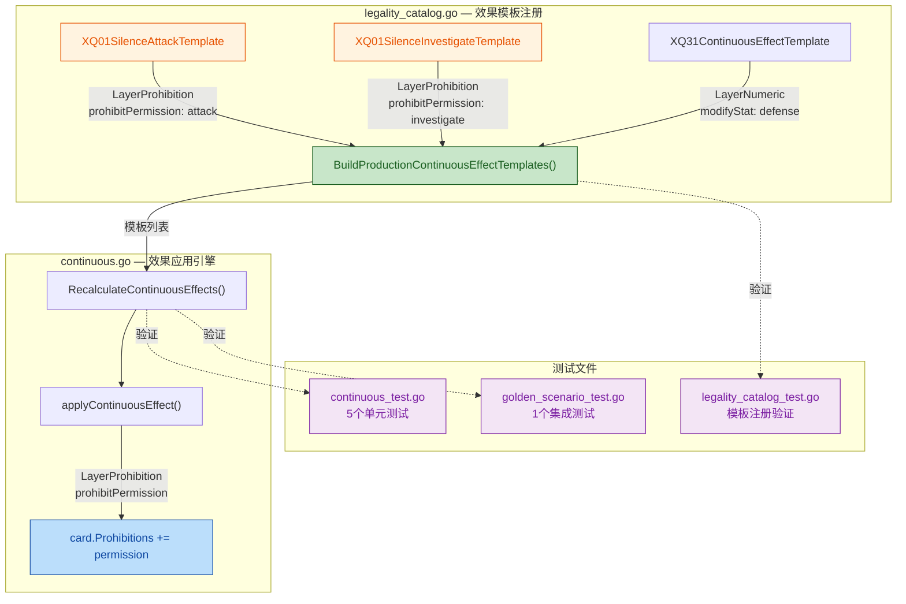
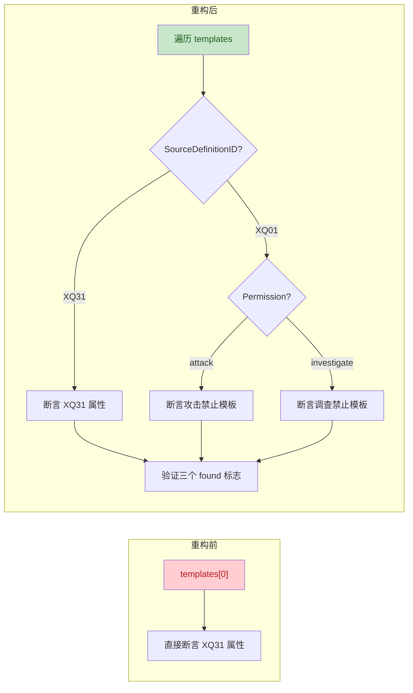

## 1. 高层摘要 (TL;DR)

* **影响范围:** 🟢 **低** — 新增一张卡牌（XQ01 联会禁音使）的持续效果模板，以及配套的全面测试覆盖。不涉及已有逻辑变更。
* **核心变更:**
  - 🆕 在 `legality_catalog.go` 中注册了 **XQ01** 的两个持续效果模板：**禁止攻击** 和 **禁止调查**
  - ✅ 在 `continuous_test.go` 中新增 **5 个单元测试**，覆盖沉默生效、失效的各种场景
  - ✅ 在 `golden_scenario_test.go` 中新增 **1 个黄金场景集成测试**
  - 🔧 重构 `legality_catalog_test.go` 中的模板验证逻辑，从硬编码单模板改为遍历匹配多模板

---

## 2. 视觉概览（代码与逻辑地图）

---

## 3. 详细变更分析

### 3.1 🆕 效果模板注册 — `legality_catalog.go`

新增了 **XQ01（联会禁音使）** 的两个持续效果模板。当 XQ01 处于**就绪状态**且在**场上**且**未被摧毁**时，所有角色将被施加禁止效果。

两个模板共享相同的源卡条件，区别在于禁止的权限类型：

| 属性 | `XQ01SilenceAttackTemplate` | `XQ01SilenceInvestigateTemplate` |
|---|---|---|
| **SourceDefinitionID** | `XQ01` | `XQ01` |
| **SourceCondition.Zone** | `CardZoneTable` | `CardZoneTable` |
| **SourceCondition.Ready** | `true` | `true` |
| **SourceCondition.NotDestroyed** | `true` | `true` |
| **TargetCondition** | 空（影响所有角色） | 空（影响所有角色） |
| **Layer** | `LayerProhibition` | `LayerProhibition` |
| **EffectKind** | `prohibitPermission` | `prohibitPermission` |
| **Permission** | `attack` | `investigate` |
| **DurationKind** | `permanent` | `permanent` |

> **关键设计点：** `TargetCondition` 为空结构体 `TargetCondition{}`，意味着该效果**无目标过滤**，作用于场上所有角色（包括友方和敌方）。

`BuildProductionContinuousEffectTemplates()` 的返回值从 1 个模板增加到 **3 个**。

---

### 3.2 ✅ 单元测试 — `continuous_test.go`

新增 **5 个测试函数**，全面覆盖 XQ01 沉默效果的生效与失效场景：

| 测试函数 | 场景 | 预期结果 |
|---|---|---|
| `TestXQ01SilencesAttackWhenReady` | XQ01 就绪在场 + 友方/敌方角色 | 友方和敌方均被禁止 `attack` |
| `TestXQ01SilencesInvestigateWhenReady` | XQ01 就绪在场 + 友方/敌方角色 | 友方和敌方均被禁止 `investigate` |
| `TestXQ01DoesNotSilenceWhenExhausted` | XQ01 **横置**（Exhausted=true） | 友方**不被**禁止 `attack` |
| `TestXQ01DoesNotSilenceWhenOffTable` | XQ01 在**手牌区**（CardZoneHand） | 友方**不被**禁止 `attack` |
| `TestXQ01DoesNotSilenceWhenDestroyed` | XQ01 **已摧毁**（Destroyed=true） | 友方**不被**禁止 `attack` |

> **测试模式：** 每个测试都通过 `newContinuousTestState()` 创建初始状态，手动设置卡牌，调用 `RecalculateContinuousEffects()`，然后断言 `card.Prohibitions` 切片。

---

### 3.3 ✅ 黄金场景测试 — `golden_scenario_test.go`

新增 `TestGoldenScenario_XQ01SilencesAttackAndInvestigation`，使用 `NewGameState()` 构建更贴近真实游戏的场景：

- **Given:** P1 场上有就绪的 XQ01，P1 和 P2 各有一个角色
- **When:** 调用 `RecalculateContinuousEffects()`
- **Then:** 验证友方和敌方角色同时被禁止 `attack` **和** `investigate`

与单元测试的区别在于使用了 `NewGameState(InitialStateConfig{...})` 初始化完整游戏状态，且卡牌包含 `PrintedKeywords` 字段。

---

### 3.4 🔧 模板注册测试重构 — `legality_catalog_test.go`

`TestBuildProductionContinuousEffectTemplates` 从**硬编码单模板断言**重构为**遍历匹配多模板**：

**主要变化：**
- 模板数量断言从 `1` → `3`
- 引入 `foundXQ31`、`foundXQ01Attack`、`foundXQ01Investigate` 三个布尔标志
- 使用 `switch template.SourceDefinitionID` 分发验证逻辑
- XQ01 的两个模板分别验证 `Layer`、`EffectKind`、`SourceCondition` 等属性

---

## 4. 影响与风险评估

### ⚠️ 潜在风险

| 风险项 | 级别 | 说明 |
|---|---|---|
| **XQ01 自身也被沉默** | ⚠️ 中 | `TargetCondition` 为空，XQ01 自身也会被禁止攻击和调查。如果游戏规则要求 XQ01 不受自身效果影响，需要额外添加排除逻辑 |
| **效果叠加** | 🟢 低 | 当前 `applyContinuousEffect` 使用 `containsString` 去重，不会产生重复禁止项 |
| **已有功能回归** | 🟢 低 | XQ31 模板未做任何修改，仅测试结构重构 |

### 🧪 测试建议

- [ ] 验证 XQ01 自身是否也应被禁止攻击/调查（当前实现会禁止自身）
- [ ] 验证 XQ01 被其他效果赋予 `grantPermission("attack")` 时，禁止与授权的优先级关系（`LayerProhibition` 优先级为 0，高于 `LayerPermission` 的 1，禁止应优先）
- [ ] 运行完整测试套件确认无回归：`go test ./server/pkg/rules/...`