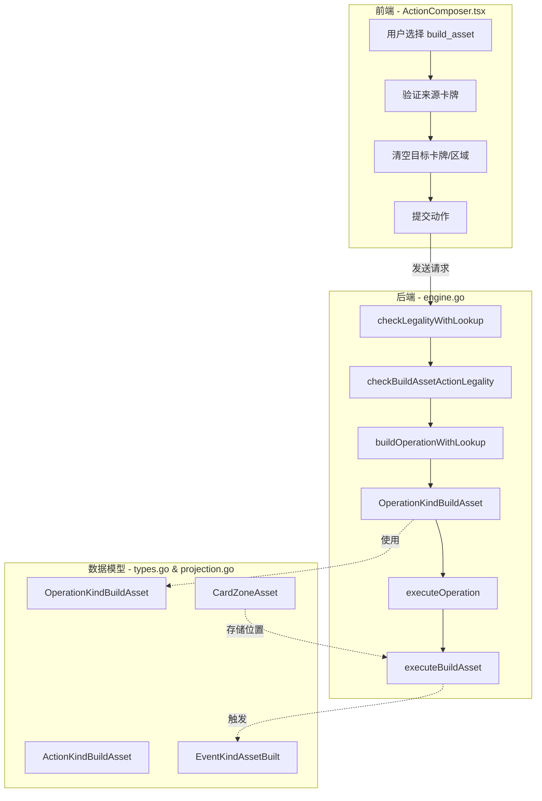
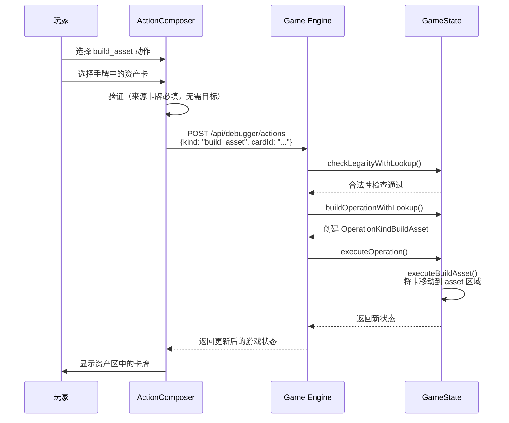

## 1. 高层摘要 (TL;DR)

*   **影响范围:** **高** - 引入了全新的游戏机制：独立的资产动作类型和资产区域
*   **核心变更:**
    *   新增 `build_asset` 动作类型，替代原有的 `play_asset` 快捷方式
    *   新增 `CardZoneAsset` 区域，资产卡不再放在 `table` 区域
    *   前后端全面支持资产区的显示、验证和执行逻辑
    *   更新游戏不变量以支持新区域

---

## 2. 可视化概览 (代码与逻辑映射)

---

## 3. 详细变更分析

### 🎮 后端核心逻辑 (Go)

#### **server/pkg/rules/types.go**
*   **变更内容:** 新增动作、操作和事件类型
*   **新增常量:**
    *   `ActionKindBuildAsset = "build_asset"`
    *   `OperationKindBuildAsset = "build_asset"`
    *   `EventKindAssetBuilt = "asset_built"`

#### **server/pkg/rules/projection.go**
*   **变更内容:** 新增资产区域定义
*   **新增常量:**
    *   `CardZoneAsset = "asset"`

#### **server/pkg/rules/engine.go**
*   **变更内容:** 实现资产动作的完整生命周期处理
*   **关键函数更新:**
    *   `checkLegalityWithLookup()`: 添加 `ActionKindBuildAsset` 分支，调用 `checkBuildAssetActionLegality()`
    *   `buildOperationWithLookup()`: 添加 `ActionKindBuildAsset` 分支，构建 `OperationKindBuildAsset` 操作
    *   `executeOperation()`: 添加 `OperationKindBuildAsset` 分支，调用 `executeBuildAsset()`
    *   `actionRequiresEmptyStack()`: 将 `ActionKindBuildAsset` 加入需要空栈的动作列表

#### **server/pkg/rules/invariants.go**
*   **变更内容:** 更新游戏状态不变量以支持资产区
*   **具体修改:**
    *   `InvariantCardZoneValid()`: 在有效区域映射中添加 `CardZoneAsset: true`
    *   `InvariantCardDestroyedStateValid()`: 扩展检查逻辑，资产区的卡也不能被标记为已销毁

#### **server/pkg/rules/play_card_action.go**
*   **变更内容:** 更新忠诚度颜色计数逻辑
*   **具体修改:**
    *   `countPlayerLoyaltyColors()`: 在统计条件中包含 `CardZoneAsset` 区域的卡牌

#### **server/pkg/rules/rulebook_flow.go**
*   **变更内容:** 重置回合时清除资产使用标记
*   **具体修改:**
    *   `resetFirstPlayerPrivilegeMarkers()`: 添加 `setMarker(state, playerID, markerTypeBuildAssetUsed, 0)`

---

### 🌐 前端核心逻辑 (TypeScript)

#### **web/src/battle/components/ActionComposer.tsx**
*   **变更内容:** 重构资产动作的UI交互逻辑
*   **关键修改:**
    *   将动作选项从 `"play_asset"` 改为 `"build_asset"`
    *   新增 `build_asset` 的特殊处理逻辑：当选择手牌中的卡时，自动设置来源卡牌并清空目标卡牌/区域
    *   移除 `toServerActionKind()` 函数（不再需要转换）
    *   重命名 `isPlayLikeActionKind()` 为 `isPlayCardActionKind()`，仅返回 `"play_card"`
    *   更新验证逻辑：`build_asset` 不再需要目标卡牌，也不再限制卡牌类型

#### **web/src/battle/components/BattleTable.tsx**
*   **变更内容:** 显示资产区的卡牌和统计
*   **具体修改:**
    *   从 `battle.local.assets` 和 `battle.opponent.assets` 获取资产卡（而非从 table 过滤）
    *   添加资产区统计显示（`ZoneStat`）

#### **web/src/battle/model.ts**
*   **变更内容:** 扩展数据模型以支持资产区
*   **类型定义更新:**

| 类型 | 新增字段 | 说明 |
|------|----------|------|
| `BattlePlayerArea` | `assets: CardView[]` | 本方资产区的卡牌 |
| `BattleOpponentArea` | `assetCount: number` `assets: CardView[]` | 对方资产区数量和卡牌 |

*   **函数更新:**
    *   `deriveBattleState()`: 从 `"asset"` 区域提取卡牌填充到 `assets` 字段

#### **web/src/debugger/protocol.ts**
*   **变更内容:** 更新协议类型定义
*   **具体修改:**
    *   `CardZone` 类型添加 `"asset"` 选项

#### **web/src/battle/BattleShell.test.tsx**
*   **变更内容:** 更新测试用例以匹配新的资产动作
*   **测试修改:**
    *   修改测试名称：从 "submits establish asset shortcut as play_card" 改为 "submits establish asset shortcut as build_asset without extra target"
    *   验证请求体中 `kind` 为 `"build_asset"`，且不包含 `targetCardId` 和 `targetRegionCardId`
    *   新增测试：验证角色风格的部署流程也支持 `build_asset` 动作
    *   更新断言：使用 `getAllByText()` 代替 `getByText()` 以处理重复的资产区文本

#### **web/public/battle-action-guide.md**
*   **变更内容:** 添加 `build_asset` 动作文档
*   **新增内容:**
    *   用途：将手牌正面放入资产区
    *   必填：来源卡牌
    *   不需要：部署地区、目标卡牌
    *   约束：每回合通常只能执行一次

---

## 4. 影响与风险评估

### ⚠️ 破坏性变更

| 变更类型 | 旧行为 | 新行为 | 影响 |
|----------|--------|--------|------|
| **动作类型** | `play_asset` → 转换为 `play_card` | `build_asset` 独立动作 | 客户端需要更新动作类型 |
| **卡牌区域** | 资产卡在 `table` 区域 | 资产卡在 `asset` 区域 | 前端渲染逻辑需要适配 |
| **API 参数** | 需要 `targetCardId` | 不需要 `targetCardId` | 客户端提交逻辑简化 |

### 🧪 测试建议

1.  **功能测试:**
    *   验证从手牌选择资产卡执行 `build_asset` 动作
    *   确认卡牌正确移动到资产区
    *   验证资产区统计数字正确显示
    *   测试每回合只能执行一次的限制（如果后端实现了）

2.  **边界测试:**
    *   尝试对非资产卡执行 `build_asset`（应被拒绝）
    *   尝试在非空栈状态下执行 `build_asset`（应被拒绝）
    *   验证资产区的卡不能被标记为已销毁

3.  **UI 测试:**
    *   确认资产区在战场上正确渲染
    *   验证资产区的卡牌可以正常交互（如点击查看详情）
    *   测试资产区统计数字的实时更新

4.  **兼容性测试:**
    *   确认旧版本的客户端不会崩溃（如果存在向后兼容需求）
    *   验证存档迁移（如果游戏支持存档）

---

## 5. 总结

本次变更实现了**资产机制的独立化**，将资产从通用的 `table` 区域分离到专门的 `asset` 区域，并引入了独立的 `build_asset` 动作类型。这一改动：

✅ **提高了代码的可维护性** - 资产逻辑不再与角色卡混在一起  
✅ **增强了游戏机制的表达力** - 可以针对资产区实现更精细的规则  
✅ **简化了前端交互** - 建立资产不再需要选择目标卡牌  

⚠️ **需要注意** - 这是一个较大的架构变更，确保所有相关系统（AI、存档、日志等）都已适配新的区域和动作类型。