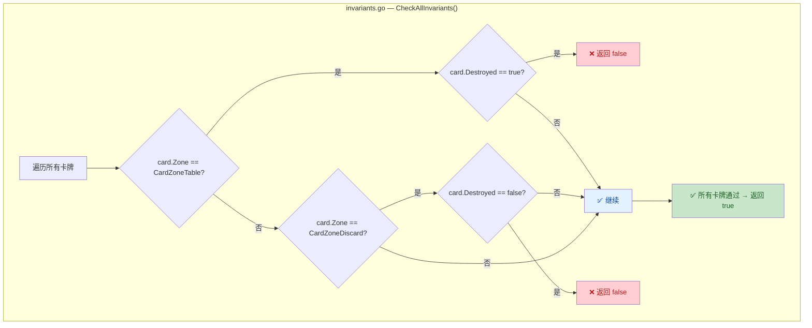
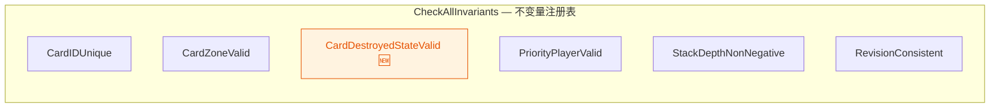
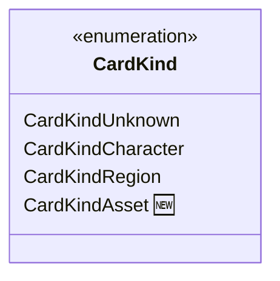

## 1. 高层摘要 (TL;DR)

- **影响级别：** 🟢 **低** — 新增一个游戏状态不变量校验规则和一个卡牌类型枚举值，属于防御性编程与数据模型扩展。
- **核心变更：**
  - ✅ 新增 **`InvariantCardDestroyedStateValid`** 不变量，确保卡牌的 `Destroyed` 状态与其所在区域 (`Zone`) 保持一致
  - ✅ 新增 **`CardKindAsset`** 卡牌类型枚举，扩展卡牌种类体系
  - ✅ 更新测试用例，将预期不变量结果数量从 5 调整为 6

---

## 2. 可视化概览

### 新增不变量校验逻辑流



### 不变量注册体系



### CardKind 枚举扩展



---

## 3. 详细变更分析

### 📁 组件一：`invariants.go` — 不变量校验

**变更内容：** 新增 `InvariantCardDestroyedStateValid` 函数，并将其注册到 `CheckAllInvariants` 的不变量列表中。

**业务逻辑：** 该不变量强制执行以下两条规则：

| 卡牌区域 (`Zone`) | 要求 `Destroyed` 状态 | 含义 |
|---|---|---|
| `CardZoneTable`（场上） | 必须为 `false` | 场上的牌不能处于已销毁状态 |
| `CardZoneDiscard`（弃牌堆） | 必须为 `true` | 弃牌堆中的牌必须标记为已销毁 |

> **设计意图：** 防止引擎在处理卡牌消灭/移除时出现状态不一致的 bug。例如，一张牌被消灭后应先标记 `Destroyed=true` 再移入弃牌堆，该不变量可捕获中间态错误。

**关键代码片段（`invariants.go`）：**

```go
func InvariantCardDestroyedStateValid(state GameState) bool {
    for _, card := range state.Board.Cards {
        if card.Zone == CardZoneTable && card.Destroyed {
            return false  // 场上牌不应被销毁
        }
        if card.Zone == CardZoneDiscard && !card.Destroyed {
            return false  // 弃牌堆中的牌必须已销毁
        }
    }
    return true
}
```

---

### 📁 组件二：`invariants_test.go` — 测试适配

**变更内容：** 将 `TestCheckAllInvariants` 中预期的不变量结果数量从 **5** 更新为 **6**，以适配新增的 `CardDestroyedStateValid` 不变量。

| 项目 | 旧值 | 新值 |
|---|---|---|
| 预期不变量数量 | `5` | `6` |

---

### 📁 组件三：`projection.go` — 数据模型扩展

**变更内容：** 在 `CardKind` 枚举中新增 `CardKindAsset` 值。

| 枚举值 | 字符串值 | 状态 |
|---|---|---|
| `CardKindUnknown` | `"unknown"` | 已有 |
| `CardKindCharacter` | `"character"` | 已有 |
| `CardKindRegion` | `"region"` | 已有 |
| `CardKindAsset` | `"asset"` | 🆕 新增 |

> **注意：** 当前 diff 仅添加了枚举定义，尚未看到该类型在其他业务逻辑中的使用。这可能为后续功能（如资产/装备类卡牌）预留。

---

## 4. 影响与风险评估

- ⚠️ **破坏性变更：** 无。新增的不变量是**只读校验**，不改变任何游戏状态逻辑。
- ⚠️ **潜在风险：** 如果现有代码路径中存在卡牌在 `CardZoneTable` 上被标记为 `Destroyed` 但尚未移至弃牌堆的**合法中间态**，该不变量会产生**误报**。建议确认引擎的消灭流程是否为原子操作。
- 🧪 **测试建议：**
  - 验证正常场景下所有不变量均通过（已有测试覆盖）
  - 建议补充针对 `InvariantCardDestroyedStateValid` 的**专项边界测试**：
    - 场上牌 `Destroyed=true` → 应返回 `false`
    - 弃牌堆牌 `Destroyed=false` → 应返回 `false`
    - 手牌/牌库中牌的 `Destroyed` 状态不受限制 → 应返回 `true`
  - 确认 `CardKindAsset` 在序列化/反序列化时能正确处理