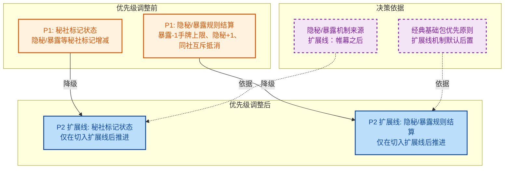

## 1. 高级摘要（TL;DR）

*   **影响范围：** 🟡 中等 - 调整了游戏机制实现的优先级排序，影响开发路线图
*   **核心变更：**
    *   将"秘社标记状态"和"隐秘/暴露规则结算"从 P1 降级为 P2（扩展线优先级）
    *   新增关于隐秘/暴露机制来源的说明（源自扩展线"帷幕之后"）
    *   添加《规则手册》完整版提取文档的引用

---

## 2. 可视化概览（优先级调整逻辑）

---

## 3. 详细变更分析

### 📄 文档：`docs/MECHANISM_ENGINE_GAP_MATRIX_2026-04-02.md`

#### **新增说明内容**

| 行号 | 新增内容 | 说明 |
|------|----------|------|
| 10 | `口口径纠偏：隐秘/暴露机制来源于扩展线（帷幕之后及其后续产品沿用），若按"经典基础包优先"执行，应默认后置。` | 明确了隐秘/暴露机制的来源，为优先级调整提供依据 |
| 11 | `《规则手册》完整版规则抽出见：docs/RULEBOOK_EXTRACTION_2026-04-02.md（108/108 索引术语覆盖）。` | 添加规则手册提取文档的引用，覆盖全部108个索引术语 |

#### **优先级调整（P1 → P2）**

| 机制名称 | 原优先级 | 新优先级 | 变更原因 |
|----------|----------|----------|----------|
| **秘社标记状态** 隐秘/暴露等秘社标记增减 | P1 | P2（扩展线） | 该机制来源于扩展线"帷幕之后"，按"经典基础包优先"原则应后置 |
| **隐秘/暴露规则结算** 暴露-1手牌上限、隐秘+1、同社互斥抵消 | P1 | P2（扩展线） | 同上，扩展线机制，仅在切入扩展线后推进 |

#### **行动计划更新**

| 机制 | 原计划 | 新计划 |
|------|--------|--------|
| 秘社标记状态 | 衔接手牌上限、条件判断与互斥规则 | 仅在切入扩展线后推进 |
| 隐秘/暴露规则结算 | 作为基础包 P1 第一实现项 | 仅在切入扩展线后推进 |

---

## 4. 影响与风险评估

### ⚠️ 潜在影响

*   **开发路线图调整：** 基础包开发阶段将不再实现隐秘/暴露相关机制，这些功能推迟到扩展线阶段
*   **资源重新分配：** 开发资源将更集中于基础包核心机制（DSL 基础执行、附属与持续效果、目标保护等）

### ✅ 测试建议

*   **文档一致性检查：** 确认其他相关文档（如开发计划、需求文档）中关于隐秘/暴露机制的优先级描述已同步更新
*   **规则手册提取验证：** 验证 `docs/RULEBOOK_EXTRACTION_2026-04-02.md` 确实覆盖了全部 108 个索引术语

### 📋 后续行动项

1. ✅ 已完成：在差距矩阵中明确隐秘/暴露机制的来源（扩展线）
2. ✅ 已完成：将相关机制优先级从 P1 调整为 P2
3. ⏳ 待确认：开发团队是否需要更新 Sprint Backlog 或迭代计划
4. ⏳ 待确认：其他相关文档是否需要同步更新优先级描述

---