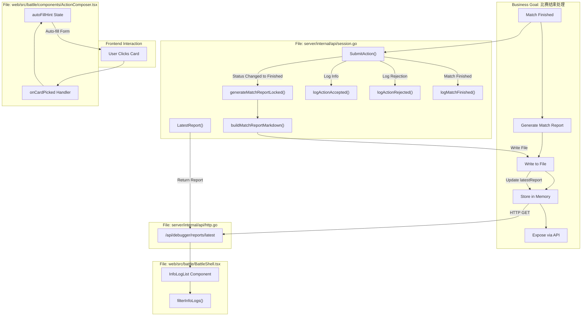

## 1. High-Level Summary (TL;DR)

*   **Impact:** High - 新增完整的比赛报告生成系统、详细日志记录机制和前端交互改进
*   **Key Changes:**
    *   ✅ 新增比赛结束时自动生成 Markdown 格式报告的功能
    *   ✅ 添加 `/api/debugger/reports/latest` API 端点获取最新报告
    *   ✅ 实现详细的动作日志记录（accepted/rejected/finished）
    *   ✅ 前端添加信息日志面板和卡牌点击自动填充功能
    *   ✅ 游戏状态新增 3 个地区卡牌（REGION-1/2/3）

## 2. Visual Overview (Code & Logic Map)



## 3. Detailed Change Analysis

### 📊 后端核心功能

#### **比赛报告生成系统** (`server/internal/api/session.go`)

**新增数据结构：**
```go
type MatchReport struct {
    GameID           string `json:"gameId"`
    Revision         int    `json:"revision"`
    WinnerPlayerID   string `json:"winnerPlayerId,omitempty"`
    EndReason        string `json:"endReason,omitempty"`
    FinishedRevision int    `json:"finishedRevision"`
    GeneratedAt      string `json:"generatedAt"`
    Path             string `json:"path"`
    Content          string `json:"content"`
}
```

**核心方法：**

| 方法 | 功能 | 触发时机 |
|------|------|----------|
| `generateMatchReportLocked()` | 生成 Markdown 报告并写入文件 | 比赛状态变为 `Finished` 时 |
| `buildMatchReportMarkdown()` | 构建报告内容（分数、时间线、快照） | 报告生成时 |
| `LatestReport()` | 返回最新报告（或不存在） | API 调用时 |
| `logActionAccepted()` | 记录接受的动作日志 | 动作成功时 |
| `logActionRejected()` | 记录拒绝的动作日志 | 动作非法时 |
| `logMatchFinished()` | 记录比赛结束日志 | 比赛结束时 |

**报告内容包括：**
- 📋 比赛元数据（Game ID, 生成时间, 获胜者, 结束原因）
- 📊 最终分数表
- 🎯 最终回合快照（回合数, 活跃玩家, 优先权, 阶段）
- 📜 动作时间线（修订号, 动作 ID, 演员类型, 操作类型, 事件类型, 阶段, 优先权, 栈深度）
- 🃏 桌面快照（地区卡数, 角色卡数, 弃牌数, 计分卡数）

#### **新增 API 端点** (`server/internal/api/http.go`)

| 端点 | 方法 | 功能 | 响应 |
|------|------|------|------|
| `/api/debugger/reports/latest` | GET | 获取最新比赛报告 | 200 + MatchReport 或 404 + 错误 |

### 🎮 游戏状态更新

#### **新增地区卡牌** (`server/pkg/rules/m0.go`)

| Card ID | 名称 | 类型 | 地区顺序 |
|---------|------|------|----------|
| REGION-1 | The Silver District | Region | 1 |
| REGION-2 | The Ash Quarter | Region | 2 |
| REGION-3 | The Gilded Gate | Region | 3 |

同时更新了所有相关的测试数据文件（`testdata/m0/*.json`），每个文件的卡牌数量从 4 增加到 7。

### 🖥️ 前端功能增强

#### **信息日志面板** (`web/src/battle/BattleShell.tsx`)

**新增组件：**
- `InfoLogList` - 显示过滤后的日志条目
- 日志过滤器 - 支持按类型过滤（全部/accepted/rejected/system）

**日志类型：**

| 类型 | 标识符 | 显示内容 |
|------|--------|----------|
| accepted | `ActionAccepted` | ACCEPTED {actor} -> {actionKind} |
| rejected | `ActionRejected` | REJECTED {actor} -> {actionKind} |
| system | `StatePatched` | SYSTEM rev {revision} {phase}/{step} |

#### **卡牌点击自动填充** (`web/src/battle/components/ActionComposer.tsx`)

**新增功能：**
- 点击卡牌自动填充 Source/Target 字段
- 手动输入后锁定该字段，防止自动覆盖
- 切换玩家视角时清空无效的 Source Card

**自动填充逻辑：**
```typescript
// 本方卡牌 → Source Card
// 敌方卡牌 → Target Card
// 地区卡牌 → Target Card
```

#### **UI 改进** (`web/src/battle/components/BattleTable.tsx`)

- 所有可见卡牌变为可点击按钮
- 添加 `onCardPicked` 回调处理卡牌选择
- 地区卡牌标题也变为可点击按钮

### 🧪 测试更新

#### **新增测试用例：**

| 文件 | 测试名称 | 验证内容 |
|------|----------|----------|
| `http_test.go` | `TestLatestReportEndpointReturns404WhenNoReportExists` | 无报告时返回 404 |
| `http_test.go` | `TestLatestReportEndpointReturnsMostRecentReport` | 返回最新报告内容 |
| `session_test.go` | `TestSandboxSessionLogsAcceptedRejectedAndFinishedAtInfoLevel` | 日志记录功能 |
| `session_test.go` | `TestSandboxSessionSubmitStillSucceedsWhenReportWriteFails` | 报告写入失败不影响动作提交 |
| `BattleShell.test.tsx` | `auto-fills source and target from table card clicks` | 自动填充功能 |
| `BattleShell.test.tsx` | `keeps manual source selection when auto-fill would otherwise override it` | 手动锁定保护 |
| `BattleShell.test.tsx` | `shows action docs and supports info log filtering` | 日志过滤功能 |
| `BattleShell.test.tsx` | `clears stale source card when switching actor perspective` | 切换视角清空 |
| `battle.spec.ts` | `battle table combo actions` | 复合动作测试 |
| `battle.spec.ts` | `finished match disables actions and latest report endpoint is readable` | 比赛结束和报告端点 |

### 🎨 样式更新 (`web/src/styles/global.css`)

新增样式类：
- `.battle-card__button` - 卡牌按钮样式
- `.battle-actions__guide` - 动作说明面板
- `.battle-region-button` - 地区按钮样式
- `.battle-info-logs__*` - 信息日志面板相关样式

### 📝 配置更新

**`.gitignore` 新增：**
```
runtime/match-reports/
```

## 4. Impact & Risk Assessment

### ⚠️ Breaking Changes

无破坏性变更。所有新增功能都是向后兼容的。

### 🔍 Testing Suggestions

1.  **报告生成测试：**
    *   完成一局比赛，验证 `runtime/match-reports/` 目录下是否生成 Markdown 文件
    *   检查报告内容是否包含完整的分数、时间线和快照信息
    *   验证 `/api/debugger/reports/latest` 端点返回正确的报告

2.  **日志记录测试：**
    *   提交合法动作，检查是否出现 `ACCEPTED` 日志
    *   提交非法动作（如非优先权玩家行动），检查是否出现 `REJECTED` 日志
    *   完成比赛，检查是否出现 `match_finished` 日志

3.  **自动填充测试：**
    *   点击本方卡牌，验证 Source Card 自动填充
    *   点击敌方卡牌，验证 Target Card 自动填充
    *   手动输入后再次点击，验证不会覆盖手动输入
    *   切换玩家视角，验证 Source Card 被清空

4.  **日志过滤测试：**
    *   选择 "accepted" 过滤器，只显示接受的日志
    *   选择 "rejected" 过滤器，只显示拒绝的日志
    *   选择 "system" 过滤器，只显示系统日志

5.  **地区卡牌测试：**
    *   验证 3 个地区卡牌正确显示在桌面上
    *   验证地区卡牌可以点击作为 Target
    *   验证角色卡牌正确关联到地区（`RegionCardID` 字段）

6.  **错误处理测试：**
    *   将报告目录设置为不可写的文件路径，验证动作提交仍能成功
    *   验证报告写入失败时记录错误日志