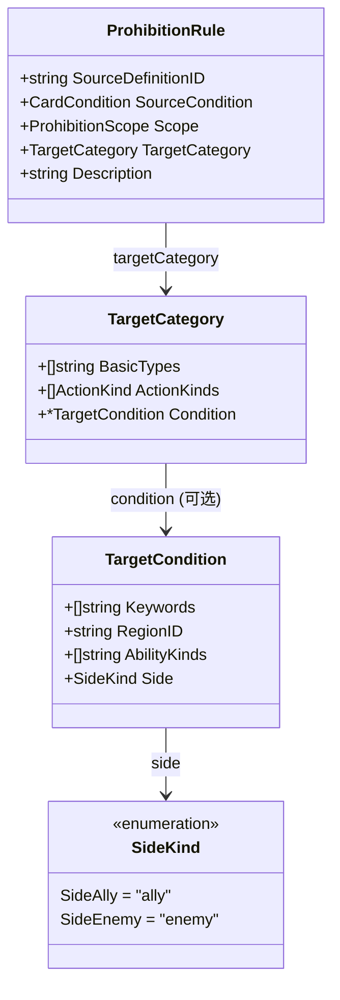
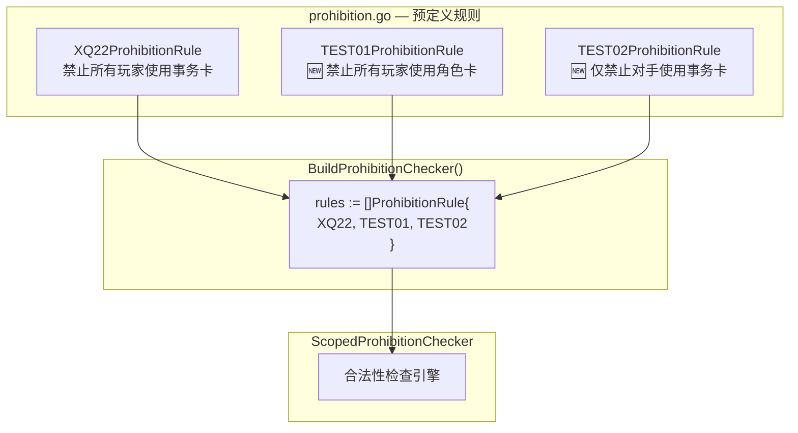

## 1. 高层摘要 (TL;DR)

* **影响等级：** 🟡 **低** — 新增测试用禁止规则和预留扩展类型，不影响现有业务逻辑。
* **核心变更：**
  - ✅ 新增 **2 张测试禁止卡**（`TEST01`、`TEST02`），验证框架对多规则、不同作用域的支持。
  - ✅ 新增 **`TargetCondition`** 结构体作为预留扩展点，为未来 XQ31/XQ01 等卡牌的复杂禁止效果做准备。
  - ✅ 新增 **`SideKind`** 类型（`ally` / `enemy`），用于区分目标阵营。
  - ✅ 在 `TargetCategory` 中嵌入可选的 `Condition` 字段，保持向后兼容。

---

## 2. 可视化概览

### 类型关系图



### 禁止规则注册流程



---

## 3. 详细变更分析

### 📁 组件一：`server/pkg/rules/types.go` — 类型扩展

**变更内容：** 新增 `TargetCondition` 结构体和 `SideKind` 枚举，并在 `TargetCategory` 中添加可选的 `Condition` 字段。

#### 新增类型：`TargetCondition`

为未来的复杂禁止效果（如 XQ31 的"声望"关键词过滤、XQ01 的"本地区"区域限制）预留扩展点，当前所有字段均为 `omitempty`，**不影响现有行为**。

| 字段 | 类型 | 用途说明 | 预留卡牌 |
|------|------|----------|----------|
| `Keywords` | `[]string` | 目标必须包含的关键词 | XQ31（"声望"） |
| `RegionID` | `string` | 目标所在区域 | XQ01（"本地区"） |
| `AbilityKinds` | `[]string` | 受影响的能力种类 | XQ01（"触发能力"、"行动能力"） |
| `Side` | `SideKind` | 目标阵营（己方/敌方） | XQ31（"本方"、"敌方"） |

#### 新增枚举：`SideKind`

| 常量 | 值 | 含义 |
|------|-----|------|
| `SideAlly` | `"ally"` | 己方（与来源卡控制者相同） |
| `SideEnemy` | `"enemy"` | 敌方（与来源卡控制者不同） |

#### `TargetCategory` 结构体变更

```diff
  type TargetCategory struct {
      BasicTypes  []string         `json:"basicTypes,omitempty"`
      ActionKinds []ActionKind     `json:"actionKinds,omitempty"`
+     Condition   *TargetCondition `json:"condition,omitempty"`   // 新增：可选扩展条件
  }
```

> ⚠️ 使用指针类型 `*TargetCondition`，`nil` 时表示无条件限制，**完全向后兼容**。

---

### 📁 组件二：`server/pkg/rules/prohibition.go` — 新增测试规则

**变更内容：** 新增两张测试卡规则并注册到 `BuildProhibitionChecker`。

#### 新增规则对比

| 属性 | `TEST01ProhibitionRule` | `TEST02ProhibitionRule` |
|------|------------------------|------------------------|
| **测试目的** | 验证多规则共存 | 验证不同作用域 |
| **禁止目标** | 角色卡（`"角色"`） | 事务卡（`"事务"`） |
| **作用域** | `all_players`（所有玩家） | `opponents_only`（仅对手） |
| **源卡条件** | 桌面 + 就绪 + 未破坏 | 桌面 + 就绪 + 未破坏 |

#### `BuildProhibitionChecker` 注册变更

```diff
  rules := []ProhibitionRule{
      XQ22ProhibitionRule,
+     TEST01ProhibitionRule,
+     TEST02ProhibitionRule,
  }
```

---

## 4. 影响与风险评估

### ⚠️ 潜在风险

- **测试卡泄漏风险：** `TEST01` 和 `TEST02` 规则被硬编码到 `BuildProhibitionChecker` 中，如果在生产环境中调用此函数，测试规则会被意外激活。建议通过构建标签（build tags）或配置开关隔离测试规则。

### ✅ 安全点

- **向后兼容：** `TargetCondition` 为新增类型，`TargetCategory.Condition` 为可选指针字段，现有代码无需修改。
- **无破坏性变更：** 未修改任何已有结构体字段或函数签名。

### 🧪 测试建议

| 场景 | 验证要点 |
|------|----------|
| 多规则共存 | 同时存在 XQ22 + TEST01 时，角色卡和事务卡均被禁止 |
| 作用域隔离 | TEST02 仅影响对手，不影响控制者自身 |
| 向后兼容 | `TargetCategory.Condition` 为 `nil` 时，禁止逻辑行为不变 |
| `SideKind` 枚举 | 验证 `ally` / `enemy` 值在序列化/反序列化时正确传递 |