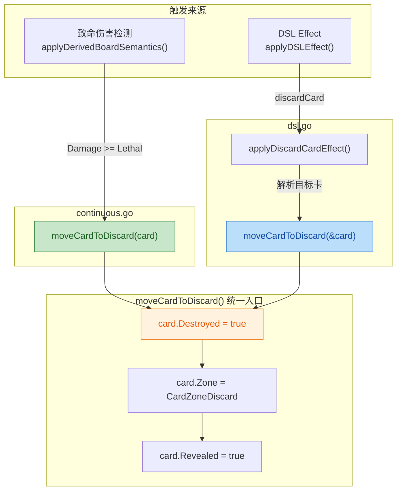
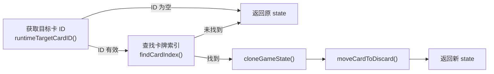

## 1. 高层概览（TL;DR）

- **影响等级：** 🟢 **Low** — 内部重构 + 新增最小 DSL 能力，无破坏性变更
- **核心改动：**
  - 🏗️ 提取 `moveCardToDiscard()` 统一 helper，收敛"卡牌进入弃牌堆"的散写逻辑
  - ✨ 新增 `discardCard` DSL effect，支持规则引擎主动弃牌
  - 🧪 新增 `discard_test.go`，覆盖致命伤害路径和 DSL 弃牌路径
  - 📝 更新设计文档，记录 Discard / Graveyard V1.5 阶段性进展

---

## 2. 视觉总览（逻辑流图）



**关键设计意图：** 两条完全不同的触发路径（致命伤害 vs DSL 指令）最终汇聚到同一个 `moveCardToDiscard()` 函数，确保弃牌语义的一致性。

---

## 3. 详细变更分析

### 3.1 🏗️ `continuous.go` — 提取统一 Helper

| 项目 | 详情 |
|------|------|
| **文件** | `server/pkg/rules/continuous.go` |
| **变更类型** | 重构（Extract Method） |

**变更内容：**

将 `applyDerivedBoardSemantics()` 中内联的三行弃牌逻辑：

```go
// 旧代码（已删除）
card.Destroyed = true
card.Zone = CardZoneDiscard
card.Revealed = true
```

提取为独立函数 `moveCardToDiscard(card *CardState)`，原调用处改为：

```go
// 新代码
moveCardToDiscard(card)
```

> **为什么这样做：** 弃牌逻辑即将被 DSL effect 复用，散写会导致语义漂移风险。统一入口后，未来修改弃牌行为（如增加日志、触发事件）只需改一处。

---

### 3.2 ✨ `dsl.go` — 新增 `discardCard` DSL Effect

| 项目 | 详情 |
|------|------|
| **文件** | `server/pkg/rules/dsl.go` |
| **变更类型** | 新增功能 |

**DSL 路由注册：**

在 `applyDSLEffect()` 的 switch 中新增分支：

```go
case "discardCard":
    return applyDiscardCardEffect(state, operation, effect)
```

**`applyDiscardCardEffect()` 实现逻辑：**



| DSL Effect 参数 | 说明 |
|-----------------|------|
| `Kind` | `"discardCard"` |
| `TargetRef` | `"selected"` — 使用 `operation.TargetCardID` 定位目标卡 |
| 返回值 | 不可变风格：clone 后修改，返回新 `GameState` |

> **设计一致性：** 该函数严格遵循了 `applyDealDamageEffect()` 等已有 effect 的不可变模式（`cloneGameState` → 修改 → 返回），而非 `applyDerivedBoardSemantics()` 的原地修改风格。

---

### 3.3 🧪 `discard_test.go` — 新增单元测试

| 项目 | 详情 |
|------|------|
| **文件** | `server/pkg/rules/discard_test.go`（新增） |
| **测试数量** | 2 个 |

| 测试函数 | 覆盖路径 | 验证点 |
|----------|----------|--------|
| `TestDiscardCardDSLEffectExists` | DSL `discardCard` effect | `target.Zone == CardZoneDiscard` |
| `TestLethalDamageUsesMoveCardToDiscard` | 致命伤害 → `applyDerivedBoardSemantics()` | `Zone`、`Destroyed`、`Revealed` 三个字段均正确 |

**测试设计亮点：**
- 致命伤害测试构造了 `Damage:3` vs `Defense:2` 的场景（伤害 > 防御），直接调用 `applyDerivedBoardSemantics()` 验证端到端行为
- DSL 测试使用 `TargetRef: "selected"` + `TargetCardID` 的标准操作模式

---

### 3.4 📝 `NEXT_GEN_RULE_PLAN.md` — 文档更新

新增 **2026-04-01 第十次补记** 章节，明确记录：

- ✅ **已完成：** 统一离场 helper + `discardCard` 最小 DSL
- ❌ **未完成：** 坟墓检索、复活、回手、坟墓作为资源区

---

## 4. 影响与风险评估

| 风险类别 | 评估 |
|----------|------|
| ⚠️ **破坏性变更** | **无** — 纯内部重构 + 新增 DSL 分支，不影响已有 API 或数据结构 |
| ⚠️ **行为变更** | **无** — `moveCardToDiscard()` 的逻辑与原内联代码完全一致 |
| ⚠️ **测试覆盖** | **良好** — 两条触发路径均有独立测试覆盖 |

**建议测试场景：**
- ✅ 致命伤害导致角色卡进入弃牌堆（`Damage >= Defense`）
- ✅ 通过 DSL `discardCard` effect 主动弃掉指定卡牌
- ✅ 目标卡不存在时 DSL effect 应静默返回原 state（不 panic）
- ✅ 非 `CardZoneTable` 区域的卡不受致命伤害检测影响