## 1. 高层摘要 (TL;DR)

*   **影响:** 🟡 Medium — 修复了规则引擎中不变量检查的时机问题，调整了目标合法性校验范围，并清理了测试规则对生产代码的污染。
*   **关键变更:**
    *   🔧 **不变量检查时机后移**: `SubmitActionWithProjection` 中将 `commitState` 提前到不变量检查之前，确保在**已提交状态**（含 revision/history 更新、持续效果重算）上验证不变量。
    *   🎯 **目标合法性范围收窄**: `CheckLegality` 中"不能成为目标"（XQ31）校验新增 `ActionKindQueueOperation` 条件，角色行动（如攻击/调查）不再受目标合法性限制。
    *   🛡️ **优先玩家不变量修复**: `InvariantPriorityPlayerValid` 补齐了与 `currentPriorityPlayerID` 一致的 fallback 逻辑。
    *   🧹 **测试规则隔离**: 从生产 `BuildProhibitionChecker` 中移除 `TEST01`/`TEST02` 规则，测试改为显式构造 checker。

---

## 2. 可视化概览 (逻辑流程图)

```mermaid
flowchart TD
    subgraph "SubmitActionWithProjection (engine.go)"
        A["执行操作 applyOperation()"] --> B{"不变量检查启用?"}
        B -- Yes --> C["commitState() 提交状态"]
        C --> D["CheckAllInvariants(result.State)"]
        D --> E{"所有不变量通过?"}
        E -- No --> F["返回 legalityError ❌"]
        E -- Yes --> G["返回 result ✅"]
        B -- No --> C
    end

    subgraph "CheckLegality (engine.go)"
        H["action.TargetCardID != '' ?"] --> I{"action.Kind ==\nActionKindQueueOperation?"}
        I -- Yes --> J["BuildTargetLegalityChecker\n检查目标合法性"]
        I -- No --> K["跳过目标检查 ✅\n(角色行动不受限)"]
        J --> L{"CanTarget?"}
        L -- No --> M["返回合法性失败 ❌"]
        L -- Yes --> N["通过 ✅"]
    end

    subgraph "InvariantPriorityPlayerValid (invariants.go)"
        O["读取 Priority.CurrentPlayerID"] --> P{"为空?"}
        P -- Yes --> Q["Fallback: PriorityPlayerID"]
        P -- No --> R["使用 CurrentPlayerID"]
        Q --> S{"仍为空?"}
        R --> S
        S -- Yes --> T["返回 true\n(游戏未开始)"]
        S -- No --> U["检查是否在 Players 列表中"]
    end

    subgraph "BuildProhibitionChecker (prohibition.go)"
        V["生产规则列表"] --> W["仅 XQ22ProhibitionRule"]
        W --> X["NewScopedProhibitionChecker(rules)"]
    end

    style C fill:#c8e6c9,color:#1a5e20
    style D fill:#c8e6c9,color:#1a5e20
    style I fill:#fff3e0,color:#e65100
    style K fill:#bbdefb,color:#0d47a1
    style Q fill:#f3e5f5,color:#7b1fa2
    style W fill:#ffcdd2,color:#b71c1c
```



---

## 3. 详细变更分析

### 3.1 🔄 `SubmitActionWithProjection` — 不变量检查时机修正

**文件:** `server/pkg/rules/engine.go`

**变更逻辑:** 将 `commitState()` 调用从不变量检查**之后**移到**之前**。

| 方面 | 修改前 | 修改后 |
|------|--------|--------|
| 检查对象 | `working` 状态（操作后、提交前） | `result.State`（已提交状态） |
| 检查时机 | `commitState` 之前 | `commitState` 之后 |
| 能否捕获提交阶段引入的问题 | ❌ 不能 | ✅ 能 |

**为什么重要:** `commitState` 会执行 revision 递增、历史记录追加、持续效果重算（`maybeRecalculateContinuousEffects`）等操作。在提交**之前**检查不变量，会遗漏这些阶段引入的状态不一致问题。

**附带修复:** 循环变量 `result` 重命名为 `invResult`，避免与外层 `result`（`SubmitResult`）变量名冲突。

### 3.2 🎯 `CheckLegality` — 目标合法性校验范围收窄

**文件:** `server/pkg/rules/engine.go`

**变更逻辑:** 在目标合法性检查前新增 `action.Kind == ActionKindQueueOperation` 条件。

```go
// 修改前
if action.TargetCardID != "" {

// 修改后
if action.TargetCardID != "" && action.Kind == ActionKindQueueOperation {
```

**业务含义:** XQ31"不能成为目标"效果现在**仅阻止卡牌/技能的定向 targeting**，不再阻止角色行动（如 `DeclareAttack`、`DeclareInvestigation`）指定目标。这符合卡牌游戏设计中"不能成为目标"通常只限制卡牌效果、不限制攻击/调查的惯例。

### 3.3 🛡️ `InvariantPriorityPlayerValid` — 优先玩家不变量对齐

**文件:** `server/pkg/rules/invariants.go`

**变更逻辑:** 补齐与 `currentPriorityPlayerID()` (engine.go:870) 一致的 fallback 逻辑。

```go
// 新增 fallback 逻辑
priorityPlayer := state.Turn.Priority.CurrentPlayerID
if priorityPlayer == "" {
    priorityPlayer = state.Turn.PriorityPlayerID  // ← 新增
}
```

**为什么重要:** 引擎运行时使用 `currentPriorityPlayerID()` 获取优先玩家，该函数在 `CurrentPlayerID` 为空时会 fallback 到 `PriorityPlayerID`。不变量检查如果只看 `CurrentPlayerID`，会在 fallback 生效的场景下产生**误报**（引擎认为合法，不变量却报错）。

### 3.4 🧹 `BuildProhibitionChecker` — 测试规则隔离

**文件:** `server/pkg/rules/prohibition.go` / `prohibition_multicard_test.go`

| 规则 | 修改前位置 | 修改后位置 |
|------|-----------|-----------|
| `XQ22ProhibitionRule` | 生产 `BuildProhibitionChecker` | 生产 `BuildProhibitionChecker`（不变） |
| `TEST01ProhibitionRule` | 生产 `BuildProhibitionChecker` | 仅在测试中显式构造 |
| `TEST02ProhibitionRule` | 生产 `BuildProhibitionChecker` | 仅在测试中显式构造 |

**测试文件变更:** 3 个测试函数（`TestMultiCardProhibition`、`TestMultiCardProhibitionDifferentScopes`、`TestProhibitionCheckerEmptyControllerID`）从调用 `BuildProhibitionChecker(state)` 改为显式构造 `NewScopedProhibitionChecker(rules)`，按需注入测试规则。

---

## 4. 影响与风险评估

### ⚠️ 潜在风险

| 风险项 | 级别 | 说明 |
|--------|------|------|
| 不变量检查范围扩大 | 🟡 中 | 在已提交状态上检查不变量，可能暴露之前被遗漏的持续效果重算问题。如果现有测试未覆盖这些场景，可能出现新的测试失败。 |
| 目标合法性范围收窄 | 🟡 中 | 角色行动（攻击/调查）不再受"不能成为目标"限制。需确认这是符合游戏设计意图的，而非意外行为。 |

### ✅ 测试建议

1. **不变量回归测试:** 运行全部不变量相关测试，确认在已提交状态上检查不会产生新的误报。
2. **目标合法性边界测试:** 验证以下场景：
   - 卡牌效果 targeting 被"不能成为目标"正确阻止 ✅
   - 攻击行动（`DeclareAttack`）指定目标不受 XQ31 限制 ✅
   - 调查行动（`DeclareInvestigation`）指定目标不受 XQ31 限制 ✅
3. **优先玩家不变量:** 测试 `CurrentPlayerID` 为空但 `PriorityPlayerID` 有值时，不变量不再误报。
4. **禁止规则测试:** 确认 `TestMultiCardProhibition` 等测试仍然通过，验证测试规则隔离正确。