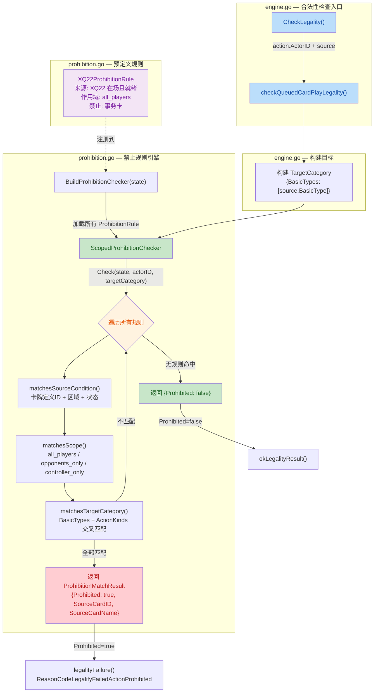

## 1. 高层摘要 (TL;DR)

*   **影响：** 🔴 **高** — 将硬编码的卡牌禁止逻辑（XQ22）重构为通用的、数据驱动的禁止规则引擎，为后续扩展更多卡牌效果奠定基础。
*   **关键变更：**
    *   ✨ 新增 **`ScopedProhibitionChecker`** 通用禁止规则引擎（`prohibition.go`），支持来源条件、作用域和目标类别三维度匹配
    *   ✨ 新增 **6 个类型定义**（`ProhibitionRule`、`CardCondition`、`ProhibitionScope`、`TargetCategory` 等），构成完整的规则描述模型
    *   ♻️ 重构 `checkQueuedCardPlayLegality()`，从硬编码 XQ22 检查改为调用通用 `checker.Check()`
    *   🗑️ 移除废弃的 `isReadyDefinitionCard()` 辅助函数
    *   ✅ 新增 **7 个单元测试**，覆盖空状态、来源条件、作用域、目标类别、多来源等场景

---

## 2. 可视化概览（逻辑架构图）



---

## 3. 详细变更分析

### 📦 组件一：新增类型定义（`types.go`）

新增了一套完整的禁止规则类型系统，用于描述"谁在什么条件下禁止什么行为"：

| 类型 | 用途 | 关键字段 |
|------|------|----------|
| **`ProhibitionScopeKind`** | 枚举：禁止作用域类型 | `"all_players"` / `"opponents_only"` / `"controller_only"` |
| **`CardCondition`** | 来源卡的激活条件 | `Zone`、`Ready`、`NotDestroyed`、`Revealed` |
| **`ProhibitionScope`** | 作用域包装 | `Kind ProhibitionScopeKind` |
| **`TargetCategory`** | 被禁止的目标类别 | `BasicTypes []string`、`ActionKinds []ActionKind` |
| **`ProhibitionRule`** | 完整的禁止规则定义 | `SourceDefinitionID`、`SourceCondition`、`Scope`、`TargetCategory`、`Description` |
| **`ProhibitionMatchResult`** | 规则匹配结果 | `Prohibited`、`MatchedRule`、`SourceCardID`、`SourceCardName` |

### 📦 组件二：新增禁止规则引擎（`prohibition.go`）

全新的 **`ScopedProhibitionChecker`** 结构体，实现了三阶段匹配流水线：

1.  **`matchesSourceCondition()`** — 检查场上卡牌是否满足规则的来源条件（定义 ID、区域、是否就绪、是否被摧毁、是否揭示）
2.  **`matchesScope()`** — 检查禁止作用域是否适用于当前行动者（全部玩家 / 仅对手 / 仅控制者）
3.  **`matchesTargetCategory()`** — 检查被操作的目标类别是否命中禁止列表（BasicTypes 和 ActionKinds 的交叉匹配）

预定义了 **`XQ22ProhibitionRule`** 作为首个规则实例，语义等价于原来的硬编码逻辑：

| 属性 | 值 |
|------|----|
| 来源卡 | `XQ22`（州议员贝伦·希恩斯） |
| 激活条件 | 在场 (`CardZoneTable`) + 就绪 (`Ready`) + 未被摧毁 (`NotDestroyed`) |
| 作用域 | `all_players`（所有玩家） |
| 禁止目标 | `BasicTypes: ["事务"]`（事件卡） |

### 📦 组件三：重构合法性检查（`engine.go`）

**`checkQueuedCardPlayLegality()`** 的核心变化：

| 方面 | 重构前 | 重构后 |
|------|--------|--------|
| **函数签名** | `(state, source)` | `(state, actorID, source)` — 新增行动者 ID |
| **检查方式** | 硬编码遍历 `state.Board.Cards` 查找 XQ22 | 调用 `BuildProhibitionChecker().Check()` 通用引擎 |
| **作用域支持** | ❌ 无（隐式影响所有玩家） | ✅ 支持 `all_players` / `opponents_only` / `controller_only` |
| **可扩展性** | ❌ 每张新卡需修改此函数 | ✅ 只需添加新的 `ProhibitionRule` |
| **错误信息来源** | 直接从遍历的 `card` 获取 | 从 `ProhibitionMatchResult` 获取 |

**调用链变更：**

```
CheckLegality()
  └─ checkQueuedCardPlayLegality(state, action.ActorID, source)  // 新增 actorID 参数
       ├─ 构建 TargetCategory{BasicTypes: [source.BasicType]}
       ├─ checker := BuildProhibitionChecker(state)
       ├─ result := checker.Check(state, actorID, targetCategory)
       └─ if result.Prohibited → legalityFailure(result.SourceCardID, result.SourceCardName)
```

**移除代码：**
- 🗑️ `isReadyDefinitionCard()` — 原用于判断卡牌是否"就绪"的辅助函数，其逻辑已被 `matchesSourceCondition()` 完全覆盖

### 📦 组件四：新增单元测试（`prohibition_test.go`）

| 测试用例 | 覆盖场景 |
|----------|----------|
| `TestProhibitionCheckerEmptyStateAllowsAll` | 无禁止来源时，所有操作放行 |
| `TestProhibitionCheckerMatchesSourceCondition` | 5 种卡牌状态：就绪/疲惫/摧毁/手中/错误ID |
| `TestProhibitionCheckerRespectsScope` | `AllPlayers` 作用域下 P1 和 P2 均被禁止 |
| `TestProhibitionCheckerMatchesTargetCategory` | 事务卡被禁止，角色卡和地区卡放行 |
| `TestProhibitionCheckerMultipleSources` | 场上多张 XQ22 时正确匹配 |
| `TestProhibitionCheckerNoBasicType` | 空 BasicType 不触发禁止 |
| `TestProhibitionCheckerReturnsRuleInfo` | 验证返回的 SourceCardID、SourceCardName、MatchedRule 正确 |

---

## 4. 影响与风险评估

### ⚠️ 潜在风险

| 风险项 | 等级 | 说明 |
|--------|------|------|
| **行为等价性** | 🟡 中 | 新引擎对 XQ22 的语义应与旧逻辑等价，但 `matchesSourceCondition` 中 `Ready` 条件检查的是 `!card.Exhausted`，而旧函数 `isReadyDefinitionCard` 也是 `!card.Exhausted`，逻辑一致 |
| **性能** | 🟢 低 | 新引擎每次检查遍历所有规则 × 所有场上卡牌，当前仅 1 条规则，性能影响可忽略 |
| **actorID 传递** | 🟡 中 | `CheckLegality` 调用处新增了 `action.ActorID` 参数，需确认所有调用路径都能正确传递 |

### ✅ 测试建议

1. **回归测试：** 验证 XQ22 在场且就绪时，所有玩家无法打出事务卡（与旧行为一致）
2. **边界测试：** XQ22 疲惫或被摧毁时，事务卡应可正常打出
3. **作用域测试：** 当未来添加 `opponents_only` 规则时，验证控制者本人不受影响
4. **多卡叠加：** 场上同时存在多张不同禁止效果卡牌时的行为
5. **错误信息：** 确认禁止失败时返回的 `prohibitingCardId` 和 `prohibitingCardName` 正确对应实际来源卡