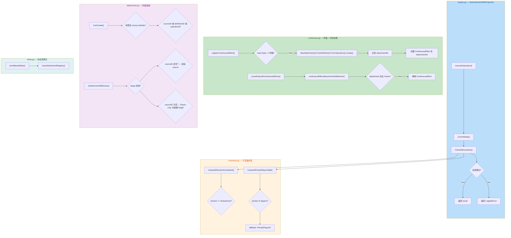
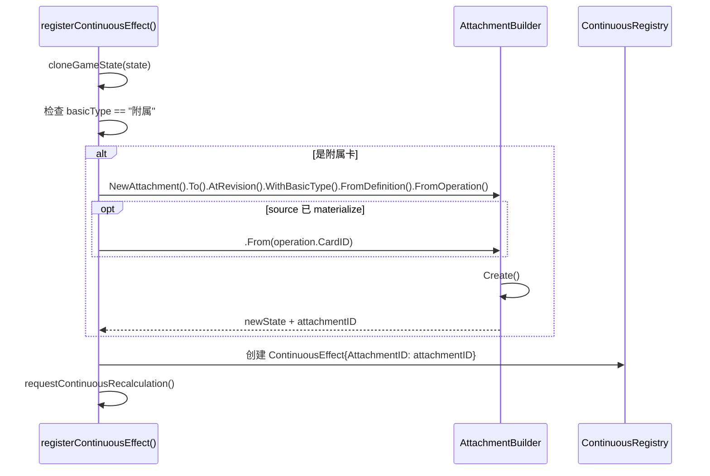

## 1. 高层摘要 (TL;DR)

*   **影响：** 🟡 **中等** — 涉及规则引擎核心层（不变量检查时机、附属追踪生命周期、目标合法性范围）的纠偏修复，同时大幅更新交接文档以同步最新事实。
*   **关键变更：**
    - 🔧 **不变量检查后移**：从 pre-commit working state 改为 committed state，确保 history/revision/continuous recalc 一致性
    - 🔧 **`InvariantRevisionConsistent` 收紧**：移除 `+1` 容差，要求 `revision == len(history.actions)` 严格相等
    - 🔧 **`InvariantPriorityPlayerValid` 修正**：按 engine 真实 fallback 逻辑读取 `PriorityPlayerID`
    - ✨ **附属追踪 V0**：支持 fixture-only source（`sourceDefinitionID` + `sourceOperationID`），host 离场同步清理 continuous effect，补齐 `cloneBoardState` 深拷贝
    - 📝 **交接文档大幅更新**：新增 §2.2.2 纠偏同步章节，更新待办事项和已知限制

---

## 2. 可视化概览（代码与逻辑映射）



---

## 3. 详细变更分析

### 3.1 🔧 不变量检查纠偏

#### `server/pkg/rules/engine.go` — 检查时机后移

**变更内容：** `CheckAllInvariants` 从 `commitState()` **之前**移到**之后**执行。

| 维度 | 旧逻辑 | 新逻辑 |
|------|--------|--------|
| 检查时机 | pre-commit working state | committed state |
| 可验证范围 | 仅 operation 直接效果 | history/revision/continuous recalc 全部 |
| 返回值 | `commitState(working, ...)` 的结果 | 直接返回已计算的 `result` |

**核心意义：** pre-commit 状态看不到 `commitState` 内部写入的 history actions、revision 递增、continuous recalculation 结果，导致检查"盲区"。移到 committed state 后，不变量成为真正的 **commit 后真相检查**。

---

#### `server/pkg/rules/invariants.go` — 两项收紧

**A. `InvariantRevisionConsistent` — 移除 `+1` 容差**

```go
// 旧: 允许 revision 比历史长度多 1
return state.Revision.Number == expectedRevision || state.Revision.Number == expectedRevision+1

// 新: 严格相等
return state.Revision.Number == expectedRevision
```

> 配合检查时机后移，committed state 的 revision 必然等于 `len(actions)`，`+1` 容差只会掩盖真正的数据不一致。

**B. `InvariantPriorityPlayerValid` — 按 engine fallback 逻辑读取**

```go
priorityPlayer := state.Turn.Priority.CurrentPlayerID
if priorityPlayer == "" {
    priorityPlayer = state.Turn.PriorityPlayerID  // 与 engine.go 的 currentPriorityPlayerID 一致
}
```

> 确保不变量检查的"优先玩家"定义与引擎实际使用的完全一致。

---

#### `server/pkg/rules/invariants_test.go` — 测试对齐

| 测试 | 变更 | 目的 |
|------|------|------|
| `TestInvariantPriorityPlayerValidFallsBackToLegacyPriorityField` | 🆕 新增 | 验证 fallback 到 `PriorityPlayerID` 时，非法玩家仍被拒绝 |
| `TestInvariantRevisionConsistentPass` | 移除 `revision+1` 通过用例 | 与收紧后的语义对齐 |
| `TestInvariantRevisionConsistentFail` | 新增 `revision = len+1` 应失败的用例 | 确认容差已移除 |

---

### 3.2 ✨ 附属追踪系统 V0

#### `server/pkg/rules/types.go` — 数据结构扩展

**`Attachment` 新增字段：**

| 字段 | 类型 | JSON Key | 用途 |
|------|------|----------|------|
| `SourceDefinitionID` | `string` | `sourceDefinitionId` | fixture-only source 的卡牌定义 ID（如 `"BQ022"`） |
| `SourceOperationID` | `string` | `sourceOperationId` | 产生附属效果的 operation ID |

**`ContinuousEffect` 新增字段：**

| 字段 | 类型 | JSON Key | 用途 |
|------|------|----------|------|
| `AttachmentID` | `string` | `attachmentId` | 关联的 attachment ID，用于生命周期联动 |

---

#### `server/pkg/rules/attachment.go` — Builder 扩展与校验逻辑

**新增 Builder 方法：**
- `FromDefinition(sourceDefinitionID)` — 设置 fixture-only source 的定义 ID
- `FromOperation(sourceOperationID)` — 设置产生附属效果的 operation ID

**`CanCreate()` 校验逻辑变更：**

```go
// 旧: 要求 sourceID 对应的卡牌在场上
if !b.isCardValid(b.sourceID) { return false }

// 新: 只要求某种稳定 source identity 存在
if b.sourceID == "" && b.sourceDefinitionID == "" && b.sourceOperationID == "" {
    return false
}
// 如果 sourceID 非空，仍需校验其为有效场上实体
if b.sourceID != "" && !b.isCardValid(b.sourceID) { return false }
```

**`isAttachmentStillActive()` 逻辑变更：**

```go
// 旧: source 和 target 都必须有效
return am.isCardValid(attachment.SourceCardID) && am.isCardValid(attachment.TargetCardID)

// 新: target 必须有效; source 仅在非空时校验
if !am.isCardValid(attachment.TargetCardID) { return false }
if attachment.SourceCardID != "" { return am.isCardValid(attachment.SourceCardID) }
return true  // fixture-only source 仅依赖 target 生命周期
```

---

#### `server/pkg/rules/continuous.go` — 附属创建前置 + 生命周期联动

**核心变更：** 附属创建从 continuous effect 创建**之后**移到**之前**，以便将 `attachmentID` 写入 `ContinuousEffect`。



**新增 `continuousEffectAttachmentIsStillActive()`：** 在 `pruneExpiredContinuousEffects` 中，如果 effect 关联的 attachment 已被 prune（host 离场），则同步移除该 continuous effect。

---

#### `server/pkg/rules/clone.go` — 补齐深拷贝

新增 `cloneAttachmentRegistry()` 和 `cloneAttachments()`，确保 `cloneBoardState()` 不会产生 `Attachments` 的 snapshot aliasing。

---

### 3.3 🧪 新增测试

| 测试文件 | 测试名 | 验证内容 |
|----------|--------|----------|
| `attachment_test.go` | `TestCloneGameStateDeepCopiesAttachments` | clone 后修改不影响原始 state |
| `continuous_test.go` | `TestPureDSLAttachmentRegistersContinuousKeywordEffect`（扩展） | 验证 BQ022 附属创建后 `sourceDefinitionID`/`sourceOperationID` 正确 |
| `continuous_test.go` | `TestPureDSLAttachmentPrunesContinuousEffectWhenTargetLeavesTable` | 🆕 target 离场后 attachment + continuous effect 同步清理 |
| `role_actions_test.go` | `TestDeclareAttackIgnoresXQ31TargetLegalityRestriction` | 🆕 `declare_attack` 不被 XQ31 误伤 |

---

### 3.4 📝 交接文档更新

**`docs/HANDOVER_TRAE_2026-04-01.md`：**

- ✅ 新增 3 条已完成项（XQ31 收窄、invariant 纠偏、attachment V0）
- ✅ 新增 **§2.2.2 最新纠偏同步**（A: XQ31/invariant 纠偏，B: 附属追踪纠偏），明确标注"优先于前文旧表述"
- ✅ 更新 §2.3 待完成：`XQ31` 标注为"最小 targeting slice 已纠偏但远未完成"
- ✅ 更新 §6.2 已知限制：区分 `XQ31`（部分完成）和 `XQ01`（未开始）

---

## 4. 影响与风险评估

### ⚠️ 潜在风险

| 风险 | 级别 | 说明 |
|------|------|------|
| **不变量检查后移可能暴露隐藏不一致** | 🟡 中 | 之前 pre-commit 检查可能漏掉 committed state 的不一致，切换后可能有之前"通过"的 action 现在报错 |
| **`revision+1` 容差移除** | 🟡 中 | 如果存在任何非标准路径（如 replay、手动构造 state）未严格对齐 revision，将触发不变量失败 |
| **附属 V0 不完整** | 🟢 低（已知） | 文档明确标注：附属作为真实 table permanent、回收/回手/自身离场处理均未实现 |

### ✅ 测试建议

1. **回归测试：** 运行全部 sanity check / golden scenario，确认 XQ31 相关场景（保护声望盟友、允许本方目标、攻击不受限）均通过
2. **边界测试：** 验证 `InvariantRevisionConsistent` 在 replay 长序列后仍严格成立
3. **附属生命周期：** 验证 BQ022 附属 → target 被销毁 → continuous effect 被清理 → keyword 消失的完整链路
4. **Clone 隔离：** 验证 clone 后对 Attachments 的修改不影响原始 state