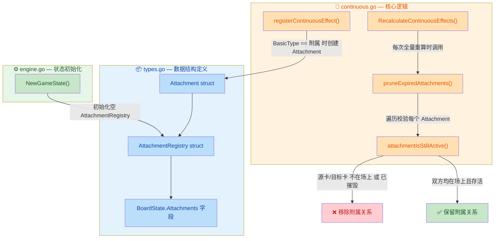
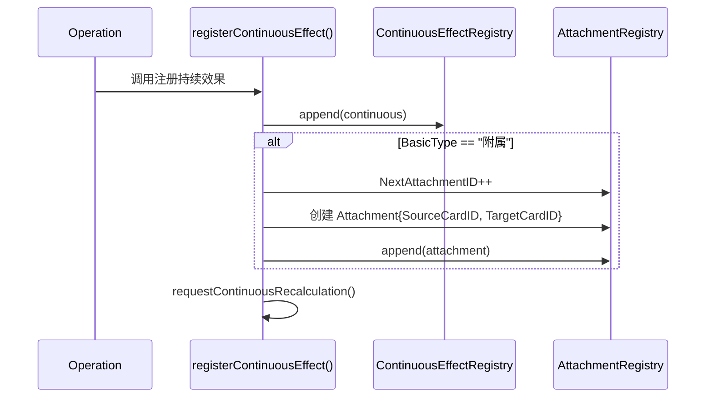

## 1. 高层摘要 (TL;DR)

* **影响：** 🟡 **中等** — 为卡牌游戏引擎新增了「附属」卡牌的 Attachment 追踪机制，涉及类型定义、注册流程和生命周期管理。
* **核心变更：**
  - ✨ 新增 `Attachment` 和 `AttachmentRegistry` 数据结构，嵌入 `BoardState` 中
  - ✨ 在 `registerContinuousEffect()` 中，当卡牌 `BasicType == "附属"` 时自动创建附属关系记录
  - ✨ 新增 `pruneExpiredAttachments()` 函数，在每次全量重算时清理失效的附属关系
  - ✨ 新增 `attachmentIsStillActive()` 校验函数，判断源卡和目标卡是否仍在场上且未被摧毁
  - 🔧 `NewGameState()` 初始化时同步初始化空的 `AttachmentRegistry`

---

## 2. 可视化概览（代码与逻辑地图）



---

## 3. 详细变更分析

### 📦 组件一：数据结构定义（`types.go`）

**变更内容：** 新增两个结构体，并将 `AttachmentRegistry` 嵌入 `BoardState`。

| 结构体 | 字段 | 类型 | 说明 |
|--------|------|------|------|
| **`Attachment`** | `ID` | `string` | 格式为 `att:{序号}`，全局唯一标识 |
| | `SourceCardID` | `string` | 附属卡（源卡）的 ID |
| | `TargetCardID` | `string` | 被附属卡（目标卡）的 ID |
| | `CreatedAtRevision` | `int` | 创建时的游戏版本号 |
| **`AttachmentRegistry`** | `Active` | `[]Attachment` | 当前所有活跃的附属关系 |
| | `NextAttachmentID` | `int` | 自增 ID 计数器，初始值为 1 |

> **BoardState 变更：** 新增 `Attachments AttachmentRegistry` 字段（JSON key: `"attachments"`）

---

### ⚙️ 组件二：状态初始化（`engine.go`）

**变更内容：** 在 `NewGameState()` 中初始化 `AttachmentRegistry`。

```go
Attachments: AttachmentRegistry{
    Active:           []Attachment{},
    NextAttachmentID: 1,
},
```

确保新游戏开始时附属注册表为空且 ID 计数器从 1 开始。

---

### 🔄 组件三：附属注册与生命周期管理（`continuous.go`）

#### 3.1 注册流程 — `registerContinuousEffect()`

在持续效果注册完成后，新增一段逻辑：

- **触发条件：** `operation.Source.BasicType == "附属"`
- **行为：** 自增 `NextAttachmentID`，创建 `Attachment` 记录并追加到 `Active` 列表
- **关键点：** 附属关系与持续效果**同时注册**，共享同一个 `targetCardID`



#### 3.2 清理流程 — `pruneExpiredAttachments()`

**调用时机：** 在 `RecalculateContinuousEffects()` 中，**先于** `pruneExpiredContinuousEffects()` 调用。

**清理策略：** 采用 filter 模式（构建 `kept` 切片），仅当确实有移除时才替换原切片。

#### 3.3 存活校验 — `attachmentIsStillActive()`

校验逻辑**双向对称**，源卡和目标卡必须**同时满足**以下条件：

| 校验项 | 条件 | 不满足时结果 |
|--------|------|-------------|
| 卡牌存在 | `findCardIndex() != -1` | ❌ 附属失效 |
| 所在区域 | `Zone == CardZoneTable` | ❌ 附属失效 |
| 摧毁状态 | `Destroyed == false` | ❌ 附属失效 |

> **与 `continuousEffectSourceIsStillActive()` 的对比：** 后者仅校验源卡，而 `attachmentIsStillActive()` **同时校验源卡和目标卡**，这是因为附属关系需要双方都在场上才有意义。

---

## 4. 影响与风险评估

### ⚠️ 潜在风险

| 风险点 | 等级 | 说明 |
|--------|------|------|
| **JSON 序列化兼容性** | 🟡 中 | `BoardState` 新增 `attachments` 字段，旧版本客户端若解析严格可能会报错 |
| **附属与效果不同步** | 🟢 低 | 附属在 `registerContinuousEffect()` 内部创建，与效果注册原子绑定，不太可能不同步 |
| **性能影响** | 🟢 低 | `pruneExpiredAttachments()` 仅在 `RecalculateContinuousEffects()` 时触发，且使用 filter 模式避免不必要的内存分配 |

### 🧪 测试建议

1. **附属创建验证：** 当 `BasicType == "附属"` 时，确认 `AttachmentRegistry.Active` 中新增了正确记录
2. **非附属卡不创建：** 当 `BasicType` 为其他值时，确认不会产生附属记录
3. **源卡被摧毁：** 摧毁附属卡后，确认重算时附属关系被正确清理
4. **目标卡被摧毁：** 摧毁被附属卡后，确认重算时附属关系被正确清理
5. **双方离开桌面：** 将任一卡移出 `CardZoneTable` 区域，确认附属关系失效
6. **ID 唯一性：** 连续创建多个附属，确认 `ID` 递增且不重复
7. **空注册表快速返回：** `Active` 为空时，确认 `pruneExpiredAttachments()` 立即返回