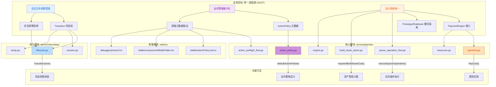

## 1. 高层摘要 (TL;DR)

**影响范围**: 🟡 **中等** - 本次变更聚焦于架构层面的"单一真相源"收口，涉及会话生命周期、动作策略、支付系统和前端元数据驱动的全面重构。

**核心变更**:
- ✅ **会话生命周期显式化**: 引入 `SessionLifecycle` 状态机，所有状态转移必须通过 `Transition()` 方法
- ✅ **动作策略集中化**: 新增 `ActionPolicy` 元数据驱动机制，前端不再硬编码校验逻辑
- ✅ **支付引擎并轨**: `queue_operation` 和 `build_asset` 正式接入支付系统，支持费用预检和扣除
- ✅ **构筑规则启用**: 默认启用派系限制（最多2个）、牌库大小（40-60张）、同名副本（最多3张）验证
- ✅ **视觉表现增强**: 卡牌显示战斗/防御/调查数值，支持横置/暗置/摧毁状态的视觉反馈

---

## 2. 可视化概览 (代码与逻辑映射)



---

## 3. 详细变更分析

### 📋 组件 1: 会话生命周期状态机

**变更说明**: 废弃了由多个布尔值拼凑生命周期的做法，引入显式 `SessionLifecycle` 状态机，所有状态转移必须通过统一的 `Transition()` 方法。

**关键代码** (Source: `server/internal/api/lifecycle.go`):

```go
func (session *SandboxSession) Transition(next SessionLifecycle) error {
    current := session.lifecycle
    
    if next.Kind == SessionLifecycleReset {
        session.lifecycle = next
        session.setup.Lifecycle = next
        return nil
    }
    
    var err error
    switch current.Kind {
    case SessionLifecycleReset, "":
        if next.Kind == SessionLifecycleSetup && next.SetupStep == 1 {
            break
        }
        // ... 状态转移矩阵校验
    }
    
    if err != nil {
        return err
    }
    
    session.lifecycle = next
    session.setup.Lifecycle = next
    return nil
}
```

**状态转移规则**:

| 当前状态 | 允许转移至 | 条件 |
|---------|-----------|------|
| `Reset` | `Setup(1)` | - |
| `Setup(N)` | `Setup(N+1)` | 步骤递增1 |
| `Setup(7)` | `MatchActive` | 步骤7完成 |
| `MatchActive` | `MatchFinished` | - |
| `MatchFinished` | `Reset` | - |
| 任意状态 | `Reset` | - |

---

### 📋 组件 2: 动作策略集中化

**变更说明**: 在 Go 后端定义全量 `ActionPolicy`，通过 `RulesMetadata` 随投影下发给前端。前端不再硬编码校验逻辑，改为基于元数据动态执行字段要求、行动者约束和忠诚解析。

**新增数据结构** (Source: `server/pkg/rules/action_policy.go`):

```go
type ActionCardKindConstraint struct {
    Kind                 CardKind `json:"kind"`
    RequiresEmptyStack   bool     `json:"requiresEmptyStack"`
    RequiresActionWindow bool     `json:"requiresActionWindow"`
}

type ActionPolicy struct {
    ActionKind           ActionKind                 `json:"actionKind"`
    ActorConstraint      ActionActorConstraint      `json:"actorConstraint"`
    RequiresPriority     bool                       `json:"requiresPriority"`
    RequiresEmptyStack   bool                       `json:"requiresEmptyStack"`
    RequiresActionWindow bool                       `json:"requiresActionWindow"` // 新增
    FieldRules           []ActionFieldRule          `json:"fieldRules,omitempty"`
    CardKindConstraints  []ActionCardKindConstraint `json:"cardKindConstraints,omitempty"` // 新增
}
```

**动作策略示例** (Source: `server/pkg/rules/action_policy.go`):

| 动作类型 | 优先权要求 | 空栈要求 | 动作窗口要求 | 卡牌种类约束 |
|---------|-----------|---------|-------------|-------------|
| `play_card` | ✅ | ❌ | ✅ | Character/Asset 需空栈+动作窗口 |
| `build_asset` | ✅ | ✅ | ✅ | - |
| `declare_attack` | ✅ | ✅ | ✅ | - |
| `queue_operation` | ✅ | ❌ | ❌ | - |

---

### 📋 组件 3: 支付引擎并轨

**变更说明**: 确立 `PaymentEngine` 接口，将 `queue_operation` 和 `build_asset` 正式纳入支付预检和扣费流程。隔离 `Prototype`（当前原型）与 `Rulebook`（未来正式规则）模式。

**支付引擎接口** (Source: `server/pkg/rules/payment.go`):

```go
type PaymentEngine interface {
    Mode() PaymentMode
    Initialize(*GameState)
    RefillForTurn(*GameState)
    ResourceView(GameState, string) PlayerResourceState
    PayCost(*GameState, string, int) bool
    OnStepEnd(*GameState) // 新增钩子
}

const (
    PaymentModePrototype PaymentMode = "prototype"
    PaymentModeRulebook  PaymentMode = "rulebook" // 新增
)
```

**模式对比**:

| 特性 | `PaymentModePrototype` | `PaymentModeRulebook` |
|-----|----------------------|----------------------|
| 初始资源 | 固定值 | 0 |
| 回合补充 | 固定值 | 需明确实现 |
| 步骤结束处理 | 不清空 | 清空浮动资源 |
| 资产横置 | - | 产生费用 |

**费用检查与扣除** (Source: `server/pkg/rules/queue_operation_flow.go`):

```go
// 预检查阶段
if engine := CurrentPaymentEngine(); engine != nil {
    pool := engine.ResourceView(state, action.ActorID)
    if pool.Current < source.Cost {
        return legalityFailure(ReasonCodeCostFailedUnpaid, ...)
    }
}

// 执行阶段
if engine := CurrentPaymentEngine(); engine != nil {
    if !engine.PayCost(&working, operation.ActorID, operation.Source.Cost) {
        return ..., &LegalityError{...}
    }
}
```

---

### 📋 组件 4: 构筑规则启用

**变更说明**: 移除 `RuntimeIgnoredScopes` 中的派系/牌库限制，默认启用正式构筑规则验证。

**新增常量** (Source: `server/internal/api/setup.go`):

```go
const (
    deckSizeMin      = 40
    deckSizeMax      = 60
    duplicateLimit   = 3
    societyLimit     = 2
    FactionNeutral   = "中立"
)
```

**验证规则**:

| 规则类型 | 限制值 | 错误码 |
|---------|-------|--------|
| 派系数量 | 最多 2 个 | `society_limit_exceeded` |
| 牌库大小 | 40-60 张 | `deck_size_limit` |
| 同名副本 | 最多 3 张 | `duplicate_limit` |

**牌组过滤逻辑** (Source: `server/internal/api/setup.go`):

```go
func loadSetupPlayablePoolFiltered(societies []string, allowedSets []string) ([]setupCard, error) {
    all, err := loadSetupPlayablePoolAllowedSets(allowedSets)
    // 按派系过滤（中立牌始终可用）
    for _, card := range all {
        s := strings.TrimSpace(card.Society)
        if s == "" || s == FactionNeutral || societyMap[s] {
            filtered = append(filtered, card)
        }
    }
    return filtered, nil
}
```

---

### 📋 组件 5: 视觉表现增强

**变更说明**: 卡牌显示战斗/防御/调查数值，支持横置/暗置/摧毁状态的视觉反馈。

**新增样式类** (Source: `web/src/styles/global.css`):

| 样式类 | 视觉效果 | 适用场景 |
|-------|---------|---------|
| `.battle-card--exhausted` | 灰度化、旋转2度、"(已横置)"标签 | 横置卡牌 |
| `.battle-card--face-down` | 深色渐变背景 | 暗置卡牌 |
| `.battle-card--destroyed` | 半透明、删除线、"已摧毁"水印 | 摧毁卡牌 |
| `.stat-combat` | 红色 | 战斗力数值 |
| `.stat-defense` | 蓝色 | 防御力数值 |
| `.stat-investigation` | 橙色 | 调查力数值 |

**派系颜色映射** (Source: `web/src/battle/components/BattleTable.tsx`):

```typescript
const colorMap: Record<string, string> = {
    "方碑序列": "#4a90e2",  // 蓝色
    "帷幕守望": "#50e3c2",  // 青色
    "王座会": "#d0021b",    // 红色
    "国家机构": "#f5a623",  // 橙色
    "中立": "#9b9b9b"       // 灰色
};
```

---

### 📋 组件 6: 前端协议同步

**变更说明**: TypeScript 协议定义与 Go 后端保持同步，新增 `ActionCardKindConstraint` 和 `RequiresActionWindow` 字段。

**协议更新** (Source: `web/src/debugger/protocol.ts`):

```typescript
export type ActionCardKindConstraint = {
    kind: string;
    requiresEmptyStack: boolean;
    requiresActionWindow: boolean;
};

export type ActionPolicy = {
    actionKind: string;
    actorConstraint: ActionActorConstraint;
    requiresPriority: boolean;
    requiresEmptyStack: boolean;
    requiresActionWindow: boolean; // 新增
    fieldRules?: ActionFieldRule[];
    cardKindConstraints?: ActionCardKindConstraint[]; // 新增
};
```

---

## 4. 影响与风险评估

### ⚠️ 破坏性变更

| 变更项 | 影响范围 | 迁移建议 |
|-------|---------|---------|
| 构筑规则默认启用 | 所有开局流程 | 移除 `RuntimeIgnoredScopes` 中的 `construct` 忽略项 |
| `ActionPolicy` 新增字段 | 前端动作校验 | 更新 `actionPolicy.ts` 以读取新字段 |
| 支付引擎并轨 | `queue_operation` 和 `build_asset` | 确保卡牌 `Cost` 字段正确设置 |
| `Transition()` 强制校验 | 会话状态转移 | 使用 `Transition()` 替代直接赋值 |

### 🧪 测试建议

#### 后端测试
```bash
# 生命周期状态机测试
go test -v -run TestSessionLifecycle ./server/internal/api/

# 支付引擎并轨测试
go test -v -run TestPaymentConsolidation ./server/pkg/rules/
go test -v -run TestExecuteQueueOperation ./server/pkg/rules/

# 完整规则引擎测试
go test ./server/...
```

#### 前端测试
```bash
# 动作策略元数据测试
cd web && npm test -- run src/battle/actionPolicy.test.ts

# 类型检查
cd web && npm run typecheck

# E2E 测试
cd web && npm run test:e2e
```

#### 关键测试场景
1. ✅ **状态转移**: 验证非法状态转移被拒绝（如 `MatchFinished` → `MatchActive`）
2. ✅ **费用不足**: 验证 `queue_operation` 和 `build_asset` 在资源不足时被拒绝
3. ✅ **构筑验证**: 验证超过派系限制、牌库大小限制、同名副本限制时被拒绝
4. ✅ **视觉状态**: 验证横置/暗置/摧毁状态的正确显示
5. ✅ **元数据驱动**: 验证前端按钮可用性基于服务端下发的 `ActionPolicy`

---

## 5. 文档与决策留档

### 📄 新增文档

| 文档路径 | 用途 |
|---------|------|
| `AGENTS.md` | AI 助手开发指南 |
| `docs/superpowers/plans/2026-04-03-domain-semantics-consolidation.md` | 领域语义收口详细计划 |
| `docs/trae_review/2026-04-03-bug-fix-and-optimization.md` | 开发决策与架构留档 |
| `docs/trae_review/Domain_Semantics_Consolidation_Summary.md` | 全局领域语义收口总结 |
| `docs/NEXT_GEN_RULE_PLAN.md` | 更新后的规则计划（简化版） |

### 📄 关键决策记录

1. **为何引入显式状态机?**
   - 根因: 多个布尔值拼凑生命周期导致状态漂移
   - 决策: 所有状态转移必须通过 `Transition()` 方法，强制执行状态转移矩阵

2. **为何前端去状态化?**
   - 根因: 前端硬编码校验逻辑与后端规则逐渐漂移
   - 决策: 前端只做基于 `rulesMetadata.actionPolicies` 的展示驱动

3. **为何隔离 Prototype 与 Rulebook 模式?**
   - 根因: 当前"可玩优先"资源模型不适合正式规则书
   - 决策: 封入 `PaymentModePrototype`，为 `PaymentModeRulebook` 让路

---

## 6. 下一步建议

### 🎯 短期目标 (Phase 3 持续)
- [ ] 完成 `Rulebook` 模式的资源刷新逻辑（资产横置产生费用）
- [ ] 扩展 `ActionPolicy` 支持更复杂的动态 Target Schema
- [ ] 完善 `hidden projection` 的 golden/schema 套件

### 🎯 中期目标 (Phase 4)
- [ ] 实现 `Attachment` 完整生命周期
- [ ] 实现 `World Deck` 地区规则
- [ ] 实现 `End Step` 自动处理
- [ ] 实现 `Continuous Effect` 叠加（不仅仅是覆盖）

### 🎯 长期目标 (Phase 5)
- [ ] 实现 `Trigger` 队列系统
- [ ] 接入基础包完整卡义
- [ ] 扩展到扩展系列（霸权/星光/帷幕/序曲/间奏）

---

**变更统计**:
- 📝 文件变更: 26 个
- ➕ 新增文件: 6 个
- 📄 文档更新: 5 个
- 🧪 新增测试: 3 个测试文件
- 🔧 核心逻辑变更: 会话生命周期、动作策略、支付引擎、构筑规则